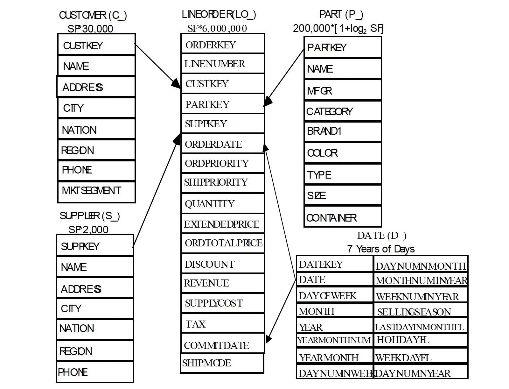
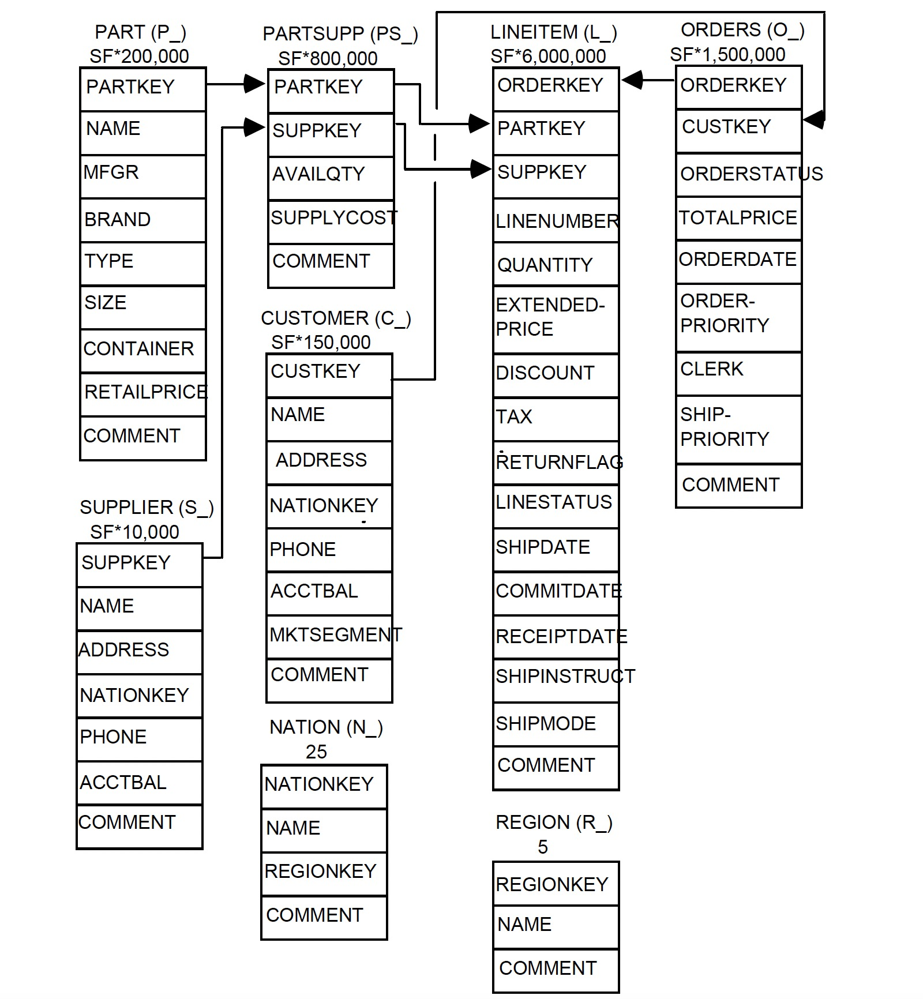
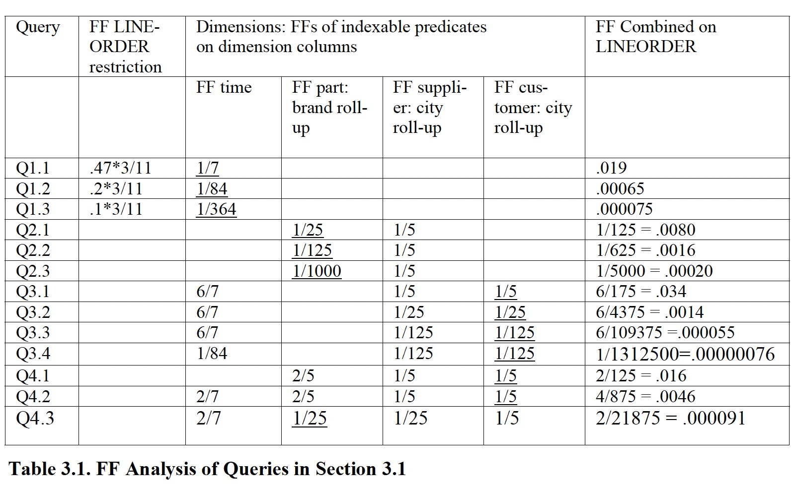

### [Star Schema Benchmark](../assets/pdfs/StarSchemaB.pdf)

> by P O'Neil 2009
> 
> https://www.cs.umb.edu/~poneil/StarSchemaB.PDF

星型模型在数仓中使用广泛，在该模型中，多个维表（dimension tables）围绕一个事实表（fact table），因此可以减少不必要的外键及 join，查询复杂度较低，但却由于不严格遵循范式，存储在数据冗余。

Star Schema Benchmark 将 TPC-H 的雪花模型改造成了星型模式，以测试数仓在决策支持场景下性能表现。

> We depart from the TPC-H query format for a number of reasons, most commonly to make
> an attempt to provide the `Functional Coverage` and `Selectivity Coverage` features.

对于查询语句的选择，SSB 主要考虑:

- Functional Coverage: 尽可能选择星型模式中常见的重要查询以满足用户的预期
- Selectivity Coverage: 通过对维表条件的选择可以决定事实表检索的数量（total Filter Factor）

#### SSB 的表结构



事实表将 TPC-H 中的 `LINEITEM` 和 `ORDERS` 进行了合并，更加符合数仓的标准，增加了冗余，同时减少了在查询过程中不必要的 join 计算。

对比 TPC-H 的表结构为:



#### SSB Queries

Q1: 选择一个维表（date）作为查询过滤条件，计算给定`日期范围`内，折扣和销售数量在某个范围内的订单的`销售收入`之和。

```sql
select sum(lo_extendedprice * lo_discount) as revenue
 from lineorder, date
 where lo_orderdate = d_datekey
  and [DATE_FILTER]
  and [LO_DISCOUNT_FILTER]
  and [LO_QUANTITY_FILTER]; 
```

Q2: 对两个维表（part、supplier）进行查询过滤，计算每个品牌每年带来的收入之和。

```sql
select sum(lo_revenue), d_year, p_brand1
 from lineorder, date, part, supplier
 where lo_orderdate = d_datekey
  and lo_partkey = p_partkey
  and lo_suppkey = s_suppkey
  and [PART_FILTER]
  and [S_REGION_FILTER]
 group by d_year, p_brand1
 order by d_year, p_brand1; 
```

Q3: 对三个维表（customer、supplier 和 date）进行查询过滤，根据客户所在国家、供应商所在国家及日期限制计算收入之和。

```sql
select c_nation, s_nation, d_year, sum(lo_revenue) as revenue
 from customer, lineorder, supplier, date
 where lo_custkey = c_custkey
  and lo_suppkey = s_suppkey
  and lo_orderdate = d_datekey
  and [CUSTOMOR_FILTER]
  and [SUPPLIER_FILTER]
  and [DATE_FILTER]
 group by c_nation, s_nation, d_year
 order by d_year asc, revenue desc;
```

Q4: 对四个维表（全部）进行查询过滤:

Q4.1
```sql
select d_year, c_nation, sum(lo_revenue - lo_supplycost) as profit
 from date, customer, supplier, part, lineorder
 where lo_custkey = c_custkey
  and lo_suppkey = s_suppkey
  and lo_partkey = p_partkey
  and lo_orderdate = d_datekey
  and c_region = 'AMERICA'
  and s_region = 'AMERICA'
  and (p_mfgr = 'MFGR#1' or p_mfgr = 'MFGR#2')
 group by d_year, c_nation
 order by d_year, c_nation;
```

Q4.2
```sql
select d_year, s_nation, p_category, sum(lo_revenue - lo_supplycost) as profit
 from date, customer, supplier, part, lineorder
 where lo_custkey = c_custkey
  and lo_suppkey = s_suppkey
  and lo_partkey = p_partkey
  and lo_orderdate = d_datekey
  and c_region = 'AMERICA'
  and s_region = 'AMERICA'
  and (d_year = 1997 or d_year = 1998)
  and (p_mfgr = 'MFGR#1' or p_mfgr = 'MFGR#2')
 group by d_year, s_nation, p_category
 order by d_year, s_nation, p_category;
```

Q4.3
```sql
select d_year, s_city, p_brand1, sum(lo_revenue - lo_supplycost) as profit
 from date, customer, supplier, part, lineorder
 where lo_custkey = c_custkey
  and lo_suppkey = s_suppkey
  and lo_partkey = p_partkey
  and lo_orderdate = d_datekey
  and c_region = 'AMERICA'
  and s_nation = 'UNITED STATES'
  and (d_year = 1997 or d_year = 1998)
  and p_category = 'MFGR#14'
 group by d_year, s_city, p_brand1
 order by d_year, s_city, p_brand1;
```

四类查询共 13 个查询对事实表的 Filter Factor 如下表所示：



#### References:

[1] [Star Schema Benchmark data set generator (ssb-dbgen)](https://github.com/eyalroz/ssb-dbgen)<br>
[2] [Difference between Star Schema and Snowflake Schema](https://www.geeksforgeeks.org/difference-between-star-schema-and-snowflake-schema/)