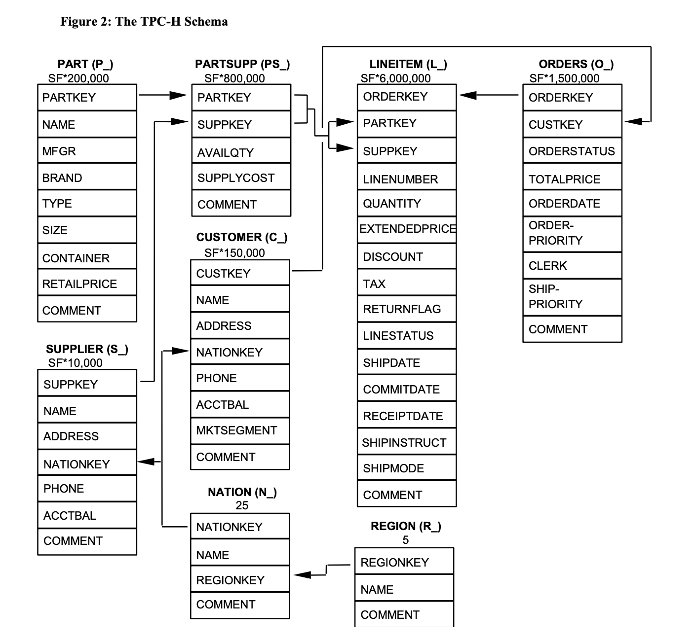
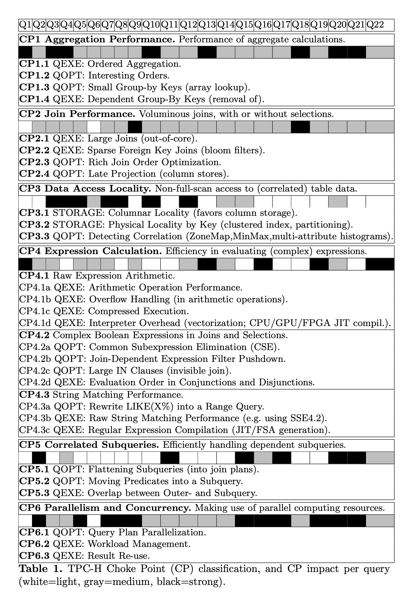

### [TPC-H Analyzed: Hidden Messages and Lessons Learned from an Influential Benchmark](https://homepages.cwi.nl/~boncz/snb-challenge/chokepoints-tpctc.pdf)

TPC-H 是由 TPC（事务处理性能委员会）制定的一个 决策支持系统（DSS）基准测试，用于评估数据库系统在处理复杂查询、数据分析任务时的性能表现。其 Schema 由八张表组成，如下:

这篇论文仍深入分析了 TPC‑H 的 "瓶颈点"（choke points），并从设计层面总结其对未来数据库基准设计的重要启示。

作者识别出 28 个关键瓶颈点，分为六类（CP1–6）：

- 聚合性能（Aggregation）
- 连接性能（Join）
- 数据访问局部性（Locality）
- 表达式计算（Expression Calculation）
- 关联子查询（Correlated Subqueries）
- 并行执行（Parallel Execution）

在评估数据库系统时，关注这些瓶颈能帮助准确诊断性能优势与劣势。

#### References:

[1] [TPC BENCHMARK H Standard Specification](https://www.tpc.org/tpc_documents_current_versions/pdf/tpc-h_v3.0.1.pdf)
