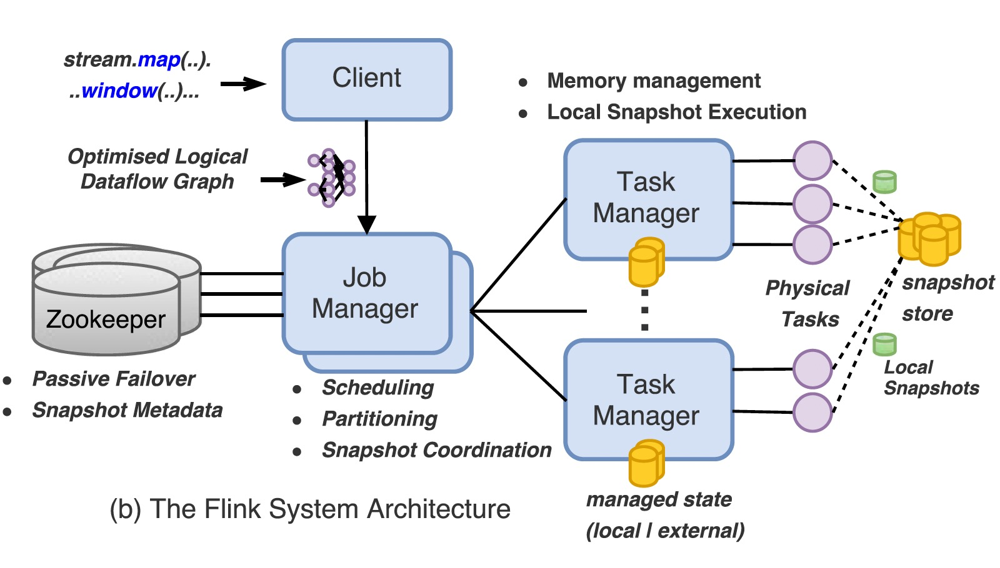
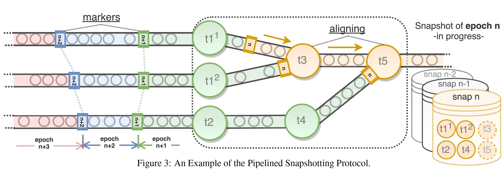
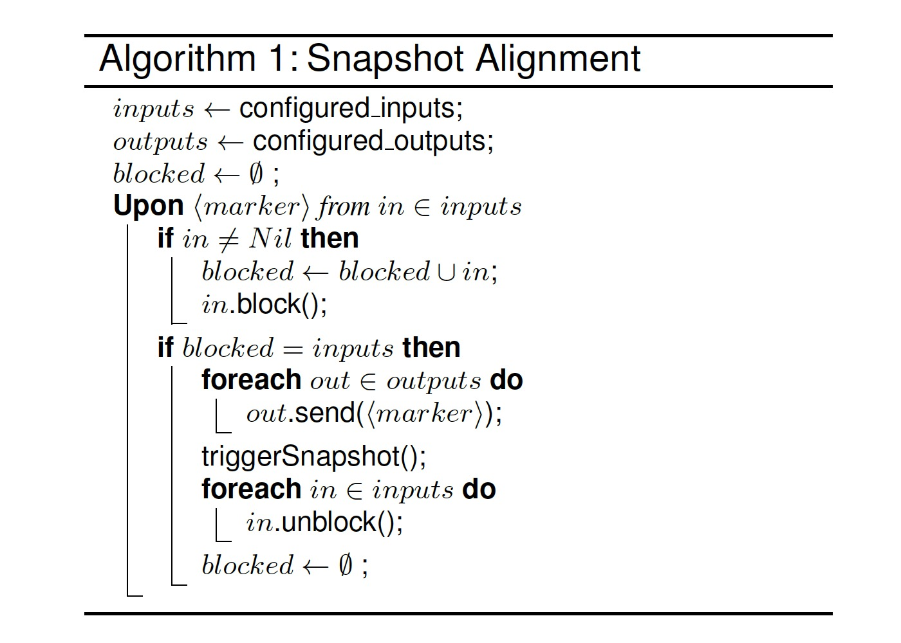

### [State Management in Apache Flink](../assets/pdfs/state-management-in-apache-flink.pdf)

> PVLDB, Aug 2017
>
> https://dl.acm.org/doi/10.14778/3137765.3137777

流处理除了需要具备可扩展和低延迟的特性，一个日益增长的需求是强一致性保证和对集群配置变更、patch、故障的适应性。Flink 提供的轻量分布式快照机制保证应用状态的一致性，且不影响应用程序的持续执行。

Flink 状态管理的核心建立在分布式快照之上，分布式快照能够将分布式进程回滚到之前全局一致的执行状态，这种回滚是粗粒度的，可用于解决配置变更、容错和版本管理等问题。

> Distributed snapshotting protocols enable rollback recovery by producing a correct,
> complete state replica of a distributed execution which can be used to restore the
> system to an earlier point in time.

Flink 的分布式快照在 [abs](../distributedsystem/abs.md) 中有所介绍，类似 `chandy-lamport` 算法，不过更适合弱连接的数据流图。

> Weakly connected graphs are inherently relevant to distributed dataflow processing systems.

Flink 的算子可以维护一些状态，包括 `Keyed-State` 和 `Operator-State`，`Keyed-State` 通过 `Key-Groups` 分配到不同的 physical task，而 `Operator-State` 存在于每一个 physical task。

> Operator State (or non-keyed state) is state that is is bound to one parallel operator instance.

`Keyed-State` 在任务伸缩的时候能够重新分配，因而能适应 subtask 数目的变更，Flink 支持的 `Keyed-State` 包括:

- ValueState
- ListState
- ReduceState
- MapState

#### Pipelined Consistent Snapshots

一个分布式流任务可以被定时生成的 `markers` 切分为不同的 `epoch`，如下图所示:

当一个 task 有多个 input 的时候，需要进行 `alignment`，如上图中的 `t3` 和 `t5`，快照的执行由 `JobManager` 协调，`JobManager` 保存快照的元数据信息，如快照的目录位置，`JobManager` 可以将关键的元数据信息保存到 `Zookeeper` 来保证高可用，元数据的上传可以是异步的，因为总能保证能够回滚到一个更先前的快照版本。

Flink 的快照算法还依赖以下三个假设:

1. Input data streams are durably logged and indexed externally allowing dataflow sources to re-consume their input, upon recovery, from a specific logical time (offset) by restoring their state.
2. Directional data channels between tasks are reliable, respect FIFO delivery and can be blocked or unblocked.
3. Tasks can trigger a block or unblock operation on their input data channels and a send operation (records or control messages) on their output channels.

有向无环图的 `alignment` 算法如下:

有环图则通过 `IterationHead` 和 `IterationTail` 隐式任务支持。任务可以设置忽略 `aligment` 来支持 `Relaxing Consistency`。

Flink 任务的配置修改遵循 `checkpoint-stop-modify-restore` 的模式。

算子支持 `Local state` 和 `External state`，状态可以被声明为 `Queryable State` 被外部访问。

Flink 任务依赖分布式快照算法，支持 `at least once` 的语义，如果要支持 `exactly once` 语义，则需要 sink 端为 `Idemponet Sinks` 或 `Transational Sinks`。
