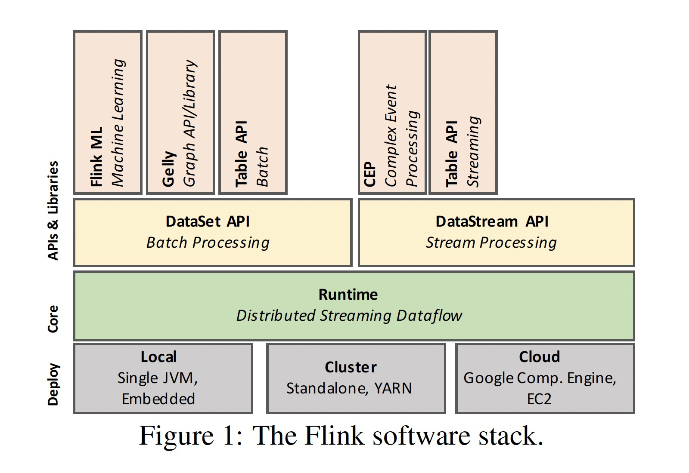
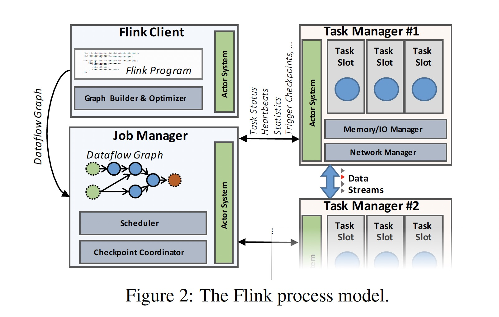

### [Apache Flink: Stream and Batch Processing in a Single Engine](../assets/pdfs/flink.pdf)

>  Bulletin of the IEEE Computer Society Technical Committee on Data Engineering, 2015
>
> http://asterios.katsifodimos.com/assets/publications/flink-deb.pdf

Apache Flink 是一个用于处理流和批处理数据的开源系统。本论文介绍了 Flink 的架构及如何在一个引擎上实现流和批的统一。

越来越多的应用需要大数据处理具有实时性，『Lambda Architecture』 通过结合流处理和批处理在一定程度上满足了这样的需求，但需要把业务逻辑实现两次，增加了复杂性且浪费资源。

Flink 的发展受 Google 的 Dataflow model 和 MillWheel 的影响。其 software stack 如下图所示:

`Runtime` 作为 Flink 的核心，负责执行 `dataflow` 任务，其上的 DataSet API 提供批处理接口，DataStream API 提供流处理接口。批处理是一种有界的流处理，二者都会生成在 `Runtime` 上运行的 `dataflow`。

通过在数据流中插入 `checkpoint barries`，使用 [ABS](../distributedsystem/abs.md) 算法实现 `exactly once` 语义。

通过在数据流中插入 `watermarks` 来实现 `window function`。

提供三种时间处理方式:

- event-time
- process-time
- ingest-time

