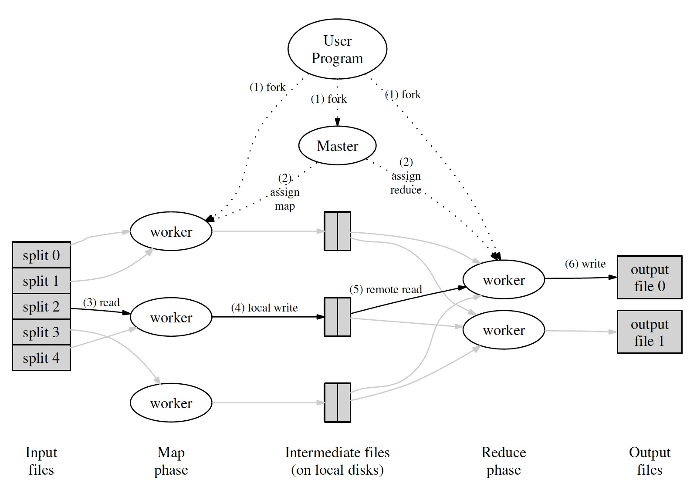

### [MapReduce: Simplified Data Processing on Large Clusters](../assets/pdfs/mapreduce-osdi04.pdf)

> OSDI'04: Sixth Symposium on Operating System Design and Implementation, San Francisco, CA (2004), pp. 137-150
>
> https://research.google/pubs/pub62/

在处理 `Distributed Grep`，`Inverted Index`、`Distributed Sort` 等问题时，虽然数据本身需要执行的转换非常简单，但在高度分布式、可扩展和容错的环境中执行这些任务却又不那么简单，MapReduce 通过隐藏所有分布式系统的复杂性，为用户提供了一个分布式计算框架，用户只需提供用于将 `key/value pair` 处理生成一组 `intermedia key/value pairs` 的 `map` 函数，和一个将同一个键对应的所有 `intermedia key/value pairs` 做合并操作的 `reduce` 函数，就可以将程序并行地运行在计算机集群上。

MapReduce 的执行过程如下:

1. The MapReduce library in the user program first
splits the input files into M pieces of typically 16
megabytes to 64 megabytes (MB) per piece (controllable
by the user via an optional parameter). It
then starts up many copies of the program on a cluster
of machines.

2. One of the copies of the program is special —— the
master. The rest are workers that are assigned work
by the master. There are `M` map tasks and R reduce
tasks to assign. The master picks idle workers and
assigns each one a map task or a reduce task.

3. A worker who is assigned a map task reads the
contents of the corresponding input split. It parses
key/value pairs out of the input data and passes each
pair to the user-defined `Map` function. The intermediate
key/value pairs produced by the `Map` function
are buffered in memory.

4. Periodically, the buffered pairs are written to local
disk, partitioned into `R` regions by the partitioning
function. The locations of these buffered pairs on
the local disk are passed back to the master, who
is responsible for forwarding these locations to the
reduce workers.

5. When a reduce worker is notified by the master
about these locations, it uses remote procedure calls
to read the buffered data from the local disks of the
map workers. When a reduce worker has read all intermediate
data, it sorts it by the intermediate keys
so that all occurrences of the same key are grouped
together. The sorting is needed because typically
many different keys map to the same reduce task. If
the amount of intermediate data is too large to fit in
memory, an external sort is used.

6. The reduce worker iterates over the sorted intermediate
data and for each unique intermediate key encountered,
it passes the key and the corresponding
set of intermediate values to the user's Reduce function.
The output of the Reduce function is appended
to a final output file for this reduce partition.

7. When all map tasks and reduce tasks have been
completed, the master wakes up the user program.
At this point, the MapReduce call in the user program
returns back to the user code.

一个 MapReduce 任务可以分为三个阶段:

- **map phase**: 在 map worker 上，处理后的中间数据根据默认或用户提供的 partitioning function 将数据保存为 `R` 个本地文件，并将文件位置上报给 master
- **shuffle phase**: 在 reduce worker 上，根据从 master 上获取的文件位置，从各个 map worker 上读取所需的文件
- **reduce phase**: 在 reduce worker 上将读取文件中 intermedia key/value pairs 进行处理的过程

#### Fault Tolerance

当 master 失败时，整个任务重做；当 map worker 失败时，即使它已经完成，也需要重做，因为中间数据文件是写在本地的；当 reduce worker 失败时，如果任务未完成，需要成重新调度其他节点完成对应的 reduce 任务，如果任务已经完成，则不需要重做，因为 reduce 的结果保存在 GFS。

#### 优化

- Locality: 由于 input file 保存在 GFS 上，MapReduce 可以根据文件存储的位置，将 map worker 调度到数据分片所在的节点上以减少网络开销
- Combiner: 当 reduce 函数满足交换律和结合律特性时，可以将 reduce 的工作在 map 阶段提前执行
- Backup Tasks: 将一定比例的长尾任务重新调度，可以减少任务的整体执行时间

Apache Hadoop 是 MapReduce 的开源实现，2014 年 Google 提出了 MapReduce 的替代模型 Cloud Dataflow，该模型支持流批一体，具有更好的性能及扩展性，对标的开源产品为 Apache Flink。