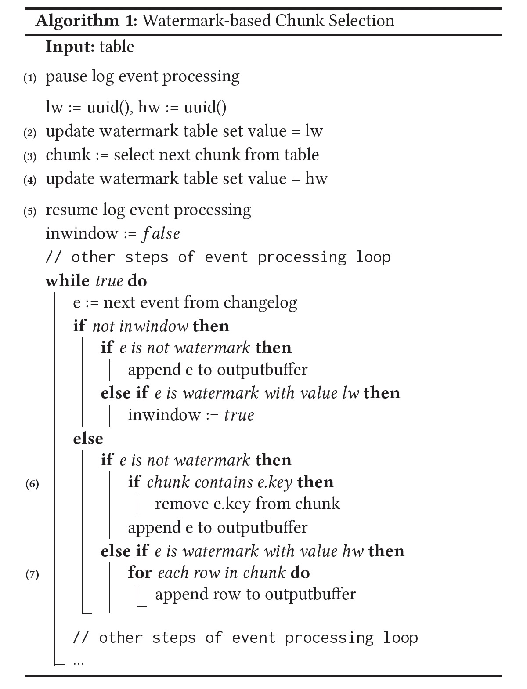
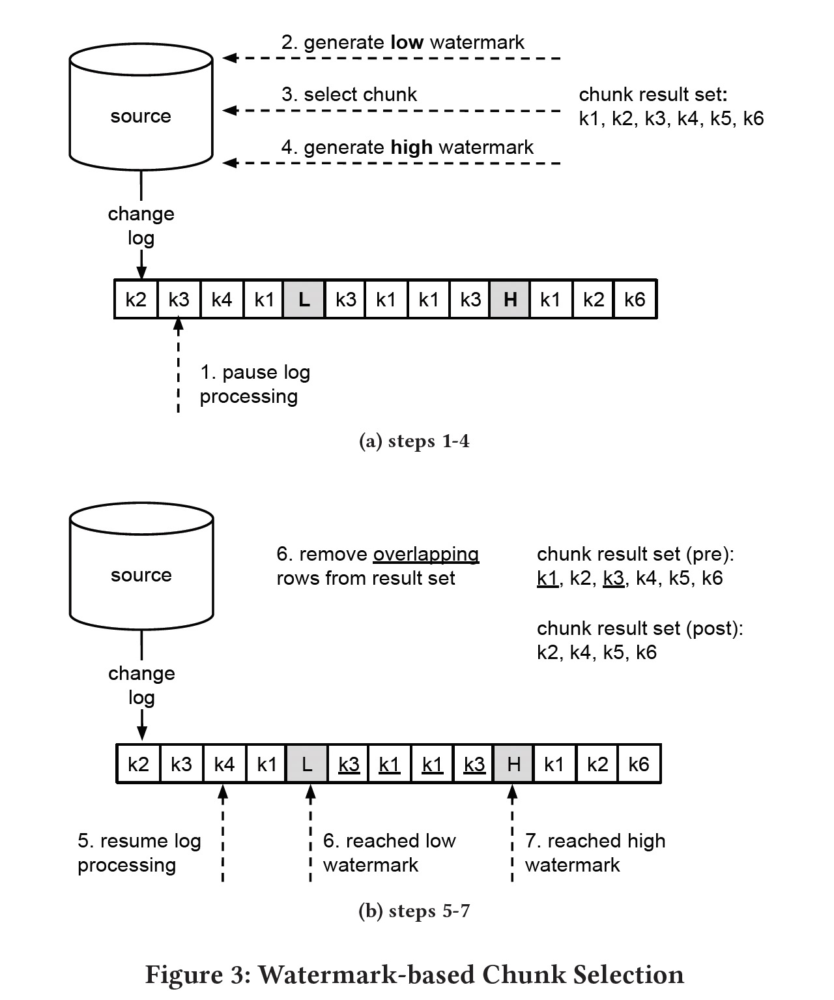
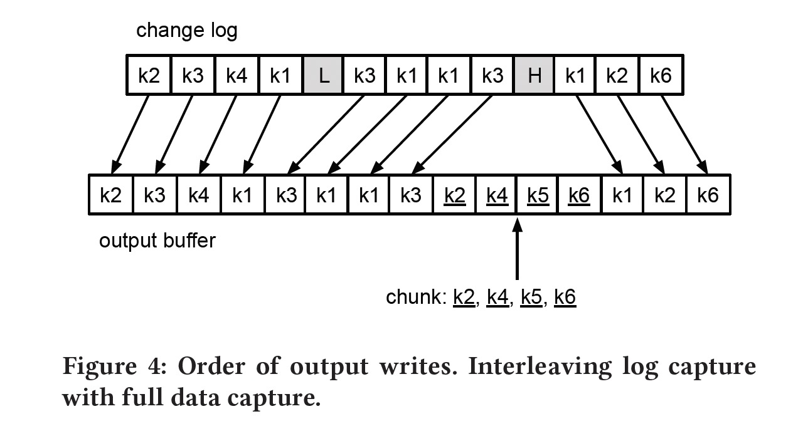

### [DBLog: AWatermark Based Change-Data-Capture Framework](../../assets/pdfs/DBLog_A_Watermark_Based_Change-Data-Capture_Framework.pdf)

> Andreas Andreakis, Ioannis Papapanagiotou. 2020
>
> https://arxiv.org/abs/2010.12597

不同特性数据库之间的同步是一个普遍存在的需求。dual-write 和分布式事务是尝试解决此问题的一种模式，但这两种方式在可行性、鲁棒性和可维护性等方面或多或少存在一些问题；CDC 则是通过捕获数据库事务日志事件来达到下游数据库同步的另一种模式，但事务日志可能并非包含所有的变更事件（create/update/delete），因此需要同步数据库的全状态（full state）。

DBLog 通过事务日志捕获变更事件，通过 `select` 来获取数据的全状态。根据主键将表切分为多个 `chunk`，每个 chunk 的 select 和事务日志同时进行，为了保证事件的历史顺序，DBLog 在源数据库中维护了一个单行单列的表作为辅助，通过在 select 前后分别更新该记录使得在事务日志中多了两个事件 lw(低水位) 和 hw(高水位)，然后将查询出来的事件和 [lw, hw] 之间的事件做以下算法，生成一个新事件流。



paper 中的示例图 (Figure 3 && Figure 4) 非常明白地解释了上述算法:





算法正确性依赖数据库的 RC 或 RR 隔离级别，select 返回的 result set 是 (lw, hw) 之间的一个点的视图，我们以 RR 隔离级别分别用图示论证增改删的正确性:

1 insert log event

insert 日志在 select 之前，select 日志中能会包含该插入记录，因此从 result set 将其删除避免了重复插入。

```txt
 ---lw------select-------hw-----
        ^
        |
      insert
```

insert 日志在 select 之后，result set 中不含该插入记录，新的事件流只包含一次该记录。

```txt
 ---lw------select-------hw-----
                    ^
                    |
                  insert
```

2 update log event

update 日志在 select 之前，select 结果中包含了更新后的结果，而 update 日志包含了更新前后的数据，将 result set 中对应的记录删除，新的事件流中包含 update 后的记录，可保证正确性。

```txt
 ---lw------select-------hw-----
        ^
        |
      update
```

update 日志在 select 之后，select 中包含更新前的结果，将 result set 中对应的记录删除了老的值，但 update 日志包含了更改前后的新老数据，同样可以保证正确性。

```txt
 ---lw------select-------hw-----
                    ^
                    |
                  update
```

3 delete log event

delete 日志在 select 之前，result set 中不含该记录，新的事件流删除一个不存在的记录不影响正确性。

```txt
 ---lw------select-------hw-----
        ^
        |
      delete
```

delete 日志在 select 之后，result set 包含该记录，需要删除该记录来保证新的事件流先删除一个不存在的记录后又将该记录插入。

```txt
 ---lw------select-------hw-----
                    ^
                    |
                  delete
```

### 疑问

output buffer 中为何还保留了 lw 之前的事务日志？


### More readings

[1] [DBLog: A Generic Change-Data-Capture Framework](https://netflixtechblog.com/dblog-a-generic-change-data-capture-framework-69351fb9099b)