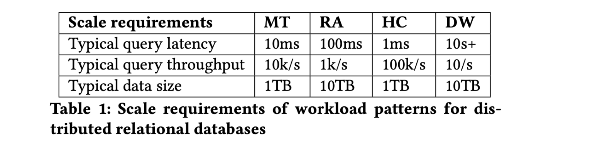
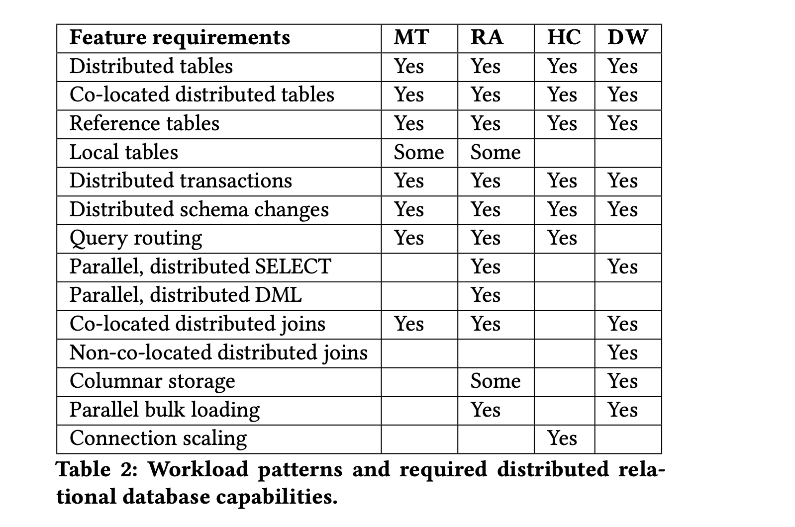
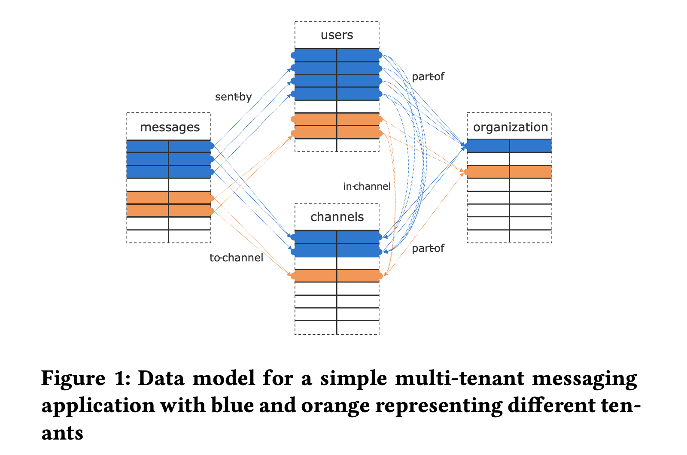
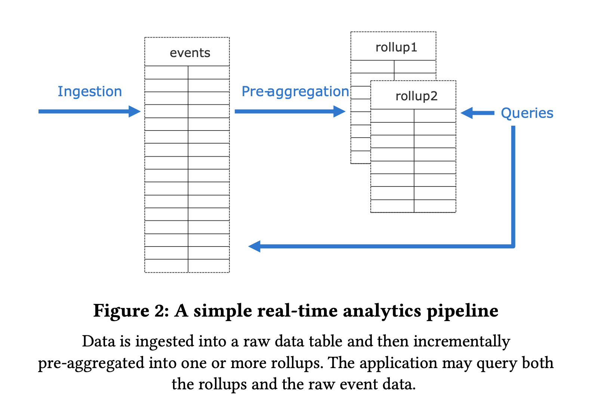
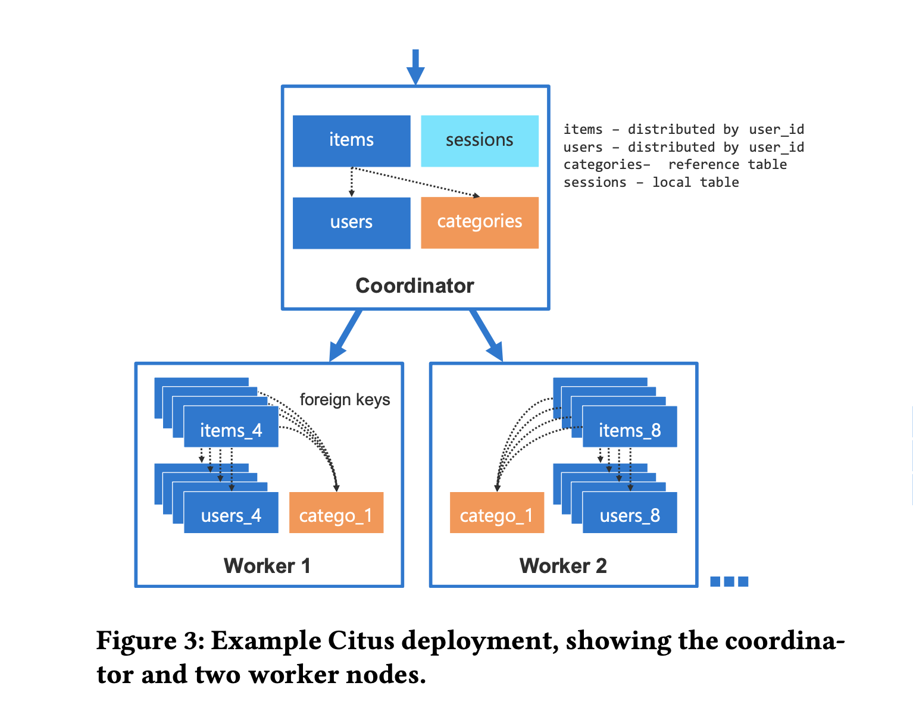
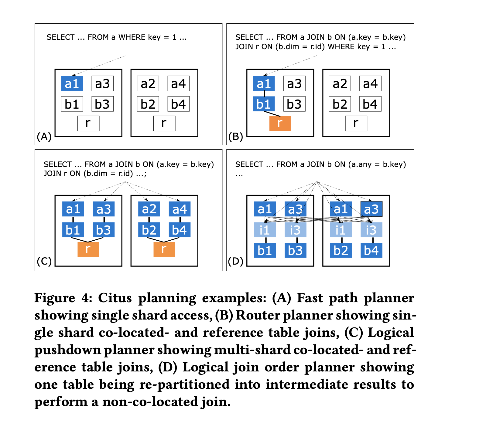
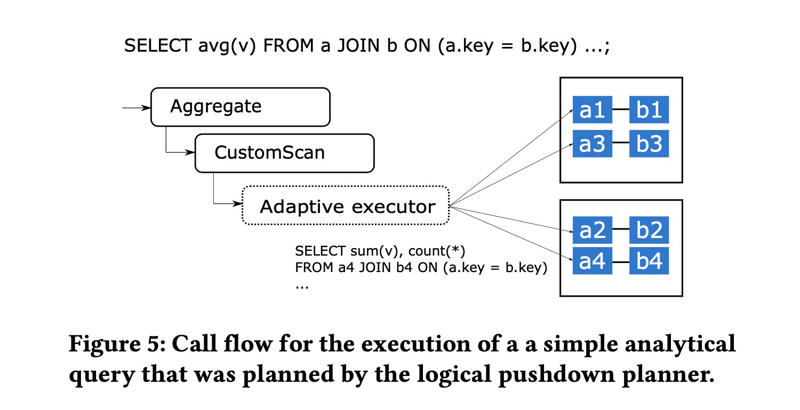

### [Citus: Distributed PostgreSQL for Data-Intensive Applications](../assets/pdfs/citus.pdf)

> SIGMOD '21 Umur Cubukcu, etc.
>
> https://dl.acm.org/doi/10.1145/3448016.3457551

Citus 是 PostgreSQL 的一个开源扩展，它实现了一个分布式数据库引擎，为用户提供在一组 PG 实例集群上存储、查询的能力。

通常情况下，实现一个兼容已有关系型 DMBS 的分布式 DBMS 会使用如下三种方法中的一种:

1. build the database engine from scratch and write a layer to provide over-the-wire SQL compatibility (CockroachDB/TiDB)
2. fork an open source database systems and build new features on top of it (Greenplum)
3. provide new features through a layer that sits between the application and database, as middleware (Vitess)

这些方法都不能完全兼容数据库的最新特性，有的甚至落后多年以至于很难从上游同步代码。Citus 则是通过 PostgreSQL 提供的扩展 API 来提供它的分布式能力。

> The extension APIs provide sufficient control over the behavior of PostgreSQL to integrate a sharding layer,
> a distributed query planner and executor, and distributed transactions in a way that is transparent to the application.

### WORKLOAD REQUIREMENTS

作为 PostgreSQL 的 extension 使得 Citus 在兼容 Postgres 新特性时非常容易。但是做到 100% 兼容且没有性能回退也不太现实，也没有必要。通过对客户需求的分析，Citus 认为能受益于横向扩展的应用大多归为以下四类:

1. Multi-tenant/SaaS
2. real-time analytics
3. high-performance CRUD
4. data warehousing



不同的 Workload Pattern 又对分布式数据库不同能力组合有着不同的需求:



#### Multi-tenant

多租户应用通常使用一个后端程序服务多个相对独立的租户，一个典型的例子就是 SaaS。比如像钉钉或企业微信这类服务，其数据模型可简化为下图:



由于独立租户的数量很大，这类应用负载扩展是一个挑战。传统的方式是手动做分库分表（sharding），每个租户的数据被单独放在一个 database 或 schema 中，应用程序层面需要维护数据的放置位置、数据同步、表结构变更等问题。

Citus 使用的方式是共享 schema 并在包含租户数据的每个表都增加一列 tenant ID，这样同一个租户的数据可以按照 tenant ID 被分布到一个节点上，进而满足复杂 SQL、外键、约束、索引等特性。租户之间共享的数据则使用 `Reference Table` 复制到每一个节点。

由于租户之间的数据量可能存在非常大的差距，Citus 还提供了解决热点的特性，即精细地控制租户的放置策略。

#### Real-time Analytics

实时分析通常用于在大规模数据流上（事件数据或时间序列数据）进行交互式分析或搜索，要求延迟小（亚秒级别），常见的场景如系统监控、异常检测（欺诈检测）、行为分析、地理空间数据分析等。数据库需要持续写入大量事件流，并服务于应用层下发的每秒上百条分析查询。这些查询通常是已知的，因此可以利用索引、物化视图、数据转换（rollup）等技术来缩短查询时间。下图为实时分析的一个简化流程:



PostgreSQL 具有很多构建实时分析程序的能力，包括:

- heap storage 和 COPY 命令可以允许非常快的写入
- MVCC 允许查询和写入同时进行
- 完善的数据类型和索引类型

唯一的缺陷在于单机 PG 不能容纳实时分析的数据量，并且 PG 的查询大多是单线程的。为了扩展实时查询的负载，数据库系统需要支持将数据分布在多个服务器上，并且支持并行批量导入等能力。

#### High-performance CRUD

这种应用负载涉及很多对象（如 JSON）或文档的独立修改，操作通常都通过主键对数据进行增删改查，但也会有一些负载的查询。当数据集过大时，Postgres 会遇到扩展的问题，如 vacuum 跟不上数据更改的速度、连接数过多等。Citus 通过根据 key 将表分布到不同节点，CRUD 操作可以路由到对应节点，利用主键索引可以加速查询以达到高吞吐和低时延。Vacuum 也能在各个节点并行执行。另外为了扩展连接数，每个 server 都需要能够处理分布式查询，Citus 在扩展连接数的能力上在与社区一起推进。

#### Data warehousing

数仓将来自不同 operational 数据库的数据结合到一个数据库系统，提供 ad-hoc 的查询分析，此类应用不需要高吞吐和低延时，但需要扫描大量的数据集。Citus 通过并行，分布式 select 和 columnar storage 来提高扫描的速度。
在 Join 的处理上，Citus 对 non-co-located joins 的支持还不完善。


### CITUS ARCHITECTURE

Citus 使用 PostgreSQL 扩展接口改变数据的行为:

- First, Citus replicates database objects such as custom types and functions to all servers.
- Second, Citus adds two new table types that can be used to take advantage of additional servers.

Citus 插件使用了 PostgreSQL 提供的如下技术来完成其功能:

1. UDF: 主要用于操作 Citus 元数据及实现 RPC。
2. Planner & Executor hooks: 是 PG 的全局函数指针，扩展可用次替换原有的优化器和执行器。当检测到是 Citus table 的时候，Citus 生成一个包含 CustomScan node 的查询树，它包含了一个分布式的查询计划。
3. CustomScan: 调用分布式执行器，发送查询给 worker node 并收集查询得到的结果返回给 PG 的执行器。
4. Transaction callbacks: Citus 使用它来实现分布式事物。
5. Utility hook: Citus 使用它来改写 DDL 及 COPY 等命令。
6. Backgroud workers: Citus 实现一个守护进程用于完成 分布式锁检测、2PC 事物恢复和清理。

一个典型的 Citus 集群包含一个 Coordinator 和 0-n 个 worker，如下图所示:



当数据量不多时，一个 Coordinator 就可以作为一个 Citus 集群。Citus 引入了两种表类型: Distributed table 和 Reference table，所有的 table 在创建时都是普通的 heap 表，用相应的 udf 把表转换为期望的表类型（是因为 parser 是不能通过插件扩展，因此 citus 没有增加建表语法？使用 reloption 来标记表的属性应该也要修改 pg 源码）。

**Distributed table**

分布表根据分布列进行哈希分区，分区成多个逻辑分片，每个分片包含一段连续的哈希值范围（consistent hash）。哈希分区的优势在于，它可以实现数据的 co-location 且无需频繁重新分片就能达到数据的平衡。

```SQL
CREATE TABLE my_table (. . . );
SELECT create_distributed_table('my_table',
    'distribution_column');

CREATE TABLE other_table (. . . );
SELECT create_distributed_table('other_table',
    'distribution_column', colocate_with := 'my_table');
```

**Reference table**

Reference table 会复制到集群中的所有节点，包括 Coordinator。分布表和引用表之间的 join 是通过将分布表的每个分片与引用表的本地副本进行 join 来实现的，不需要网络流量。

```SQL
CREATE TABLE dimensions (. . . );
SELECT create_reference_table('dimensions');
```

#### Data rebalancing

由于业务不均，worker 上的数据会产生倾斜，为了达到均匀的分布，Citus 提供了 `shard rebalancer`。默认情况下，rebalancer 依据各节点的 shard 数目进行迁移，但用户可以创建 `custom policy` 来进行不同策略的平衡。

当集群节点变更时，rebalancer 选择一个 shard 以及与它 co-located 的 shards，提交一个 shard 移动操作。Citus 首先利用 logic replication 在另一个节点创建该 shard 的副本，原 shard 依旧可以进行读写，当副本追上 source 时，Citus 在 source shard 上获取一把写锁（会短暂停止写入操作，通常只有几秒），等待复制的完成，更新分布表的元数据。之后的读写操作都切换到了新的 shard 上。

#### Distributed query planner

当 SQL 查询用到 Citus 表时，分布式 planner 会生成一个包含 CustomScan node 的查询计划，该 node 包含分布式查询计划。分布式查询计划由一组需要在 worker 节点上运行的任务(对分片的查询)组成，还可以选择性地包含一组结果需要广播或重新分区子计划，以便后续任务读取其结果。

Citus 针对不同的查询类型有四种 planner:



1. Fast path planner: 根据查询条件中的分布列的值找到 match 的 shard，改写 CRUD 查询的 table name 为对应的 shard name，常用于 high-throughput CRUD 场景
2. Router planner: 推断所有分布表是否具有相同的分布键，如果是，则将查询中的表名重写为与分布列值匹配的 shard 的名称。
3. Logical planner: 负责将跨 shard 的查询构造成一个 multi-relational algebra tree。并尽可能的将计算下推到 worker 节点。
  - Logical pushdown planner: 如果所有分布表都 co-located 且子查询不需要全局合并（即 group by 必须包含分布键），则可以将 join tree 完全下推到 worker 节点
  - Logical join order planner: 当涉及 non-co-located 的分布表时，通过评估 co-located join, broadcast join, repartion join 不同的组合顺序，找到网络开销最小的查询计划

对每个查询，Citus 由低到高迭代这四个 planner，如果 planner 能满足查询，则使用它。

#### Distributed query executor

由 Distributed query planner 生成的计划包含一个 CustomScan node，它会调用 Distributed query executor。对于 fast path 或 router planner 生成的执行计划，整个 plan 就是一个 CustomScan，因为执行过程指派给了一个 worker。对于 logical planner 生成的计划，在 CustomScan 之上还有额外的执行节点用于结果的合并，这一步由 PostgreSQL 的执行器处理。

当 PostgreSQL 执行器调用到 CustomScan 的时候，它首先执行可能存在的 subplans，然后再去调用一个叫作 Adaptive executor 的模块，如下图所示:



Adaptive executor 的设计是为了支持混杂在一起的查询和 PG process-per-connection 的架构，有些查询只有一个 task，另外一些查询涉及到多个 tasks 并由 Citus 打开多个连接并行执行。打开过多连接可能会影响性能，Adaptive executor 为了均衡并行度和低延时使用了一种称作 `slow start` 的技术:

- 在查询开始时，执行器可以对每个 worker 使用一个连接 (n=1)
- 每过 10ms，可以开启的新连接数增加 1 (n=n+1)
- 如果一个 worker 有 t 个待处理的任务未指派给特定连接，则执行器会为该工作节点增加 min(n,t) 个新的连接到连接池中


#### Distributed transactions

对于只涉及单个 worker 的事务，Citus 将事务的处理指派给 worker 节点。对于涉及多个 worker 的事务，Citus 使用两阶段提交(2PC)来确保原子性。Citus 基于 PostgreSQL 提供的 PREPARE TRANSACTION/COMMIT PREPARED/ROLLBACK PREPARED 来实现 2PC。

Citus 还实现了分布式死锁检测机制。

