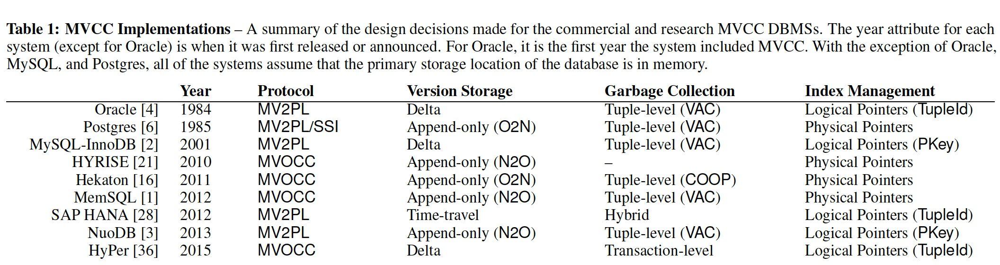

### [An Empirical Evaluation of In-Memory Multi-Version Concurrency Control](../../assets/pdfs/empirical-evaluation-of-in-memory-mvcc.pdf)

> PVLDB, March 2017
>
> https://dl.acm.org/doi/10.14778/3067421.3067427

MVCC 是现代 DBMSs 最流行的事务管理方式，它最早出现在 1979 年的一篇博士论文里，其基本思想是为数据库中的每个逻辑对象维护多个物理版本，以此来允许对同一逻辑对象的并行操作。这些对象可以是任意粒度，但通常 DBMSs 选择元组为 MVCC 的基本单元，以达到并行和版本追踪开销的平衡。

虽然现在几乎所有最新的 DBMSs 都使用了 MVCC，但却没有一个**标准**的实现。

> Despite all these newer systems using MVCC, there is no one **standard**
> implementation. There are several design choices that have different 
> trade-offs and performance behaviors.

本论文研究了 MVCC 数据库管理系统的四个关键事务管理设计上的决策:

1. concurrency control protocol
2. version storage
3. garbage collection
4. index management

在以元组为对象的 MVCC 实现中，通常都会在每个物理版本的 header 中增加几个元数据来控制该版本的读写、加锁及可见性判断:

```
 ----------------------------------------------------------------
| txn-id | begin-ts | end-ts | pointer | ... |      columns      |
 ----------------------------------------------------------------
|<----------------- header ----------------->|<---- Contents --->|
```

- `txn-id` field serves as the version's write lock
- `begin-ts` and `end-ts` timestamps that represent the lifetime of the tuple version
- `pointer` stores the address of the neighboring (previous or next) version (if any)

*不同的协议根据需要会增加额外的字段*

### concurrency control protocol

并发控制协议决定了:

1. 一个事务是否可以在运行时访问或修改一个特定的对象版本
2. 是否允许一个事务提交它所作的修改

#### Timestamp Ordering (MVTO)

该协议在 header 中增加了一个额外的字段 `read-ts`，用于记录读取该记录的最新事务。当一个事务想要修改一个物理记录（即创建一个新版本）时，需要满足两个条件:

1. 该版本上没有其它事务的写锁，通过 `txn-id` 是否为 0 进行判断
2. 事务的 Tid 要大于该版本的 `read-ts`，因为不能修改发生在未来的读取

#### Optimistic Concurrency Control (MVOCC)

OCC 的一个假设是事务之间很少会发生冲突，因此在读取或更新元组时不需要进行加锁。

MVOCC 将事务分为了三个阶段，read phase、validate phase 和 write phase。具体的算法描述感觉 paper 里描述的也不是很清楚，这里略过。

#### Two-phase Locking (MV2PL)

每个事务在允许读取或修改一个物理版本之前都要加上必要的锁。在 disk-based DBMS 中，需要额外将锁信息保存在另外地方以保证不会被写入 disk，而内存数据库中则可以直接将锁信息保存在元组的 header 中。在 MV2PL 中，`txn-id` 用作 write lock，新增一个 `read-cnt` 作为 read lock。

对于读，只需要判断 `txn-id` 为 0，然后对 `read-cnt` + 1 即可。

对于写，则需要 `txn-id` 和 `read-cnt` 都为 0。

#### Serialization Certifier

使用 SSI(Serializable Snapshot Isolation) 或 SSN(Serail Safety net) 可以避免 snapshot 隔离级别中的 write-skew anomalies。

### Version Storage

事务在更新记录的是否会产生新版本，根据新版本存放的位置、版本链的前后顺序以及是否保存元组的有所字段，将 version storage 进行以下分类:

- Append-only: 新版本与旧版本存储在相同的表结构中，且保存元组的所有字段
  - Oldest-to-Newest (O2N): version chain 的头指向旧版本，更新不需要修改 index，但会增加 pointer chasing 的时间且会污染 CPU cache
  - Newest-to-Oldest (N20): version chain 的头指向新版本，更新需要修改所有 index (可通过增加一个中间层来解决此问题)，避免了大量 pointer chasing
- Time-Travel: 新版本保存在原来的表结构，旧版本保存在分开的 time-travel 表，且保存所有字段
- Delta Storage: 新版本保存在原来的表结构中，被修改字段的旧数据保存在另外的 delta 存储中

### Gabage Collection

如果没有垃圾回收，会把存储空间耗尽且影响性能。现有垃圾回收的方式:

- Tuple-level GC
  - Background Vacuuming (VAC): 运行一个后台任务定时去检测是否有过期的数据
  - Cooperative Cleaning: 在 pointer chasing 寻找可见版本的时候来识别过期数据，仅适用于 O2N，且有 `dusty corners` 的问题
- Transaction-level GC: 在 epoch 结束的时候，所有属于那个 epoch 事务产生的版本都可以被删除

### Index Management

分为 Logical Pointers 和 Physical Pointers，其中 Logical Pointers 又可分为 Primary Key(Pkey) 和 Tuple Id(TupleId) 两种实现。

最后给出论文中总结的不同 DBMSs 的 MVCC 实现决策表格:

