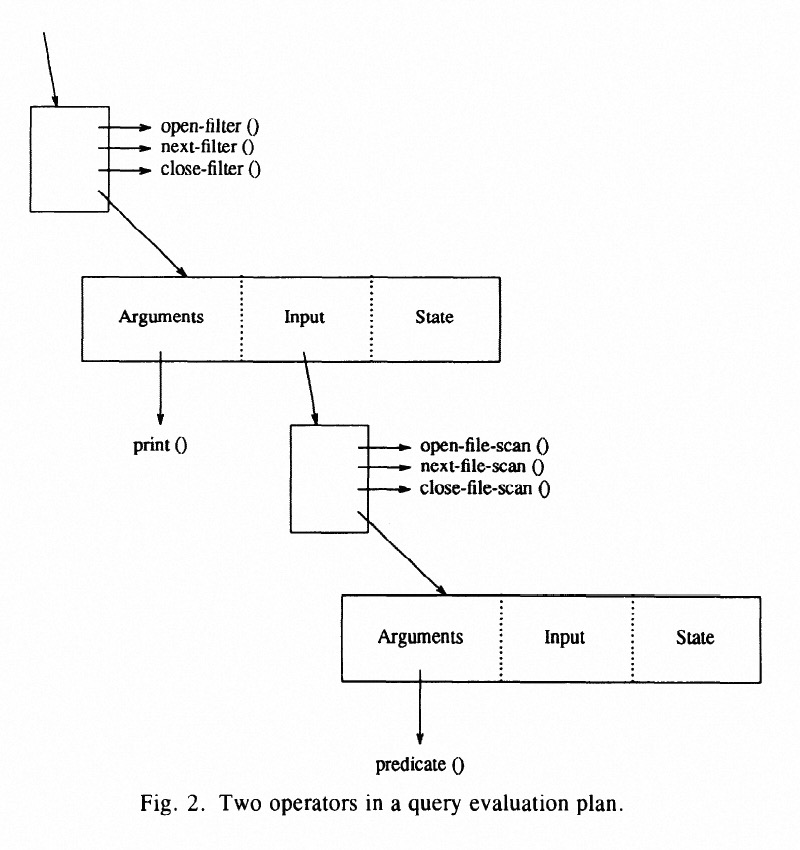
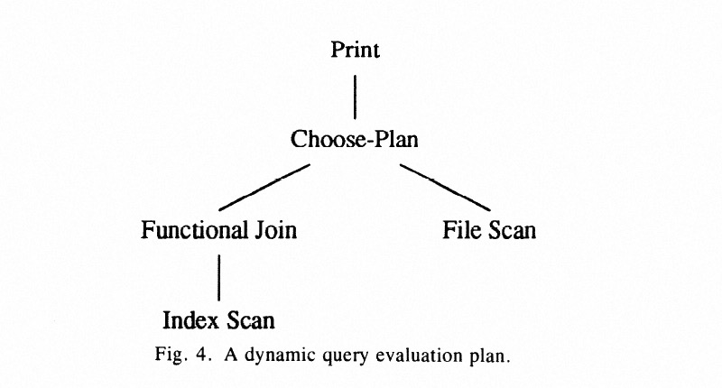
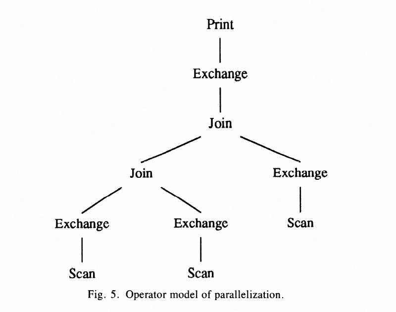

### [Volcano — An Extensible and Parallel Query Evaluation System](../../assets/pdfs/valcano.pdf)

> Goetz Graefe, IEEE Transactions on Knowledge and Data Engineering, February 1994
>
> https://dl.acm.org/doi/10.1109/69.273032

Volcano 是为了研究数据库查询处理系统**可扩展性**和**并行性**而开发的一个实验性质的数据流查询执行系统。操作系统的『机制和策略分离』的设计哲学影响了 Volcano 的设计。

Volcano 的迭代器模型，即 `open-next-close` 标准接口，使得增加新的算子和算法都非常容易；同时处理模型不依赖数据模型，而是通过提供具体的 **support function** 来供 Volcano 框架调用。这些都使得 Volcano 具有良好的可扩展性。这也是我们经常谈及的 Volcano Iterator 执行模型。下图是两个算子的示例:

Volcano 设计了两个元算子，第一个 `choose-plan` 元算子使得查询引擎能够动态选择执行的路径（类似 Adaptive query execution 的概念），该算子本身不执行任何数据操作，可以插入到执行计划树的任意位置，其 open 操作决策执行的算子，next 和 close 调用子算子对应的 next 和 close。

另一个元算子 `exchange` 能够让系统更容易地利用多处理器系统从而提高并行度，包括 inter-operator parallelism(垂直并行和 bushy 并行) 和 intra-operator parallelism（同一算子通过 partition 对不同分区进行并行）。

*注：本 paper 是一篇 Volcano 综述性的论文，该团队针对 Volcano 不同模块发表了多篇 paper，因而 Volcano 是一个论文系列。*

#### More to explore:

[1] [【论文分享】秋实：Volcano-An Extensible and Parallel Query Evaluation System](https://www.bilibili.com/video/BV18Y4y1x7k7/)
