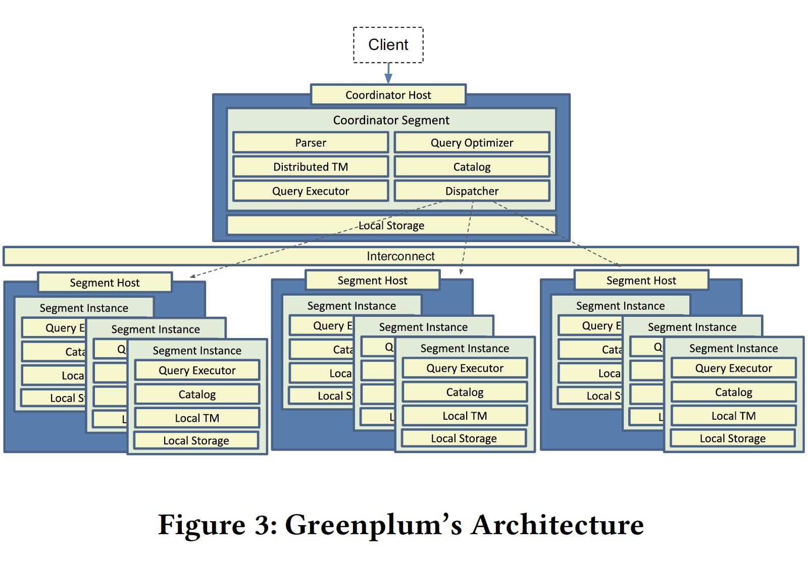
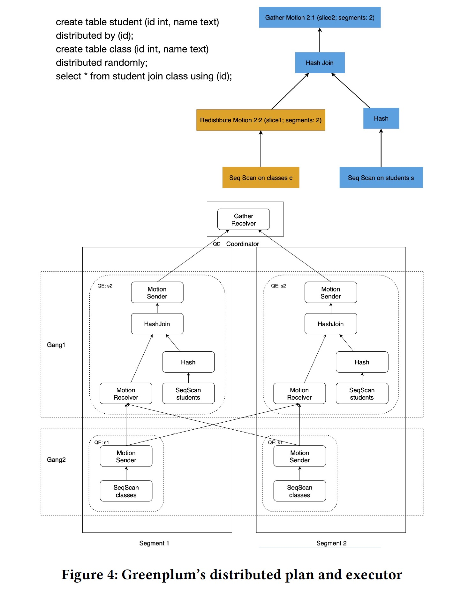
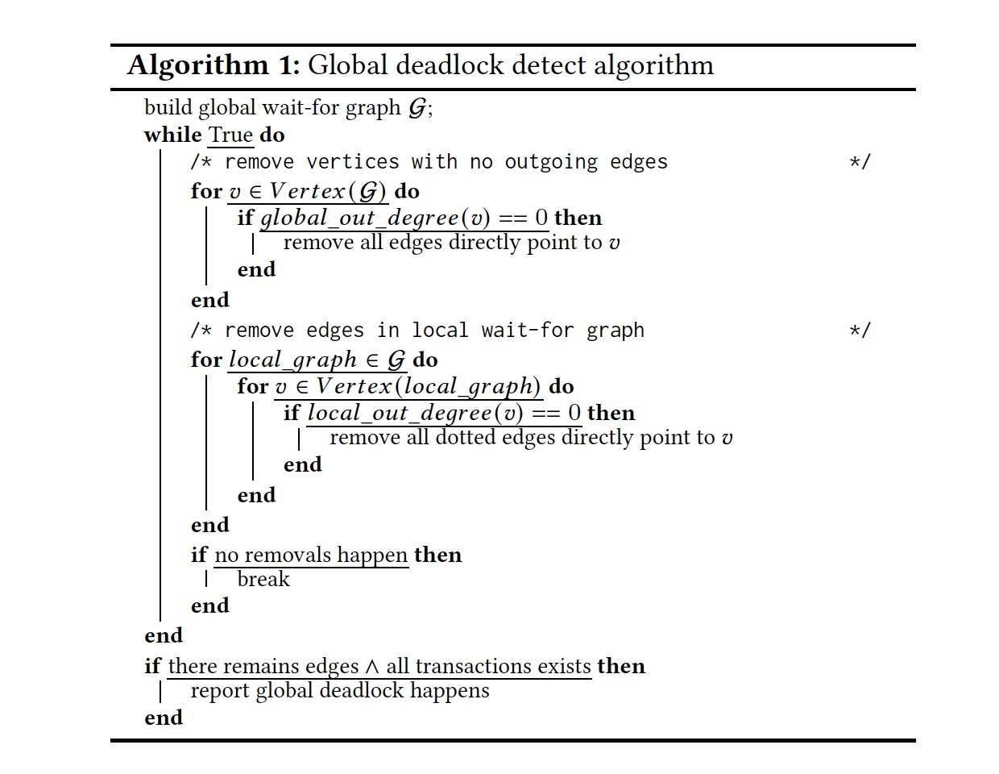

### [Greenplum: A Hybrid Database for Transactional and Analytical Workloads](../../assets/pdfs/greenplum.pdf)

> SIGMOD '21
>
> https://doi.org/10.1145/3448016.3457562

与单纯的 OLTP 或者 OLAP 系统相比，HTAP 系统具有如下两种优势:

1. reduce the waiting time of new data analysis tasks significantly, as there is no ETL transferring delay.
2. reduce the overall business cost in terms of hardware and administration.

HTAP 常见的演进路径有两种:

1. From OLTP to HTAP: Oracle Exadata, Amazon Aurora
2. From NewSQL to HTAP: TiDB with TiFlash, Google F1

Greenplum 则选择了另一条路径，在 OLAP 数仓上增加 OLTP 的能力来获取一个 HTAP 系统。

#### Greenplum's MPP Architecture

Greenplum 构造了一个 MPP 数据库（share-nothing）来解决单机系统带来的问题:

1. Data Scalability: the total amount of data is too large to store in a single host.
2. Compute Scalability: the ability to handle concurrency is limited by the compute resources of a single host, e.g., CPUs, memory, and IO.
3. High Availability: if the single host is unavailable, so is the whole database system.

这种架构同样带来了一些挑战:

由于每个 segment 上只保存了部分数据，因此在作 join 的时候需要对数据进行 shuffle 以保证 join condition。因此 GPDB 的优化器和执行器都是分布式的，为此 GPDB 引入了一种新的计划节点 `Motion plan node`。为了保证 ACID，GPDB 使用了分布式快照和两阶段提交协议。

> Motion plan nodes naturally cut the plan into pieces, each piece 
> below or above the Motion is called a **slice** in Greenplum. Each
> slice is executed by a group of distributed processes, and
> the group of processes is called **gang**.

为了将 OLAP 变为 OLTP，Greenplum 做了如下几点优化:

**Object Lock Optimization**

GPDB 中有三种锁: spinlocks, LWlocks 和 Object locks，前两种锁可以通过遵循一定规则来避免死锁（如获取锁的时候使用相同的顺序），而对象锁则需要死锁检测算法来识别。由于是分布式的架构，PostgreSQL 单机版的死锁检测算法不再适用，GPDB 提出了 GDD（Global Deadlock Detection）算法来检测死锁，过程如下:

- Greenplum launches a daemon on the coordinator segment
- The daemon periodically collects wait-for graphs on each segment
- The daemon checks if a global deadlock happens
- The daemon breaks the global deadlock using predefined policies such as terminating the youngest transaction

死锁检测算法如下:

有了 GDD，插入和更新操作就不再需要高级别的锁了，因此能提高操作的并发度。

**Distributed Transaction Management**

一个分布式事务由 Coordinator 指定一个 distributed transaction identifier，逐渐递增且全局唯一，分发给 segment。Segment 对事务依旧会分配一个本地事务id，真正写入磁盘的也是本地事务，每个 segment 维护了一个分布式事务 id 和本地事务 id 的一个映射，对一个分布式快照来说，判断元组的可见性就需要结合这个映射和元组记录的本地事务 id 来判断。

这个映射关系如果很大会影响性能，GPDB 通过只将现有分布式快照可见的最老的分布式事务 id 之后的 id 记录在 map 之中来减少 mapping meta-data 的大小。

Coordinator 使用两阶段提交来保证事务在所有 segments 上的原子性，GPDB 对于只涉及一个 segment 的事务做了一个优化，将两阶段提交变为一阶段提交（省去 Prepare/Prepared）来减少网络开销。

**Resource Isolation**

通过创建资源隔离（CPU、Memory、Concurrency）并将其指定给角色，将 OLAP 和 OLTP 可用的资源进行隔离，从而减少 OLAP 查询对 OLTP 的影响。

通常 OLAP 需要更多的 Memory，少量的连接，而 OLTP 对时延比较敏感，如果能分配独占的 CPU 会提高性能。
