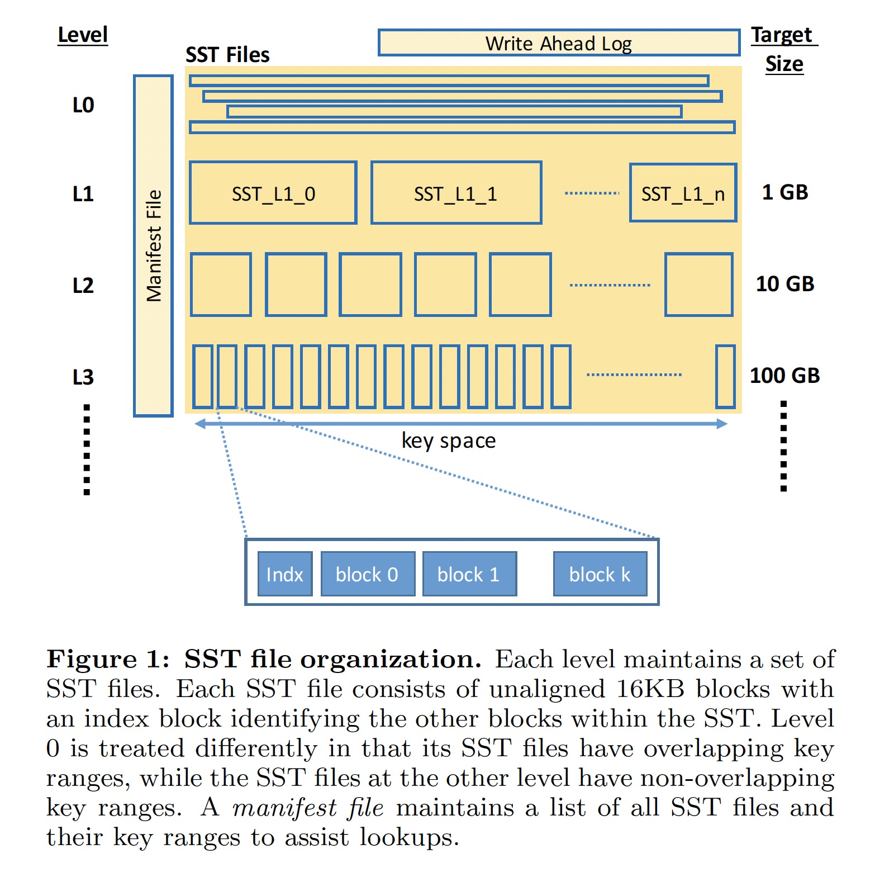
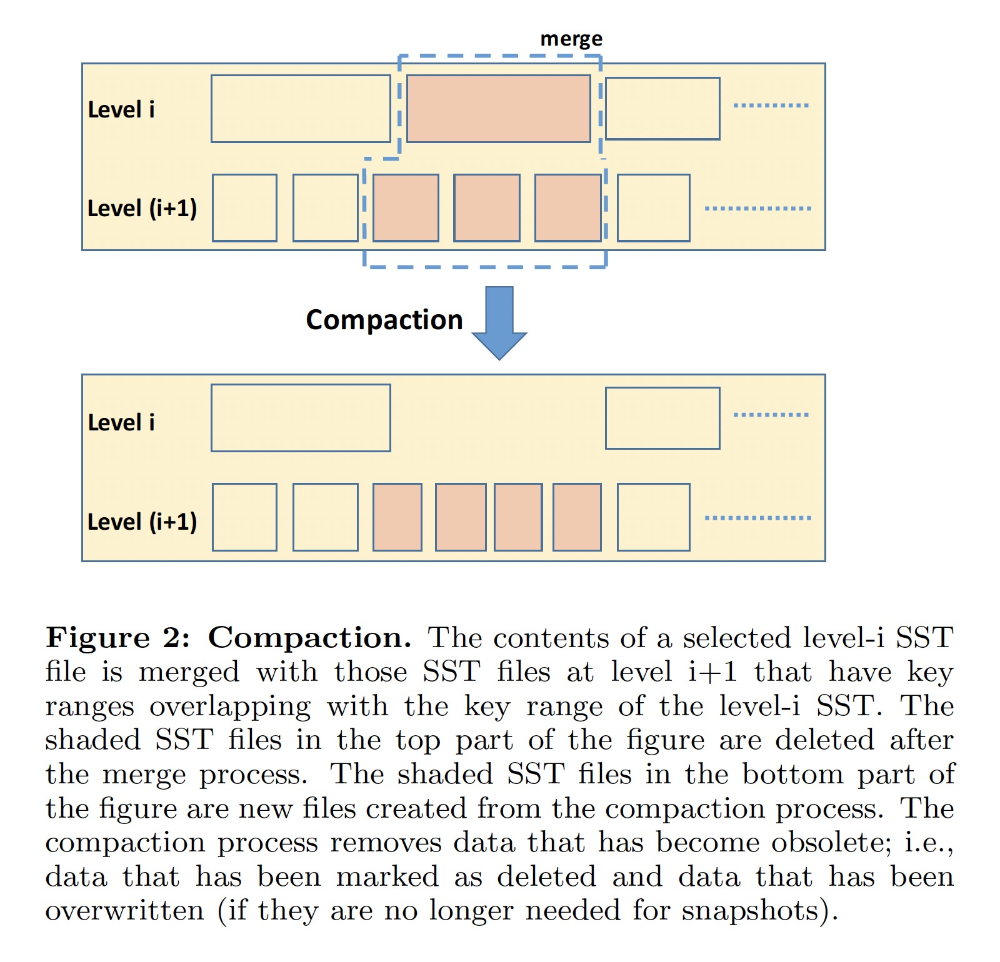

### [Optimizing Space Amplification in RocksDB](../../assets/pdfs/p82-dong-cidr17.pdf)

> CIDR 2017
>
> http://cidrdb.org/cidr2017/papers/p82-dong-cidr17.pdf

RocksDB 是 Facebook 开发的一款高性能嵌入式 kv 存储引擎，它使用 LSM-tree 来获得显著的空间效率及更好的写入吞吐量，同时实现可接受的读取性能。Facebook 拥有全球最大的 MySQL 安装量之一，存储了数十 PB 的在线数据，其实例底层的存储引擎越来越多地从 InnoDB 切换到基于 RocksDb 的 MyRocks。Facebook 使用 RocksDB 的主要目标是
最有效地利用硬件资源，同时确保可以满足所有重要的服务级别要求，包括事务延迟。

Facebook 的业务对数据存储有以下几个需求:

- SSDs are increasingly being used to store persistent data and are the primary target for RocksDB
- Facebook relies primarily on shared nothing configuration of commodity hardware in their data centers, where data is distributed across a large number of simple nodes, each with 1-2 SSDs
- the amount of data that needs to be stored is huge
- the read-write ratio is relatively low at roughly 2:1 in many (but not all) cases, given the fact that large memory-based caches are used extensively

在这样的环境下，InnoDB 在峰值时处理的读写数据量远远低于硬件的处理能力，主要是因为每个节点的查询率很低。如果 SSD 可以存储两倍的数据，那么可以预计存储节点效率将翻倍，因为 SSD 可以轻松处理预期的双倍 IOPS，并且将需要更少的节点来处理工作负载。

RocksDB 为了追求最小的空间放大，需要牺牲一些读放大和写放大。在 `RUM Tradeoff` 理论中，三者是一个不可兼得的三角。RocksDB 使用 LSM-tree 来获取较低的空间放大和写入放大特性。根据 Facebook 的使用经验，Rocksdb 相比 InnoDB 能够平均节省 50% 的存储空间，并且具有更高的写入事务吞吐，在可接受的范围内增加了读取延迟。

#### LSM-Tree

很多知名的系统都使用了 LSM-Tree，如 BigTable、LevelDB、Apache Cassandra、HBase。RocksDB 中 LSM-Tree 的实现可由如下面两张图片概括:

数据写入过程:

1. 数据写入 LSM-Tree 时，首先写入内存中的 memtable 和用于故障恢复的 WAL
2. 当 memtable 的大小达到预订的值时，当前的 memtable 和 WAL 变为 immutable，一组新的 WAL 和 memtable 用来接收后续的数据写入
3. 写满的 memtable 被刷入 SST 文件（L0-SST），完成之后对应的 memtable 和 WAL 被删除
4. 当 L0-SST 文件个数达到阈值（eg., 4）时，触发 L0-SST 和与其 key 值范围有重叠的 L1-SST 进行 compaction
5. 对于 L > 0 的文件，当该层级的所有文件尺寸达到一定的阈值时，一个或多个 SST 文件会被选取与 L+1 层有覆盖的文件进行 compaction

只有 L0 文件之间的 key 值返回会有覆盖，其它 Level 的文件之间的 key 值返回不会有覆盖。

#### Space Amplification

B-tree 的空间利用率相对较低，其页面通常只用了 1/2 ~ 2/3，这种碎片化导致在基于 B-tree 的存储引擎中空间放大要大于 1.5。相比之下，LSM-Tree 没有碎片化的问题，其空间放大主要由未被垃圾回收的陈旧数据量决定。RocksDB 使用两种策略来减少空间放大:

- Dynamic level size adaptation
  - 通过动态调整每个级别的大小是下一级数据大小的 1/10（level size multiplier = 10），可以使得空间放大减小到 1.111...
  - level size multiplier 的值越大，空间放大和读放大越小，但会增加写入放大
- Compression
  - Key prefix encoding: 通过避免写入键的重复前缀可以减少 3% - 17% 的存储空间
  - Sequence ID garbage collection: 大多数 Sequence ID 在相应的快照删除之后不再需要
  - Data compression: 通过对基于 block 的数据进行压缩可以将数据压缩到原始数据的 40% - 25%
  - Dictionary-Based Compression

#### Tradeoffs

- Tiered compression: 压缩能减少所需的存储空间，但会增加 CPU 开销
  - 在最后一层使用强压缩算法（如 zlib 或 Zstandard），即使它会导致更高的 CPU 开销，因为大多数（接近 90%）的数据都位于该级别，但只有一小部分读和写进入它
  - 在 0-2 级不使用任何压缩来获得更低的读取延迟
  - 在 3至最后一级使用轻量级压缩（如 LZ4 或 Snappy）因为它的 CPU 开销是可以接受的，同时减少了空间并写放大
- Bloom filters
  - 布隆过滤器通过为每个 key 维护 10 个 bits 来减少I/O 操作，增加了少许 CPU 开销和内存开销
  - 最后一层不使用布隆过滤器
- Prefix Bloom filters
  - 前缀布隆过滤器用于范围查询
