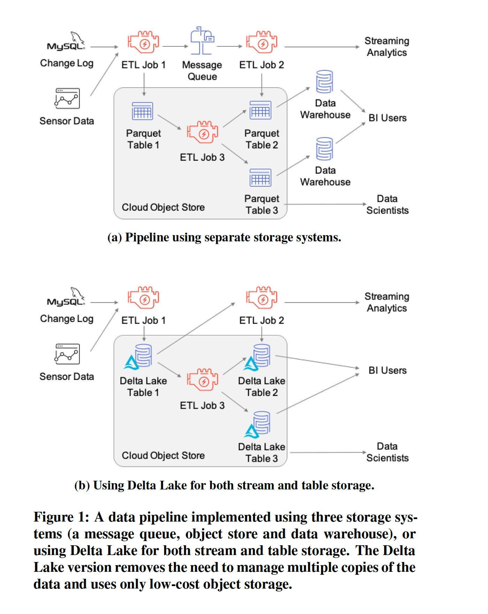
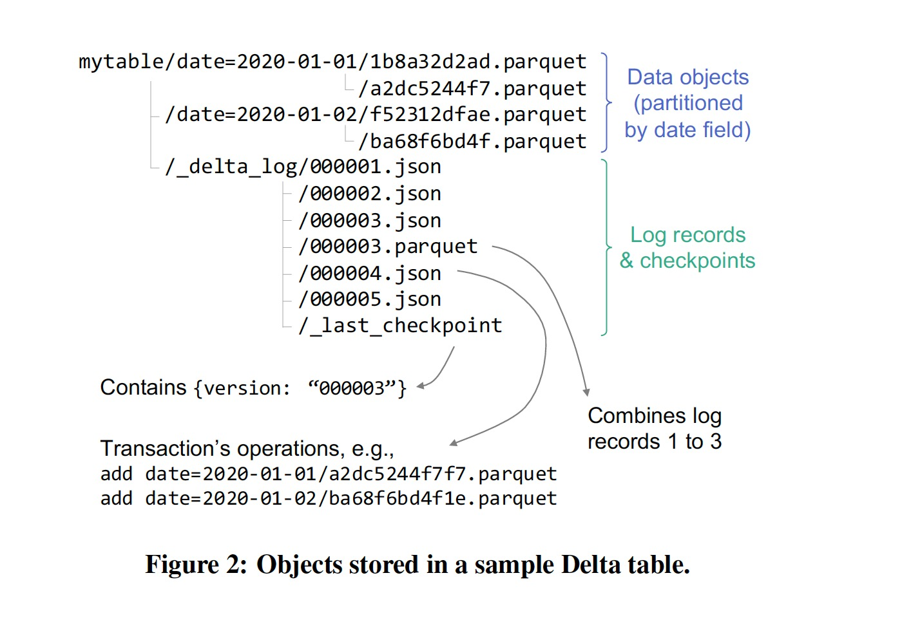

### [Delta Lake: HighPerformance ACID Table Storage over Cloud Object Stores](../../assets/pdfs/delta-lake.pdf)

> Proceedings of the VLDB Endowment, August 2020
>
> https://doi.org/10.14778/3415478.3415560

对象存储（S3，Azure Blob Service）是规模最大且最具成本效益的存储系统，许多组织用它来管理数据仓库和数据湖中的大型结构化数据集。但对象存储的 kv 形态和 immutable 的特性使得在其上实现数据仓库的功能具有一定难度。

存在的两个主要问题:

- correctness: 一个表由多个对象构成，多对象的更新不具备原子性，会出现一致性问题
- performance: 当一个表由百万级对象构成时，元数据操作（如 List）开销非常大

为了解决上述问题，Databricks 设计了 Delta Lake，其核心思想:

> we maintain information about which objects are part of a Delta table in an ACID
> manner, using a write-ahead log that is itself stored in the cloud object store.

基于 ACID 的设计，可以在 Delta Lake 上开发传统 Data Lake 不具有的特性:

- Time travel
- UPSERT, DELETE and MERGE operations
- Efficient streaming I/O
- Caching
- Data layout optimization
- Schema evolution
- Audit logging

这些特性一起提升了对象存储作为数仓和数据湖的可管理性和性能，同时映射了 Databricks 提出的第三代数据分析平台 —— `lakehouse` —— 兼具数仓和数据湖的关键特性，避免了传统部署上湖仓存储冗余数据的问题。Delta Lake 提供的查询接口可以直被 BI 工具使用，见下图:

在对象存储上管理表数据集主要有三种方法:

#### 1. Directories of Files

这种方式把表当做一堆文件对象（just a bunch of objects），可以由多种工具访问，但存在一些挑战:

- No atomicity across multiple objects
- Eventual consistency
- Poor performance
- No management functionality

#### 2. Custom Storage Engines

依赖外部强一致服务（高可用）来管理元数据，典型代表为 Snowflake，存在的问题:

- All I/O operations to a table need contact the metadata service
- Connectors to existing computing engines require more engineering work to implement than an approach that reuses existing open formats such as Parquet
- The proprietary metadata service ties users to a specific service provider

#### 3. Metadata in Object Stores

第一种方式太过粗犷，第二种方式又太过娇嫩，一种折中的方式是把元数据也存到对象存储中，并使用一组预置的协议来实现可串行化。

Delta Lake 的存储格式如下:

`_delta_log` 目录中存储了表的各种元数据，读取操作可以根据 `_last_checkpoint` 文件中 checkPoint ID 来获取最新的快照版本，或者传入一个旧的 checkpointID 来获取一个历史版本；写入操作通过 `copy on write` 的方式完成 ACID 特性。

论文中 Section 3 描述了 Delta Lake 日志内容和 checkpoint 机制，可以结合源码进行深入学习，这里忽略。

为了提高性能，Delta Lake 做了一些优化:

  - OPTIMIZE 命令: 将小文件合并为大小为 1GB 的文件
  - Z-Ordering: 按照给定的属性集以 Z-order 重新组织表中的记录，以实现多个维度的局部性
  - Caching: 缓存部分数据在计算节点以优化查询效率

论文发表时 Apache Hudi 还不支持 Z-Order，现在支持了，见 [Hudi Z-Order and Hilbert Space Filling Curves](https://hudi.apache.org/blog/2021/12/29/hudi-zorder-and-hilbert-space-filling-curves/)。
