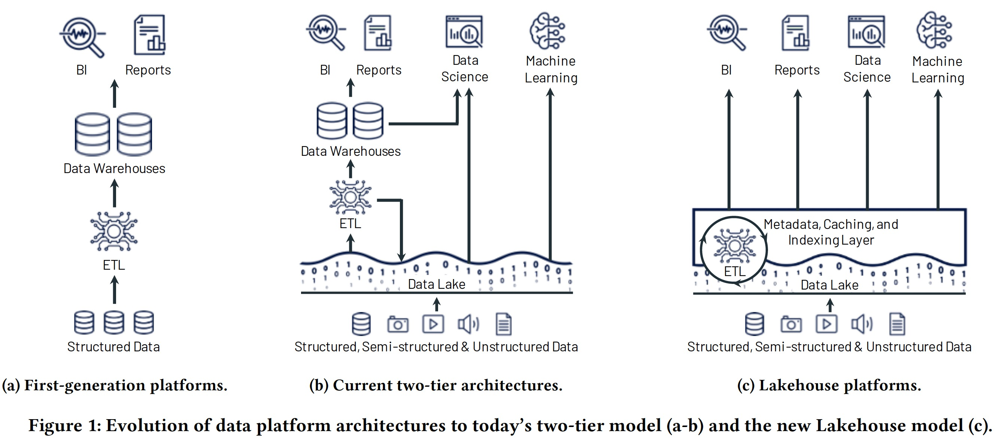
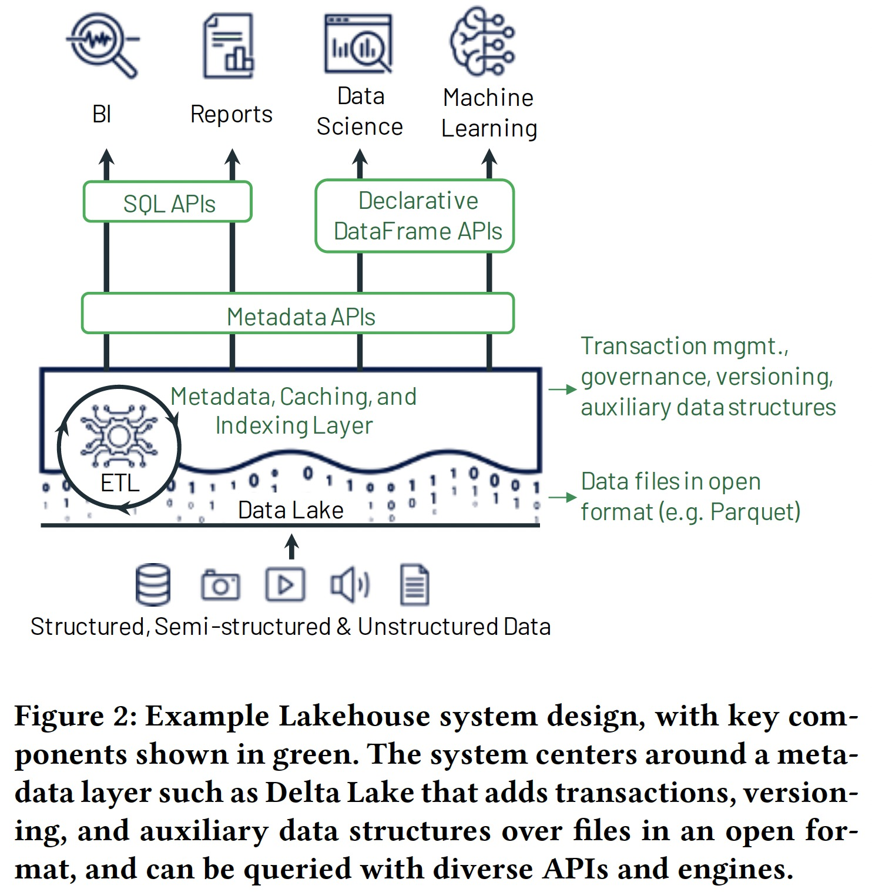

### [Lakehouse: A New Generation of Open Platforms that Unify DataWarehousing and Advanced Analytics](../../assets/pdfs/lakehouse.pdf)

> CIDR 2021. Matei Zaharia, Ali Ghodsi, Reynold Xin, Michael Armbrust
>
> https://dblp.org/rec/conf/cidr/Zaharia0XA21.html

数据分析平台发展历程经历了如下两代:

- 第一代: `schema-on-write`。通过将 [Operational database](https://en.wikipedia.org/wiki/Operational_database) 的数据收集到数仓以支持 Decision Support 及 Business Intelligence。Figure 1-a。
- 第二代: `schema-on-read`。将开放文件格式（如 Apache Parquet 和 ORC）的数据离线存储在成本较低 Data Lake 中（如 HDFS），通过 ETL 操作将一部分数据抽取到数仓后提供 DS 及 BI 的能力。这种架构在提供低成本存储各种数据类型的同时牺牲了数据质量及治理能力。从 2015 年开始，Cloud Data Lake（S3，GCS 等）由于具有极低的成本及优秀的持久性开始替代传统的 Data Lake，逐渐形成了 data lake + data warehouse 的两层架构。Figure 1-b。

两层架构由于存 (如 S3) 算 (如 Redshift) 看起来很便宜，但从用户角度却非常复杂，数据首先需要从 OLTP 数据库 ETL 到 Data Lake，然后再从 Data Lake ETL 到数仓。这种架构主要存在四个问题：

- Reliablity: 多次 ETL 降低了数据可靠性
- Data Staleness: 相比第一代架构数据直接 ETL 到数仓，两层架构反而增加了时延
- Limited support for advanced analytics: 通过 ODBC/JDBC 读取机器学习需要处理大量的 dataset 非常低效，因而高级分析工具受限
- Totol cost of ownship: 数仓中的数据由于在 Data Lake 中也保存了一份，因而增加了存储成本

*两层架构通过增加对 Parquet 和 ORC 外表的支持，可以使用相同的 SQL 引擎查询 Data Lake 上的数据，但这通常具有较差的性能；一些研究将 SQL 引擎（如 Presto）直接运行在 Data Lake 之上，但依然未支持 ACID 事务、多版本等特性。*

由于这些问题的存在，本文讨论的主题围绕一个技术问题展开:

> Is it possible to turn data lakes based on standard open data formats,
> such as Parquet and ORC, into high-performance systems that can
> provide both the performance and management features of data
> warehouses and fast, direct I/O from advanced analytics workloads?

作者认为 Lakehouse（Data `Lake` + Data Ware`house`）湖仓一体的第三代架构的时代即将来临，它具有如下特点：

- Reliable data management on data lakes: 数据以开放格式存放在低成本对象存储，并支持事务、版本管理及零拷贝克隆（如 Delta Lake、Apache Iceberg）等特性
- Support for machine learning and data science: 通过声明式 DataFrame API 支持机器学习和科学计算等负载模型
- SQL performance: 通过维护缓存、Parquet/ORC 文件的辅助数据（Statics/Bloomfilter based index）及优化数据布局（Z-order/Hilbert Curves）来提升查询性能

Databricks 通过 Delta Lake、Delta Engine 和 Databricks ML Runtime 三个项目构建了一个 Lakehouse 数据分析平台。

一个小感想:

Lakehouse 本身并没有提出什么新技术，更像是对已有技术的重新组织，通过提供更低的成本和丰富的特性为用户创造价值。
