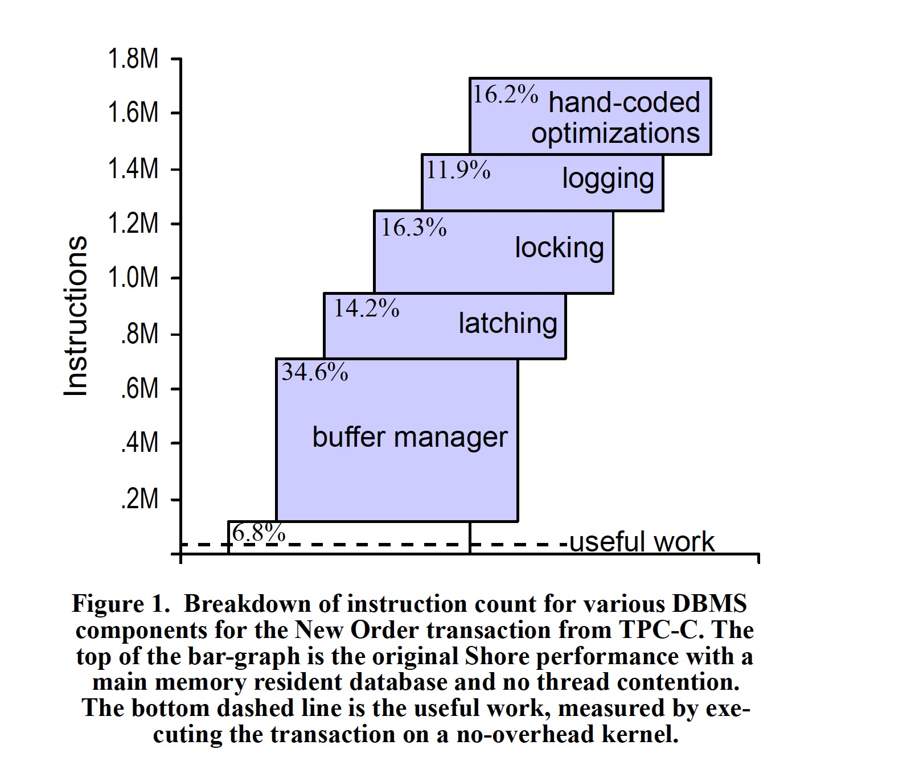

### [OLTP Through the Looking Glass, and What We Found There](../../assets/pdfs/oltp-through-the-lookingglass.pdf)

> SIGMOD '08
>
> https://dl.acm.org/doi/10.1145/1376616.1376713

传统 OLTP 数据库最初设计面向磁盘远大于内存的计算机，且内存价格高昂，这导致数据库往往包含几个标准模块:

- on-disk data structures for table storage, including heap files and B-trees
- locking based concurrency control
- log-based recovery
- an efficient buffer manager

但在今天，内存不再那么昂贵，将整个 OLTP 数据库常驻在内存成为可能。`Main Memory Database Systems` 成为了数据库领域炙手可热的研究课题。

传统数据库中各模块的消耗占比可以对内存数据库的研究提供宝贵的指导方向，本文将 [Shore](https://research.cs.wisc.edu/shore/) 通过依次剥离 Loggling、Locking、Latching、Buffer Manager 等模块，变为了一个单线程、lock-free、不支持失败恢复的内存数据库。得到各模块的指令占比图如下:

可以看出，`useful work` 只占所有指令的 1/60 左右。

根据实验结果，论文给出了未来 OLTP 引擎的实现建议:

- Concurrency Control: 对于内存数据库，OCC 可能是更好的选择
- Multi-core Support: 使用虚拟化技术，使得每一个 core 都是一个 single-threaded machine
- Replication Management: 使用 active-active architecture
- Weak Consistency: 使用 eventual consistency
- Cache-conscious B-trees