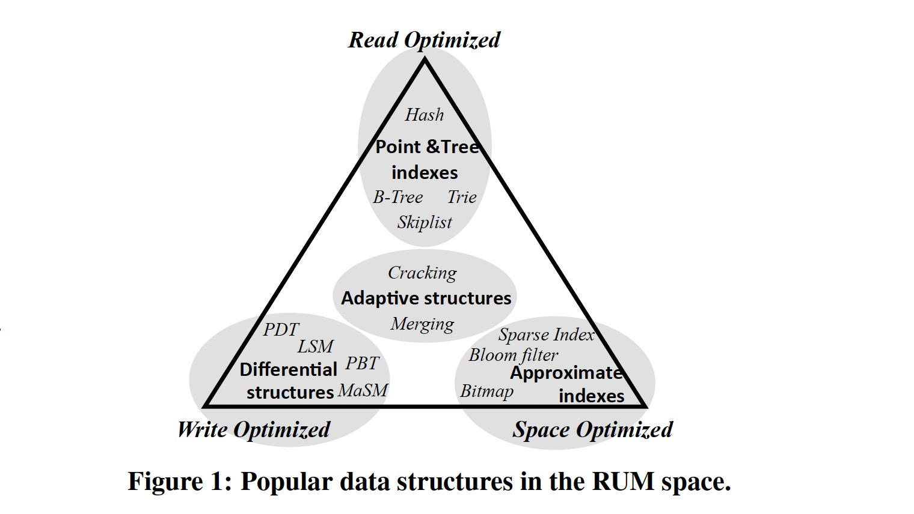
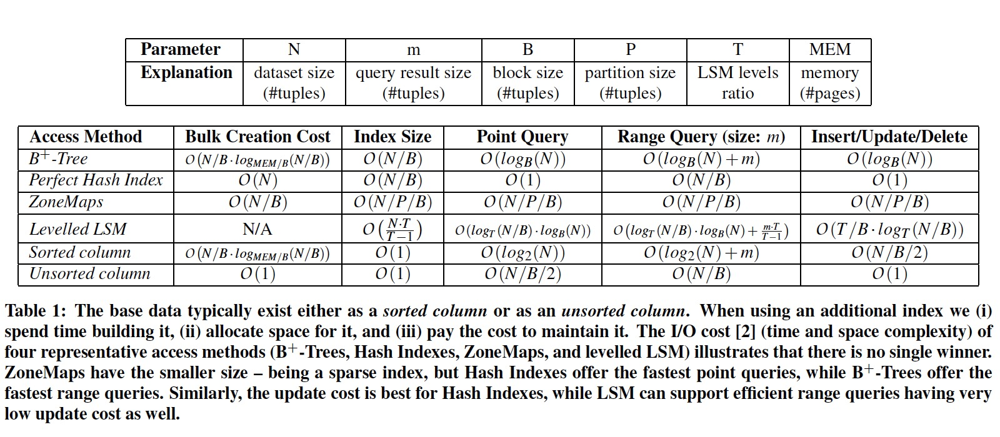

### [Designing Access Methods: The RUM Conjecture](../assets/pdfs/rum.pdf)

> 19th International Conference on Extending Database Technology (EDBT), March 2016
>
> https://stratos.seas.harvard.edu/files/stratos/files/rum.pdf

数据库领域致力于研究存储、访问、更新数据的方法已有 40 余年，不同的数据结构和算法被提出以适应不断变化的硬件和工作负载。随着新的负载要求、新应用程序及新硬件的出现，数据访问方法逐渐趋向于 `application-aware` 和 `hardware-aware`。

在设计数据访问方法的时候总是尝试最小化以下三个开销:

- Read Overhead (RO) —— 也称为 read amplification，即读放大
- Update Overhead (UO) —— 也称为 write amplification，即写放大
- Memory Overhead (MO) —— 也称为 space amplification，即空间放大

本论文提出了 RUM 推测:

> An access method that can set an upper bound for two out of the read, update,
> and memory overheads, also sets a lower bound for the third overhead.

即三者构成一个 competing triangle，下图展示了一些数据结构在该三角中的位置:

论文给出了一些典型数据结构的各种开销数据:

RUM 推测指出完美的数据访问方法不存在，但这并不代表应该停止改进，恰恰相反，应该使用该理论指导数据访问方法的研究，针对不同的应用负载和不同的硬件特性研发不同的数据访问方法。
