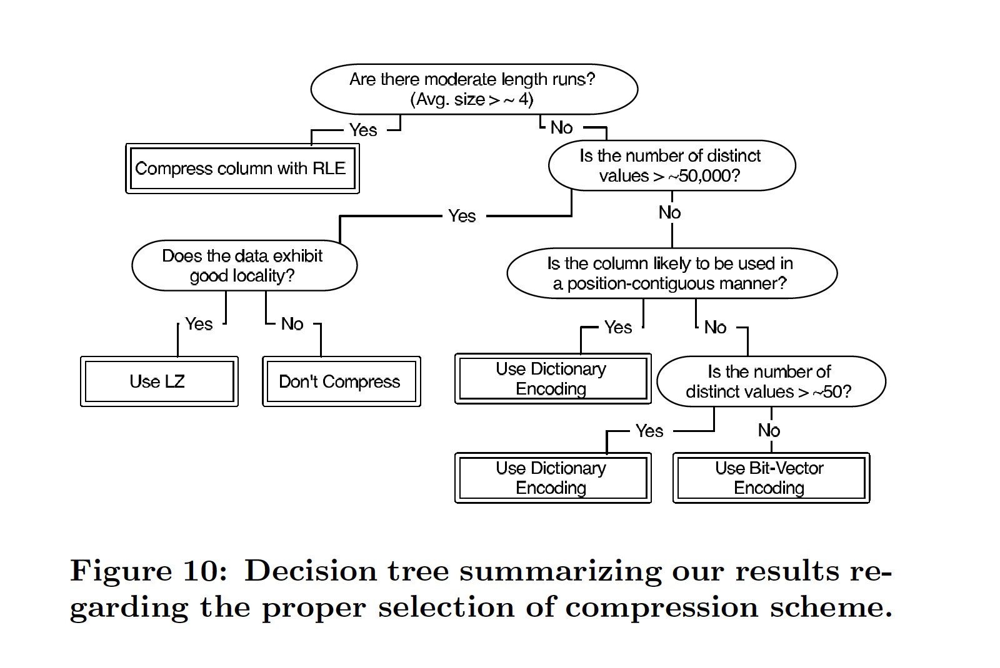

### [Integrating Compression and Execution in Column-Oriented Database Systems](../assets/pdfs/c-store-compression.pdf)

> SIGMOD '06
>
> https://doi.org/10.1145/1142473.1142548

列式存储增加了磁盘上相邻记录的相似性，因此大大增加了压缩算法的用武之地。

> The ability to compress many adjacent tuples at once lowers the per-tuple cost of compression,
> both in terms of CPU and space overheads.

虽然压缩算法在行式存储也常被用到，例如字典编码和 run-length encoding (RLE)，但其压缩比相对列式存储要显得逊色很多。

> Compression ratios are also generally higher in column-stores because consecutive entries in a
> column are often quite similar to each other, whereas adjacent attributes in a tuple are not.

对于定长字段，列式存储还能充分利用 CPU 的超标量特性来加速解压速度。

列式存储的算子能够通过直接操作压缩数据来提升查询性能。

文章对 5 种压缩算法在列式存储上的性能进行了充分的实验对比:

- Null Suppression
- Dictionary Encoding
- Run-length Encoding
- BitVector Encoding
- Lempel-Ziv Encoding

实验对排序数据的 run-length 和 cardinality (NDV, Number of Distinct Values) 进行调整，实验结果见 Section 6，最终根据结果给出了一个决策树，来指导压缩算法的选择。

要想更详细地了解算法实现，[ORC](https://github.com/apache/orc) 的代码是一个不错的参考。
