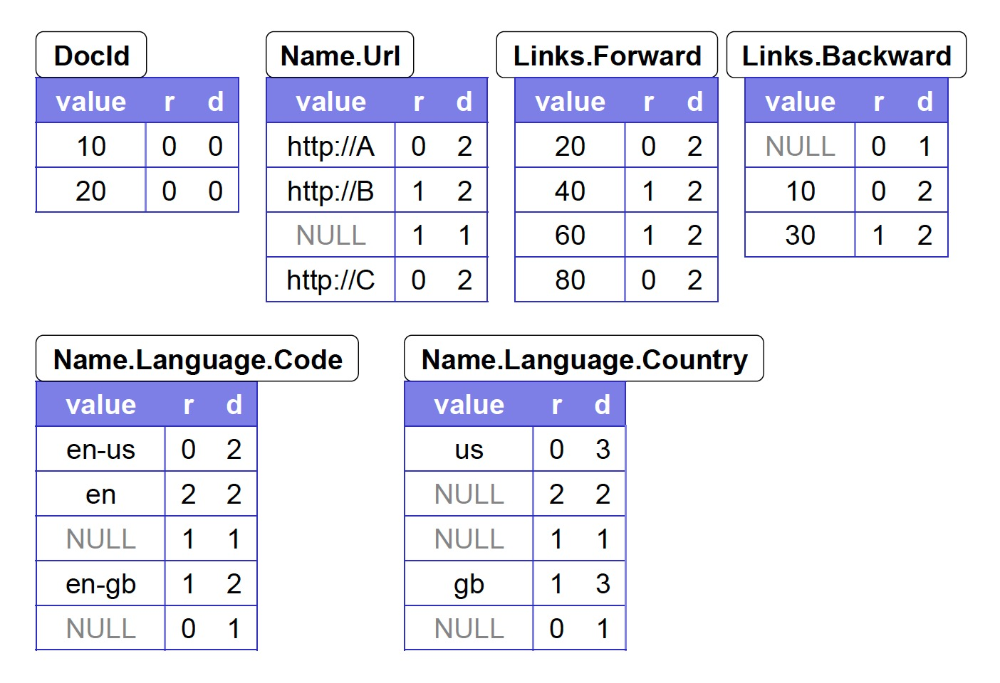

### [Dremel: Interactive Analysis of Web-Scale Datasets](../assets/pdfs/dremel.pdf)

> VLDB 2010
>
> https://dl.acm.org/doi/10.14778/1920841.1920886

Dremel 是 Google 内部使用的一个可扩展、交互式数据分析系统，通过将 **multi-level execution trees** 和**列存数据布局**结合，可以在秒级时间量级执行万亿（trillion）行表的聚集查询。

Dremel 架构借用了分布式搜索引擎 `serving tree` 的概念，查询被下推到树的各个节点并在每一步进行改写，通过聚合从低层收到的回复来组装结果；另外，Dremel 提供了一个 SQL-like 的高级语言来表达 `ad hoc` 查询，不同于 Pig 和 Hive，Dremel 查询不会转换成 MR 任务。

Dremel 使用了列存格式来存储数据，以减少不相关的数据读取和 CPU 消耗（due to cheaper compression）。虽然列存格式在 OLAP 领域并不少见，但 Dremel 开创性地将其扩展到了嵌套数据格式。

### 数据模型

Dremel 的数据模型是基于强类型的嵌套记录，抽象语法:

```txt
t = dom | <A1:t[*|?], ..., An:t[*|?]>

t 是原子类型或一个记录类型，原子类型包括整型、浮点数、字符串等
Ai 为记录的第 i 个字段，其后的 [*|?] 表示其重复类型
    * 表示该字段为 Repeated
    ？表示该字段为 Optional
    无标记则表示该字段为 Required
```

这种语法可以使用 ProtoBuffer 进行表示，PB 序列化后的数据适合用于 RPC，不适合作为下盘格式。这里我们认为 PB 数据为行存格式，下面通过例子描述如何将 PB 的数据转化为 Dremel 的列存格式。

**Schema**

```proto
message Document {
    required int64 DocId;
    optional group Links {
        repeated int64 Backward;
        repeated int64 Forward;
    }
    repeated group Name {
        repeated group Language {
            required string Code;
            optional string Country;
        }
        optional string Url;
    }
}
```

如上的 Schema 非常类似 JSON，理解起来应该不难。除了多重性标记之外，`full path` 的概念跟后面的 Repetition Level 和 Definition Level 有着密切的关系：

| Fild      | Full Path             |
| ----------| --------------------- |
| DocId     | DocId                 |
| Backward  | Links.Back            |
| Language  | Name.Language         |
| Country   | Name.Language.Country |

**两行符合上述 Schema 的记录**

*r1*
```yml
DocId: 10
Links
    Forward: 20
    Forward: 40
    Forward: 60
Name
    Language
        Code: 'en-us'
        Country: 'us'
    Language
        Code: 'en'
    Url: 'http://A'
Name
    Url: 'http://B'
Name
    Language
        Code: 'en-gb'
        Country: 'gb'
```

*r2*
```yml
DocId: 20
Links
    Backward: 10
    Backward: 30
    Forward: 80
Name
    Url: 'http://C'
```

对于这种嵌套模式，如果单纯将同一字段的数据连续存储，不能确定一个数据属于哪条记录。Dremel 引入 `Repetition Level` 和 `Definition Level` 来解决这个问题。

**Repetiton Level** 记录该值在 `full path` 的哪一级进行重复，以 Name.Language.Code 为例，它含有两个可重复字段：`Name` 和 `Language`，因此 `Code` 的 Repetition Level 可取的值为 0,1,2:

- 0 表示一个新行
- 1 表示该值最近的重复级别为 Name
- 2 表示该值最近的重复级别为 Language

对 r1 进行 Repetition Level 标注：
```yml
                  Repetition Level
DocId: 10                   0
Links
    Forward: 20             0
    Forward: 40             1
    Forward: 60             1
Name
    Language
        Code: 'en-us'       0
        Country: 'us'       0
    Language
        Code: 'en'          2
    Url: 'http://A'         0
Name
    Url: 'http://B'         1
Name
    Language
        Code: 'en-gb'       1
        Country: 'gb'       1
```

注意到 r1 的第二个 Name 中没有任何 Code，但为了表示 en-gb 是属于第三个 Name，在 Code 列中插入了一条 NULL(repetition level 为 1)。Code 在 Language 中为 **Required** 字段，所以它为 NULL 隐含了 Language 也为 NULL。因此需要额外的信息来数据属于哪个级别，以避免构造出多余的数据结构。

**Definition Level** 表示了 full path 上的 optional 或 repeated 字段实际存在的个数，对于同列非 NULL 的所有记录，其值是相同的。

对 r1 进行 Definition Level 标注：
```yml
                  Repetition Level      Definition Level
DocId: 10                   0               0
Links
    Forward: 20             0               2
    Forward: 40             1               2
    Forward: 60             1               2
Name
    Language
        Code: 'en-us'       0               2
        Country: 'us'       0               3
    Language
        Code: 'en'          2               2
    Url: 'http://A'         0               2
Name
    Url: 'http://B'         1               2
Name
    Language
        Code: 'en-gb'       1               2
        Country: 'gb'       1               3
```

Definition Level 主要对 NULL 有意义，在恢复数据的时候可以避免恢复出多余的结构。下图是 r1、r2 全量的列存结构：



假设没有 Definition Level，尝试恢复 r1 的数据结构，会得到如下的结果：

读第一行 en-us：
```yml
Document
    Name
        Language
            code: 'en-us'
```

读第二行 en：
```yml
Document
    Name
        Language
            code: 'en-us'
        Language
            code: 'en'
```

读第三行 NULL：
```yml
Document
    Name
        Language
            code: 'en-us'
        Language
            code: 'en'
    Name
        Language
```

读第四行 en-gb：
```yml
Document
    Name
        Language
            code: 'en-us'
        Language
            code: 'en'
    Name
        Language
    Name
        Language
            code: 'en-gb'
```

可以看出第二个 Name 中构造出了 Language，这在 r1 是不存在的。但如果有了 Definition Level，在读取第三行的时候就能知道实际只存在一个字段，也就是 Name，这样在构造的时候就不会构造 Language 结构:

读第三行 NULL：
```yml
Document
    Name
        Language
            code: 'en-us'
        Language
            code: 'en'
    Name
```

在实际的编码中会对上面的结构进行编码以减少不必要的存储空间。至此我们对 Dremel 的列存格式有了一定的了解。论文的附录有记录切分和组装的具体算法，这里不再描述。

### 查询执行

Dremel 使用 `multi-level serving tree` 来执行查询，根节点收到请求，读取 metadata 并据此将请求路由到下一级，直到叶子节点，叶子节点请求存储层或直接访问本地盘获取数据，处理之后逐级汇总到根节点。请求在路由到下一级之前会进行改写。


Dremel 是一个多用户系统，其 query dispatcher 会根据任务优先级和负载均衡进行调度。通过设置返回结果时必须扫描 tablets 的百分比（比如 98%），牺牲一定精确性来换取性能。

Paper 中没有提到索引、连接、数据更新相关的内容。

[Apache Parquet](https://github.com/apache/parquet-format) 的实现参考了 Dremel 的数据模型，[Apache Drill](https://github.com/apache/drill) 的实现参考了 Dremel 的查询模型。