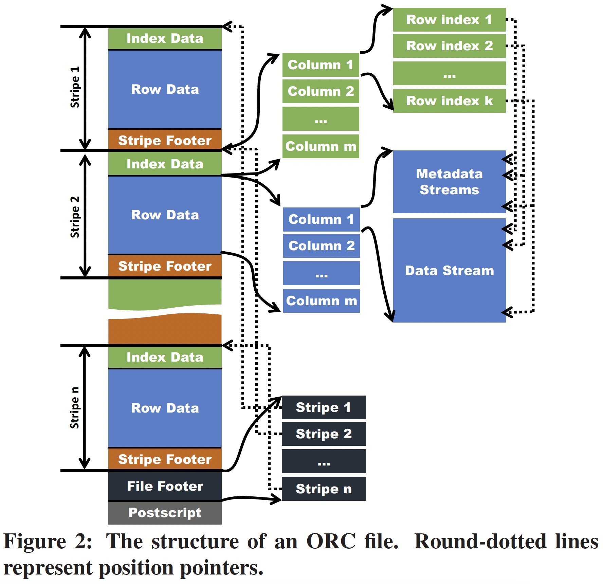

### [Major Technical Advancements in Apache Hive](../assets/pdfs/Major_Technical_Advancements_in_Apache_Hive.pdf)

> SIGMOD 2014
>
> https://dl.acm.org/doi/10.1145/2588555.2595630

Apache Hive 是 Hadoop 生态被广泛使用的数仓系统，随着用量的增大增多，出现了一些短板，主要体现在 `file formats`、`query planning` 及 `query execution` 三个方面。Hive 需要更好的文件格式来充分利用存储空间并加速数据访问；更好的查询优化器及执行器来提高资源利用率及执行性能。

本篇笔记主要关注论文中的 `file formats`，也就是 ORC(Optimized Record Columnar) 相关的内容。

Hive 最初使用两种简单的文件格式：TextFile(plain text data) 和 SequenceFile(binary key/value pairs)，由于这两种存储对存储数据类型不可知（data-type-agnostic）且数据以 one-row-at-a-time 的方式进行存储，数据很难被有效压缩。Hive 0.4 引入的 [RCFile](./rcfile.md) 列存格式在存储效率上有所提升，但其仍然对数据类型不可知且逐行进行序列化，在这种格式下，data-type specific compression 未能被有效利用。另外，RCFile 主要为 `sequential data scan` 而设计，它并未提供任何索引来帮助查询跳过无用数据。文中认为 Hive `file formats` 的两个不足：

- data-type-agnostic file formats and one-row-at-a-time serialization prevent data values being efficiently compressed
- data reading efficiency is limited by the lack of indexes and non-decomposed columns with complex data types

### File Format

为了解决存储和数据访问方面的不足，Hive 设计并实现了一个增强版的文件格式：Optimized Record Columnar File（ORC File）。其 3 个主要改进包括:

- ORC file writer 对数据类型可知，通过增加各种 type-specific 数据编码模式来更有效地存储数据
- 引入各种索引来帮助 ORC reader 查找所需数据并跳过无用数据，从而加速数据访问
- 由于 ORC writer 数据类型可知，可以将复杂类型（如 map）进一步分解

除此之外，ORC 还具有更大的默认 stripe size (RCFile 称为 row group) 并通过 memory manager 组件来防止 ORC writer 耗尽内存。

ORC 文件的结构示意图如下，我们借助此图从 `Table Placement Method`、`Indexes` 和 `Compression` 三方面对 ORC 进行介绍。

#### The Table Placement Method

当一个表存储为 ORC 文件时，它首先被水平切分成多个 `stripe`，在每个 stripe 中，数据按照 column by column 的方式存储，这跟 RCFile 保持了一致。同一个 stripe 的所有列的数据存储在同一个文件。从 Table Placement Method 的角度看，ORC 相对 RCFile 有三个改进：

1. ORC 提供的默认 stripe size 为 256MB，而 RCFile 默认为 4MB，更大的 stripe size 具有更好的读取效率
2. ORC 可以将复杂类型进一步分解成 column tree，其中间节点存储为 metadata stream，叶节点存储为 data stream
3. ORC 用户可以选择将 stripe 的边界与 HDFS block 的边界对齐，以避免将一个 stripe 存储在两个 HDFS block

我作为读者的一些疑惑及解答:

1. RCFile 选择 4MB 是由于 Lazy Decompression，本文认为但在 Hive 中，Lazy Decompression 减慢了 execution pileline，这在后文的 Qeury Execution 一节中提到
2. 对分解之后的复杂类型如何重构为一行没有进行说明，这可能需要具体阅读相关源代码

#### Indexes

ORC File 设计了两种稀疏索引 —— Data Statics 和 Position Pointers。

Data Statics 被 ORC Reader 用来避免从 HDFS 读取不必要的数据，这些数据由 ORC Writer 在生成一个 ORF file 时创建，通常包括 min/max/sum、length 等数据。Data Statics 在 ORC File 中分为三级：

- File Level: 该级别的数据记录在文件结尾，通常用于查询优化及回答简单的聚合查询
- Stripe Level: 对 Stripe 中的每一列值都存储了相应的数据，可以用来跳过非必要的数据访问
- Index group Level: stripe 中的每一列可以组成多个 index group，默认每 10,000 行数据构成一个 index group，ORC 提供了 index group 级别的 data statics，从而可以更细粒度的跳过不需要的数据。

Position Pointers 为 ORC Reader 有效读取数据提供了两种数据位置指针:

1. start points of every index group in metadata streams and datastreams
2. starting point of a stripe

#### Compression

ORC 使用了两级压缩模式，一个流首先根据其数据类型进行编码，然后再使用通用压缩算法进行压缩（第二步可选）。对于一列数据，它可以被存储在一个或多个（复杂类型）流，流分为四种类型：

- Byte Stream
- Run Length Byte Stream
- Integer Stream
- Bit Field Stream

不同类型的数据可以使用不同的编码方式，文中只介绍了 Int 类型和 String 类型如何将编码对应到上面的四种类型，更详细的实现需参考 Hive 源码。在如上编码之后，用户可以选择使用通用压缩算法如 ZLIB，Snappy 或 LZO 对流进行进一步压缩。

#### More Readings:

[1] [Create a new Optimized Row Columnar file format for Hive](https://issues.apache.org/jira/browse/HIVE-3874) 
[2] [ORC File Intro](../assets/ppts/OrcFileIntro.pptx) 
[3] [Evolving Draft for ORC Specification v2](https://orc.apache.org/specification/ORCv2/)