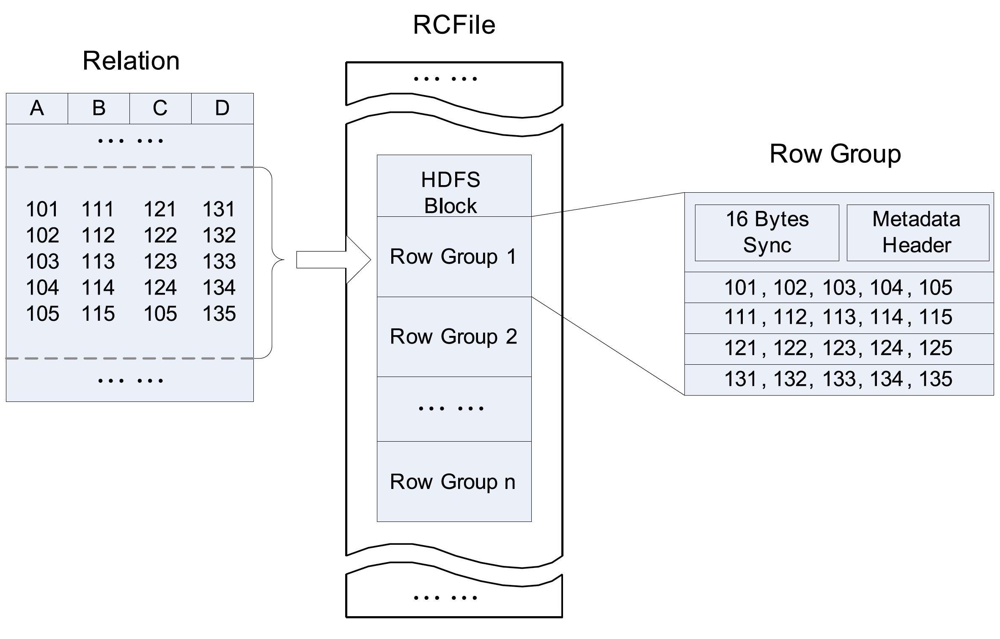

### [RCFile: A fast and space-efficient data placement structure in MapReduce-based warehouse systems](../assets/pdfs/RCFile.pdf)

> IEEE 27th International Conference on Data Engineering, 2011
> 
> https://ieeexplore.ieee.org/document/5767933

基于 MapReduce 的数仓系统在大数据分析领域扮演着一个非常重要的角色，在这样的系统中 `data placement structure` 是影响数仓性能的关键要素。作者根据对 Facebook 生产系统的观察与分析，总结了 `data placement structure` 需要满足大数据处理的四个要求:

1. Fast data loading
2. Fast query processing
3. Highly efficient storage space utilization
4. Strong adaptivity to highly dynamic workload patterns

文章对三种在传统数据库系统接受度甚广的数据格式 —— row-stores, column-stores, hybrid-stores —— 基于 MapReduce 使用场景分析了它们不适合分布式大数据分析系统的原因，并提出了一种新的数据格式 RCFile(Record Columnar File)。

### Horizontal Row-store

row-store 将一行记录的所有字段按照表的定义逐一顺序存放在磁盘页:


行存对于只读的数仓系统的弱点已经被充分讨论过，包括：

- 对于只关心少数几个列的查询，行存不能减少无用列的读取，因而很难提供快速的查询
- 各列不同类型的数据混合存储使得行存很难获得较高的压缩比（虽然有研究指出通过结合`熵编码`和`列相关性`能够为行存提供优于列存的压缩比，但解压会消耗更多的资源）

**行存满足大数据处理四个要求中的 1、4**

### Vertical Column-store

在数仓系统中广泛被使用的读优化的列存格式分为两种，一种是将每一列作为一个 `sub-relation` 单独存储，典型代表如 `Decomposition Storage Model(DSM)` 和 MonetDB；另一种将关系中的所有列组合成多个的 `column group`，并且允许不同 `column group` 之间有 overlap，典型代表如 `C-store` 和 Yahoo Zebra。文中称第一种模式为 `column-store`，将第二种模式称作 `column-group`。

`column-group` 模式中单个 `group` 的数据组织方式依赖具体实现，C-store 中每个 group 采用 `column-store`，而 Zebra 中的每个 group 则采用行存存储。下图是一个 `column-group` 的示例：


`column-store` 能够避免读取无用列的数据，并能提供较高的压缩比。但在 HDFS 中，不同列的数据不能保证存储在同一个 DataNode 上，因此重构数据时存在大量网络开销。

`column-group` 的每个 group 相当于一个物化视图，可以避免数据重构的网络开销，但由于预先设计好的 projection 只对有限的查询语句有效，因此不支持 `highly dynamic workload`。而且由于 `column-group` 的数据存在 overlap，难免会造成数据空间的膨胀。

**`column-store` 满足大数据处理四个要求中的 1、3、4**

**`column-group` 满足大数据处理四个要求中的 1、2**

### Hybrid Store: PAX

PAX 使用了一种数据混合放置的策略，同一行数据的各字段仍然存储在同一个磁盘页，只是将该磁盘页的多行记录进行了重新组织，各个列的值连续存储在 mini-page 中，并在 page header 中存储 mini-page 的指针。

PAX 的主要目的是为了提高 CPU 缓存命中率（减少 false sharing），鉴于以下三点原因，它不能满足较高的存储空间利用率及快速查询：

1. 数据未进行压缩
2. 由于单个磁盘页存储的数据内容不变，PAX 不能消除无用列的磁盘读 I/O
3. PAX 使用 fixed page 作为数据记录组织的基本单元

**PAX 满足大数据处理的四个要求中的 1、4**

### RCFile

RCFile 在设计上借用了 PAX 的理念：`First horizontally-partion, then vertically-partion`。其实现在 HDFS 之上，表的数据布局：

1. 一个表有多个 HDFS blocks
2. 在每个 HDFS block 中，按照 row group 为基本单元对记录进行组织，根据 row group size 和 HDFS block size，一个 HDFS block 可以对应一个或多个 row group
3. 每个 row group 包含三个分区: sync marker、metadata header、table data



RCFile 使用 Run Length Encoding 对 metadata header 进行压缩，table data 的数据各列数据使用 Gzip 进行独立压缩（A future work: 根据不同类型自动选择最佳的压缩算法）。

RCFile 数据追加写的方式总结如下：

> 1) RCFile creates and maintains an in-memory column holder for each column. When a record is appended,
all its fields will be scattered, and each field will be appended into its corresponding column holder. In
addition, RCFile will record corresponding metadata of each field in the metadata header.
>
> 2) RCFile provides two parameters to control how many records can be buffered in memory before they are
flushed into the disk. One parameter is the limit of the number of records, and the other parameter is the limit
of the size of the memory buffer.
>
> 3) RCFile first compresses the metadata header and stores it in the disk. Then it compresses each column holder
separately, and flushes compressed column holders into one row group in the underlying file system.

RCFile 可以根据查询语句的需要只读取 row group 中所需要的列。假设 tbl 有四列数据（c1, c2, c3, c4），如下语句只需读取并解压 c1 和 c4 列

```sql
select c1 from tbl where c4 = 1
```

当一个 row group 中没有满足 c4 = 1 的记录时，甚至不需要读取 c1 列，这被称为 `Lazy Decompression`。row group size 的大小也会影响 Lazy Decompression 的有效性，因为当 row group size 比较大时，命中满足条件的行的几率会更大，从而使得 Lazy Decompression 更容易失效。

row group size、压缩率、Lazy Decompression 之间的关系存在 trade off，文中使用数据进行了佐证。

**RCFile 满足大数据处理的四个要求中的 1、2、3、4**

#### More Readings:

[1] [RCFile vs. ORC](https://www.youtube.com/watch?v=1rOSia_r8hI) from Hadoop In Real World