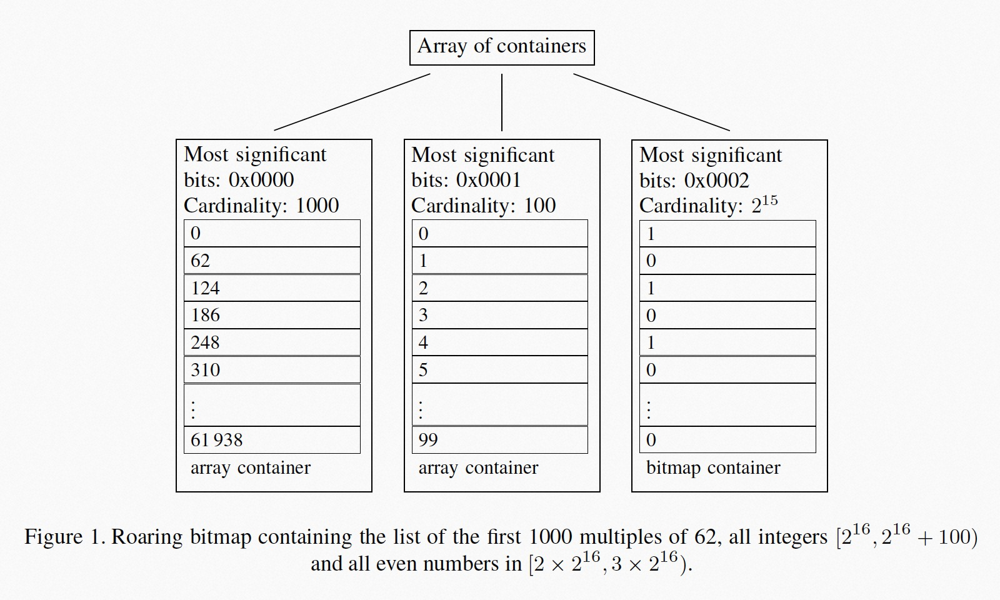

### [Better bitmap performance with Roaring bitmaps](../../assets/pdfs/better-bitmap-performance-with-Roaring-bitmaps.pdf)

> Software: Practice and Experience Volume 46, Issue 5, pages 709-719, May 2016
>
> https://arxiv.org/abs/1402.6407

bitmap 常被用作数据库和搜索引擎的索引，通过比特级别的并行，可以显著加速查询。但稀疏的 bitmap 可能会占用非常多内存，很多数据结构通过压缩来减少内存使用，如 WAH(Word Aligned Hybrid compression scheme) 和 Concise(Compressed 'n' Composable Integer Set)，而且它们大都跟随 Oracle 的脚步，使用 RLE 来压缩 bitmap。不同于这些结构，Roaring bitmap 使用 packed array 来压缩 bitmap。

当 bitmap 的基数（Cardinality，后用 S 表示）所占 bitmap 位数 n 较大时，即 |S| > n/64 时，使用未压缩的 bitmap 通常优于 arrays、hash sets、trees 等数据结构，当 n/10000 < |S| < n/64 时，压缩的 bitmap （如 Concise）通常为更合适的选择。

Roaring bitmap 将 32-bit 的索引（[0,n)） 进行分区，每个 chunk 代表的所有值其高 16 相同。使用不同的容器来表示该 chunk 中所存储数值的低 16 位。当 chunk 中的值不多于 4096 个时，使用排序的 16-bit 整型数组来表示，当多于 4096 个数值时，使用 2^16 位的 bitmap 来表示。

> Thus, we have two types of containers: an array container for sparse chunks and a bitmap container for dense chunks.

4096 为界限保证了在 container 层面，每个数值占用的内存不超过 16 bits。

> we either use 2^16 bits for more than 4096 integers, using less than 16 bits/integer, or else we use exactly 16 bits/integer.

容器存储在一个动态变化的有序数组中，根据容器的高 16 位排序，作为 roaring bitmap 的一级索引。当 n = 1000 000 时，一级索引只需保存 16 个 entries，这使得该结构可以常驻在 CPU 缓存。一个简单的例子如下图：

该结构的存取操作和逻辑操作涉及到两种容器之间的转换，算法并不复杂，但有很多可以优化的点，详见论文。

#### References:

[1] [Engineering Fast Indexes for Big Data Applications](https://www.youtube.com/watch?v=ubykHUyNi_0) 
[2] [Engineering Fast Indexes for Big Data Applications(deep dive)](https://www.youtube.com/watch?v=1QMgGxiCFWE) 
[3] [Roaring Bitmaps publications](http://roaringbitmap.org/publications/)