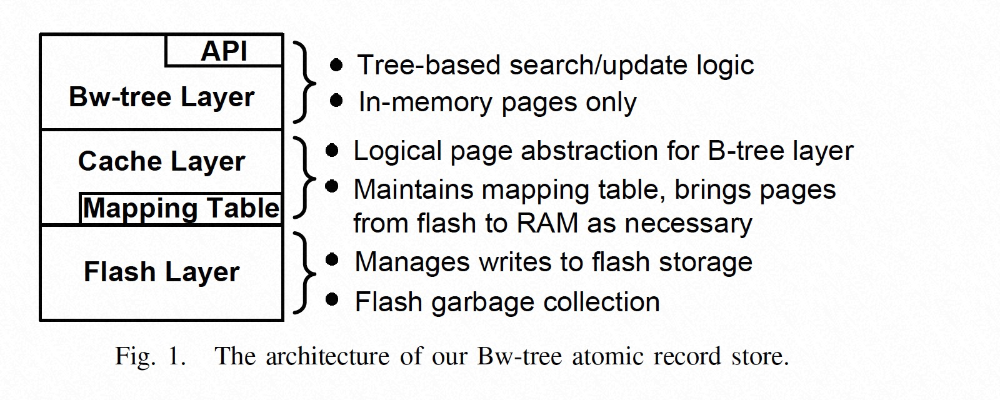
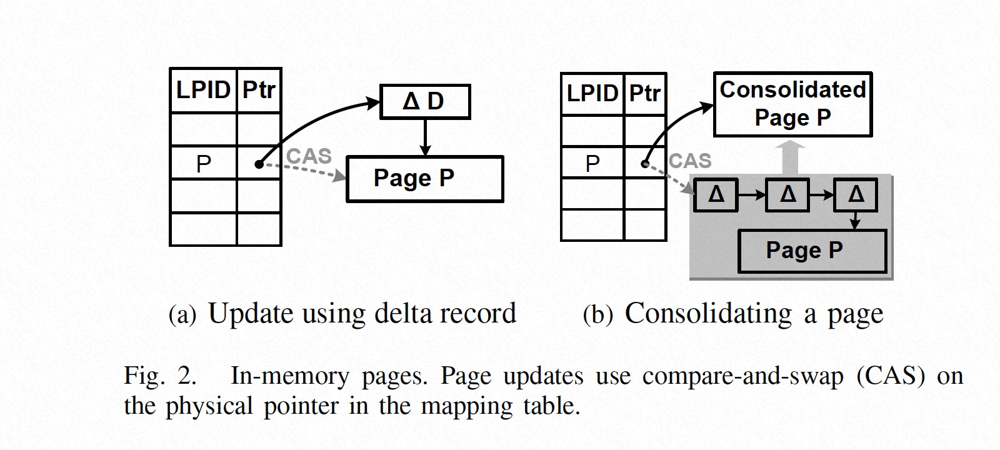
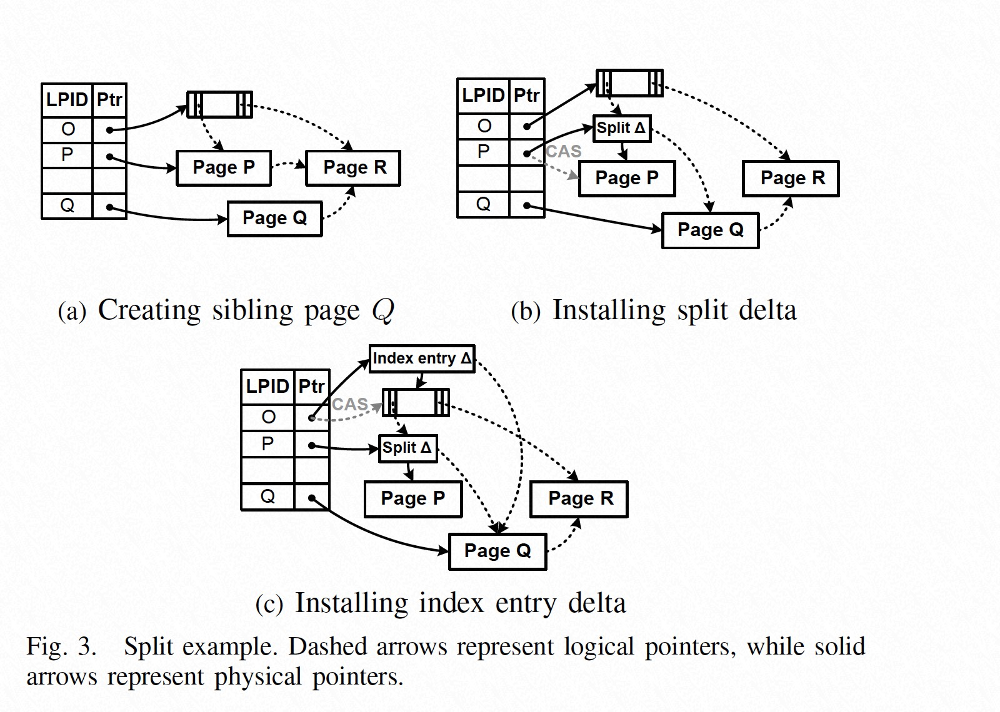
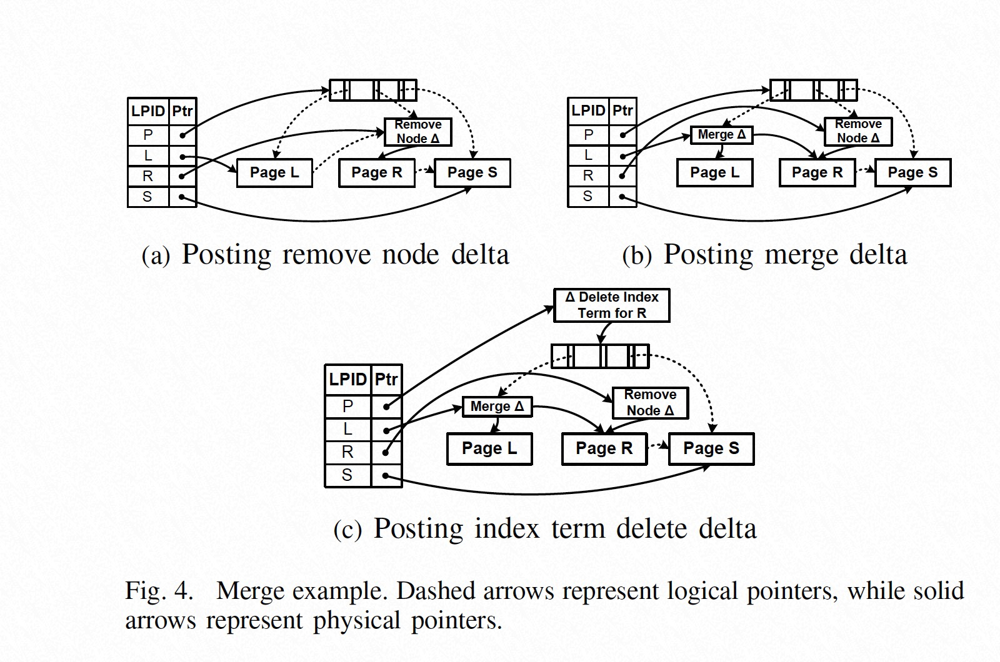

### [The Bw-Tree: A B-tree for New Hardware Platforms](../../assets/pdfs/bwtree-icde2013.pdf)

> ICDE 2013
>
> https://ieeexplore.ieee.org/document/6544834

数据库系统大多还在使用 70 年代针对硬盘和单核 CPU 设计的架构，然而新的硬件平台大多使用了 multi-core cpu 和 ssd 存储设备，如何榨取新硬件平台的极致性能是一个重要的研究话题。Bw-tree 就是这样一种为新硬件平台设计的索引结构。

#### Architecture

Bw-tree 在很多方面都与经典的 B+ tree 非常相似，它提供 O(logn) 的点查及线性的范围查询，上图中的 *Bw-tree Layer* 提供了增删改查的接口，同时与中间的 *Cache Layer* 进行交互。

*Cache Layer* 作为内存数据库的缓存，与下层的 LSS (Log-structured store) 进行数据交换以保证系统的一致性的同时，还维护了一个 Bw-tree 特有的 *Mapping Table* 结构来将逻辑页号（Logic Page Id, PID）映射到具体的物理内存地址或 SSD 偏移。

> The mapping table severs the connection between physical
location and inter-node links. This enables the physical location
of a Bw-tree node to change on every update and every
time a page is written to stable storage, without requiring that
the location change be propagated to the root of the tree.

#### In-Memory Latch Free Pages

Bw-tree 的节点中存储的信息与 B+ tree 很相似，非叶子节点存储了（seperator key, pointer），叶节点则存储了（key, record），除此之外，页面还存储了 1) **low key** 2) **high key** 3) 指向右兄弟的 **side link key**。

Bw-tree 不同于 B+ tree 的设计在于:

1. 页面中存储的 pointer 是逻辑页面（PID），通过 mapping table 进行转换，且页面大小不固定
2. 页面不允许 in-place update，需通过将 **delta record** prepend 到页面来进行修改

一个更新操作首先需要创建一个 delta record，该记录指向该页面的当前地址，然后通过 CAS 操作将 mapping table 的物理地址修改为 delta record 的地址，CAS 能使得只有一个更新操作成功。在多次更新操作之后，一个物理页面由一个 **base page** 和一条 **delta chain** 构成。delta chain 过长会影响查询性能，因此需要在达到一定阈值之后进行 **consolidation**，即创建一个 `re-organized` 的 base page 并通过 CAS 将 mapping table 中的指针改为新 base page 的地址。

#### Structure Modifications

通 B+ tree 一样，当页面大于或小于一定阈值时，Bw-tree 也需要对节点进行 split 或 merge 操作。Bw-tree 的 Split 和 Merge 操作同样使用了 CAS 操作。

`Node Split` 分为 **Child Split** 和 **Parent Update** 两步，`Node Merge` 分为 **Marking for Delete**、**Merging Children** 及 **Parent Update** 三步，其图示如下，具体描述论文里很清楚，这里不再描述。

**Node Split**

**Node Merge**

