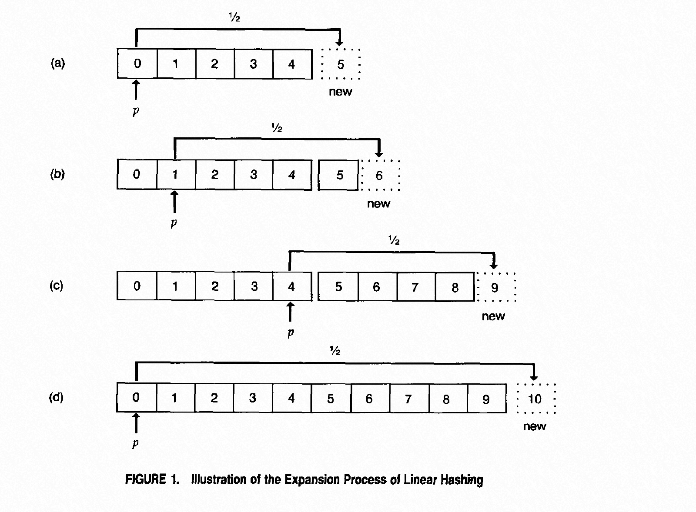
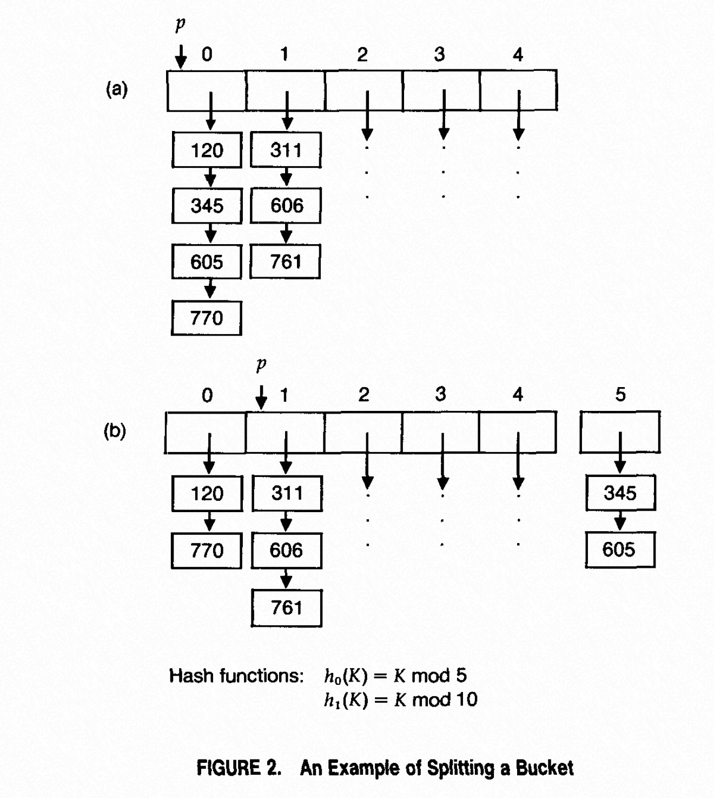

### [Dynamic hash tables](../../assets/pdfs/dynamic_hash_tables.pdf)

> Communications of the ACM, April 1988
>
> https://dl.acm.org/doi/10.1145/42404.42410

本文介绍了两种动态哈希模式：Linear Hashing 和 Spiral Storage。

#### Linear Hashing

在 load factor 超过阈值时，只对一个 bucket 进行分裂，以减少 rehashing 的时间。



哈希表维护两个变量来代表其当前状态：

- L: 哈希表 bucket 数目翻倍的次数（L >= 0）
- p: 指向下一个要分离 bucket （0 <= p <= N x 2^L，其中 N 是哈希表初始 bucket 个数）

用来确定一个键 K 所在 bucket 位置的哈希函数为：

> hj(K) = g(K) mod(N x 2^j),  j=0,1,...

其中 g(K) 可以为任意可以打散数据的哈希函数。一个例子：



上图的 hash table 扩展之前的状态为 L=0, p=0，使用 hL+1(K) 将 p 指向的 bucket 进行分裂，然后使用如下公式更新 L 和 p 值：

```
p := p + 1;
if p = N x 2^L then begin
    L := L + 1;
    p := 0;
end;
```

在查找一个 K 时，定位其所在 bucket 使用的公式为：

```
addr := hL(K);
if addr < p then addr := hL+1(K);
```

#### Spiral storage

没详细看。

论文的实验结论:

> For applications where the cardinality of the key set is known in
> advance, the best performance is obtained by a traditional
> fixed-size hash table. For applications where the cardinality
> of the key set is not known in advance,
> linear hashing gives the best overall performance.