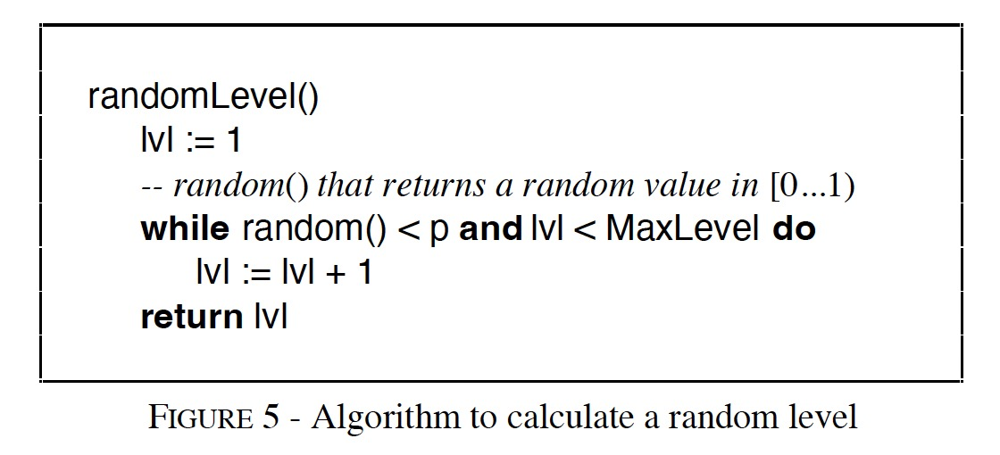
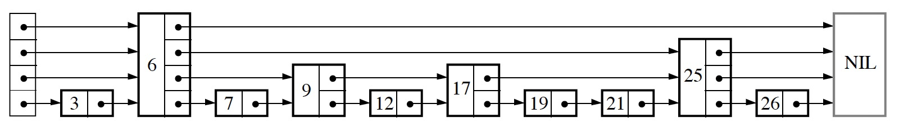
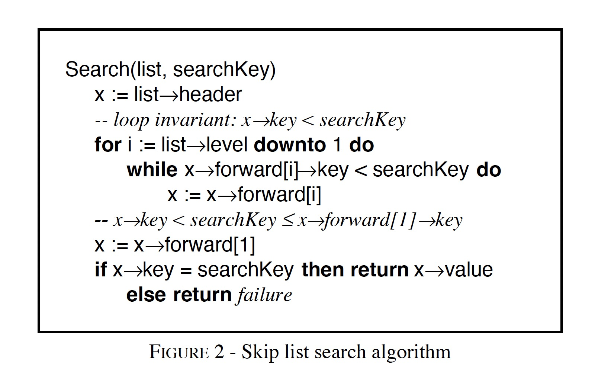
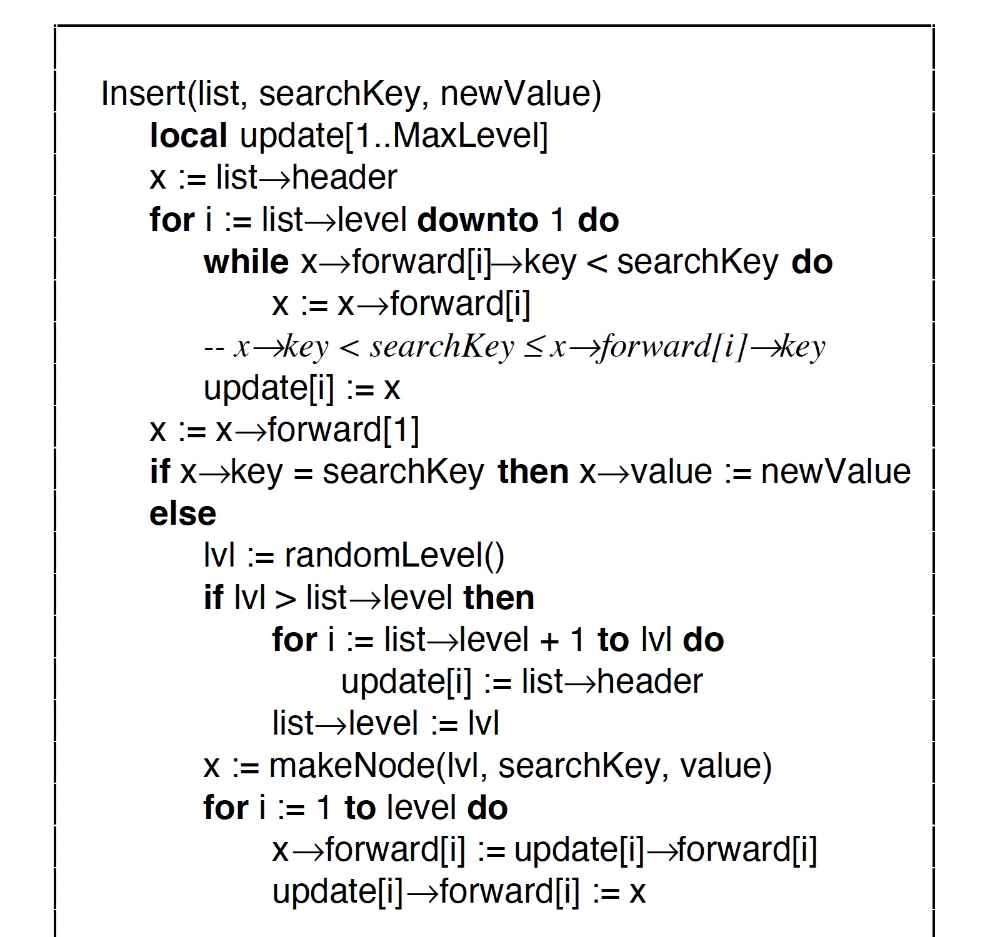
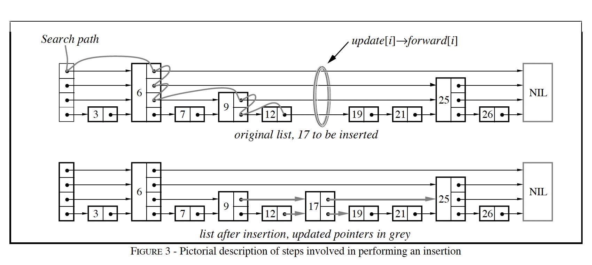
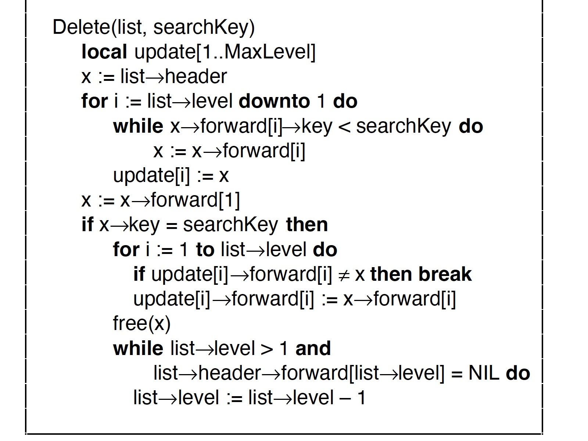
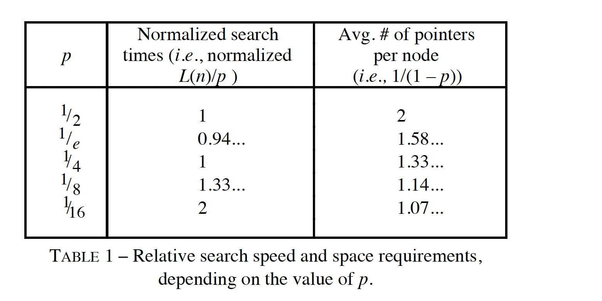
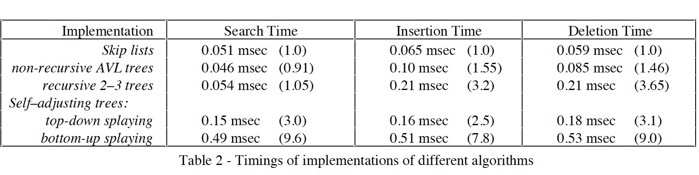

### [Skip lists: a probabilistic alternative to balanced trees](../assets/pdfs/skiplists-cacm1990.pdf)

> Communications of the ACM, June 1990
>
> https://dl.acm.org/doi/10.1145/78973.78977

> Skip lists are a data structure that can be used in place of balanced trees.
>
> Skip lists use probabilistic balancing rather than strictly enforced balancing
and as a result the algorithms for insertion and deletion in skip lists are
much simpler and significantly faster than equivalent algorithms for
balanced trees.

跳表是可以用于替代平衡树结构的一种更简单、易于实现的数据结构，RocksDB 用它实现 memtable。

#### 算法描述

跳表中的元素使用 Node 表示，每个 Node 都有对应的 Level，其值是在元素插入跳表时通过查询随机数生成器决定的。

跳表的最大 Level 由其元素个数上限 N 决定，如果 p = 1/2，那么 MaxLevel = 16 的跳表可以容纳 2^16 个元素。

跳表的最后一个元素为 NIL，其 key 值大于任意元素的 key，任意 Level 的结尾都指向 NIL。

**Search Algorithm**

**Insertion Algorithm**

插入一个元素的图示:

**Deletion Algorithm**

#### p 值的选择

> Since some of the constant overheads are related
to L(n) (rather than L(n)/p), choosing p = 1/4 (rather than
1/2) slightly improves the constant factors of the speed of the
algorithms as well. 
>
> I suggest that a value of 1/4 be used for p
unless the variability of running times is a primary concern, in
which case p should be 1/2.

#### 与平衡树的性能对比

