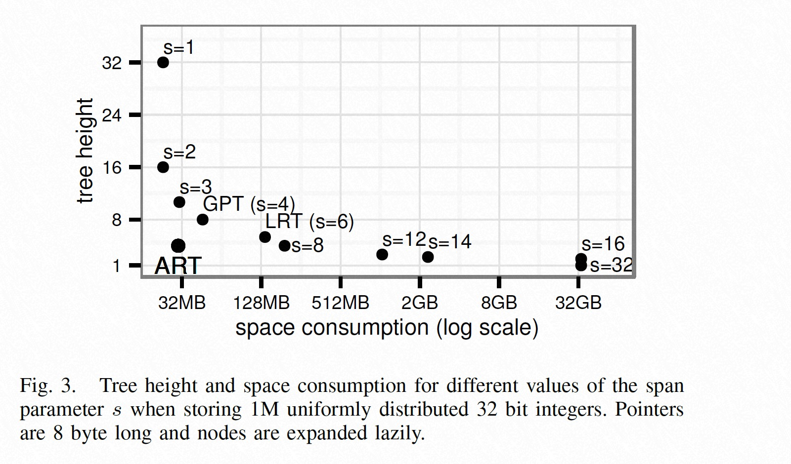
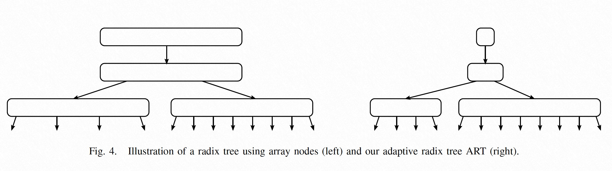
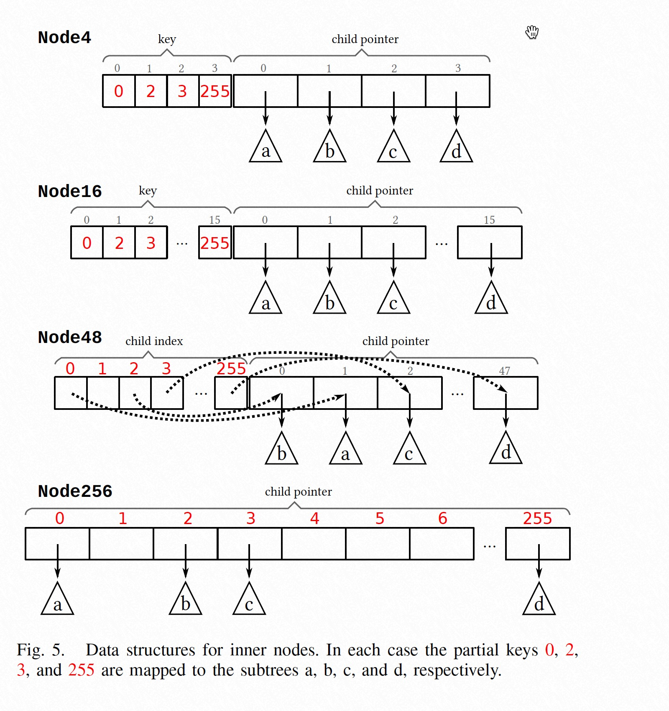
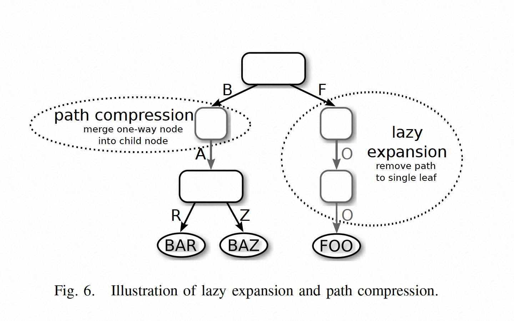

### [The Adaptive Radix Tree: ARTful Indexing for Main-Memory Databases](../../assets/pdfs/ART.pdf)

> ICDE 2013
>
> https://ieeexplore.ieee.org/document/6544812

Radix Tree，又叫做 Prefix Tree 或 Trie，通常被用作字符串的索引，具有以下特点：

- 树的高度（和复杂性）取决于 key 的长度，而非树中元素的个数
- 不需要对树进行 rebalance，同样的数据集以任何顺序插入都得到一样的树
- keys 按照字典顺序存储
- 从树根到叶子的路径隐式地代表了 key，因此可以根据路径重构出 key

在实现 Trie 的时候，需要选择 span 值（即用几个 bit 决定其下一级子节点个数，后用 s 代表）的大小，当 s 较小时，树高相对较高，但由于不存在空间浪费，其消耗的空间较小；当 s 较大时，树高相对较低，但存在一些节点的子节点很少，造成空间的浪费，进而使得索引的内存消耗很大。这是由于传统的 Trie 在选定了 span 之后，其 fanout 就固定了。

> trie height = ⌈k/s⌉
> 
> fanout = 2^s

而 ART 则是在选择了较高 span 值（s = 8）的前提下，提供了四种不同 fanout 的节点，这样能够在保留 Trie 较低树高的前提下节省了空间使用，从上图中可以看出，ART 的树高与 s=8 的前缀树树高相同，但其内存消耗却只相当于 s=3 的前缀树。下图展示了 ART 的设计思想：

ART 使用了四种 Inner Node 结构和 Leaf Nodes，Inner Nodes 的结构如下图：

ART 还使用了 lazy expansion 和 path compression 来进一步缩小存储空间：

论文中虽然描述了算法的伪代码，但非常推荐结合 [libart](https://github.com/armon/libart) 代码一起看。

另外一个值得说明的一点，不同于直接比较 key 的数据结构（hash or comparison-based search trees），要想将 trie 用作通用的索引结构，还需要将 key 转化为 `Binary-comparable key`。

> Keys stored in radix trees are ordered bitwise lexicographically.
> For some data types, e.g., ASCII encoded character strings, this yields
> the expected order. For most data types this is not the case.
>
> However, it is possible to obtain the desired order by transforming
> the keys. We call the values resulting from such a transformation
> binary-comparable keys.

需要转化的类型有：

- Unsigned Integers
- Signed Integers
- IEEE 754 Floating Point Numbers
- Character Strings
- Null

如对于 Unicode 字符串，可以使用 `The Unicode Collation Algorithm` 定义的规则进行比较。

#### ART implementations

1. [libart](https://github.com/armon/libart)
2. [rafaelkallis/adaptive-radix-tree](https://github.com/rafaelkallis/adaptive-radix-tree)