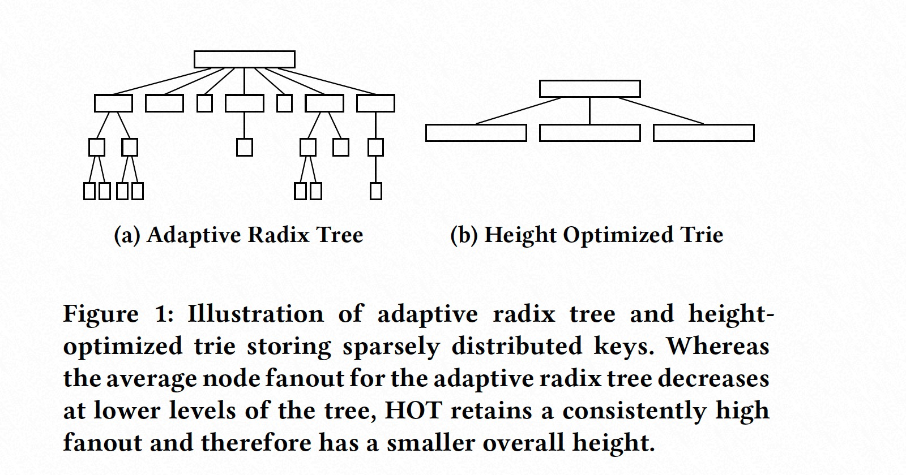
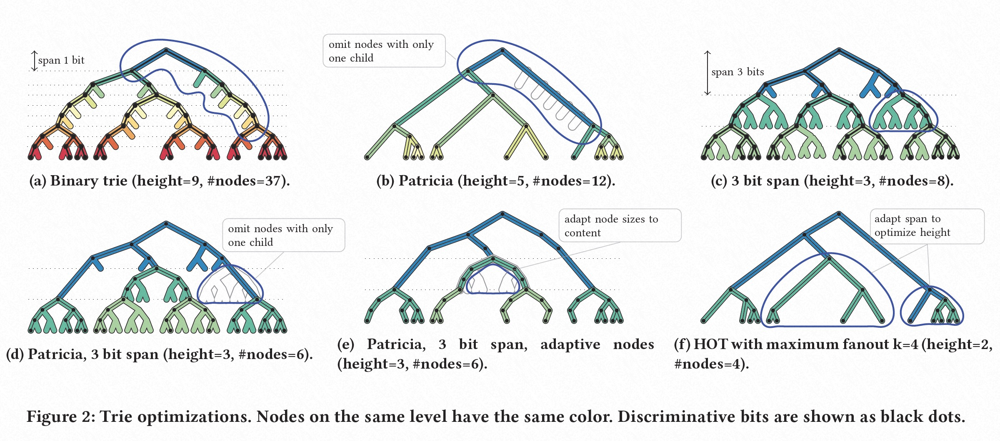
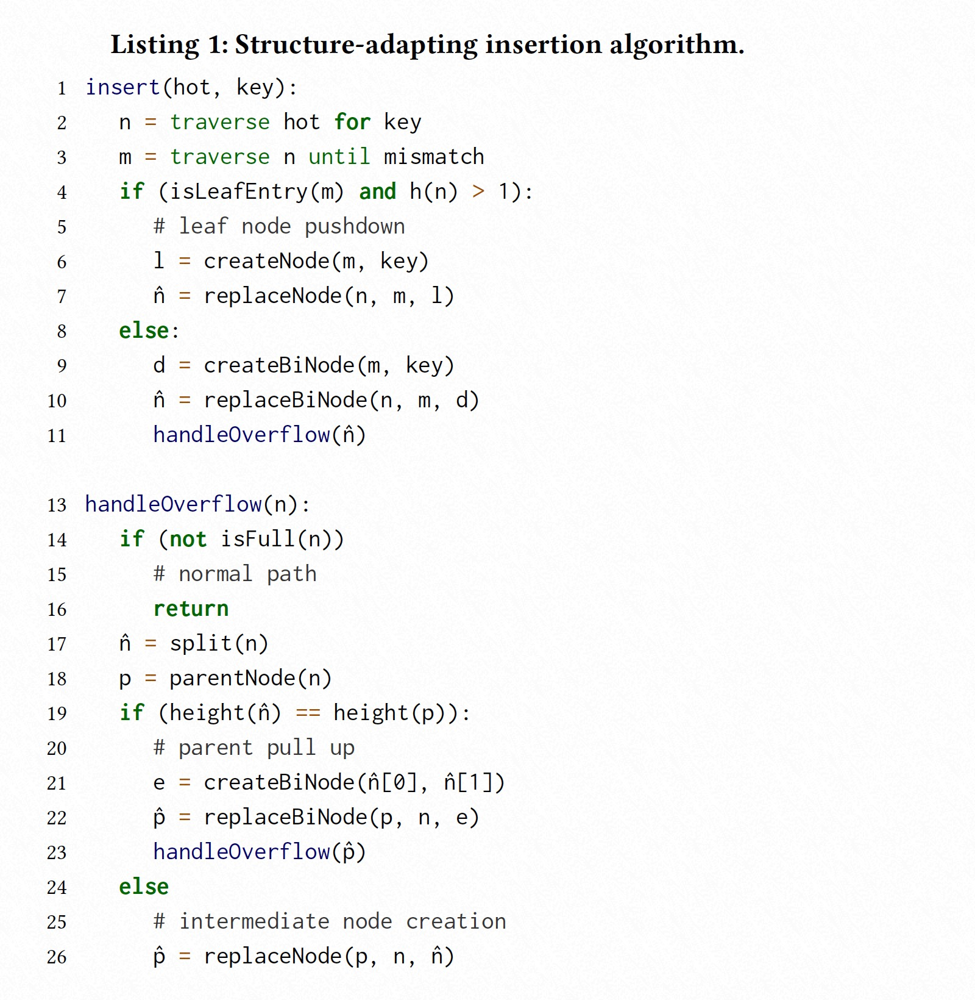
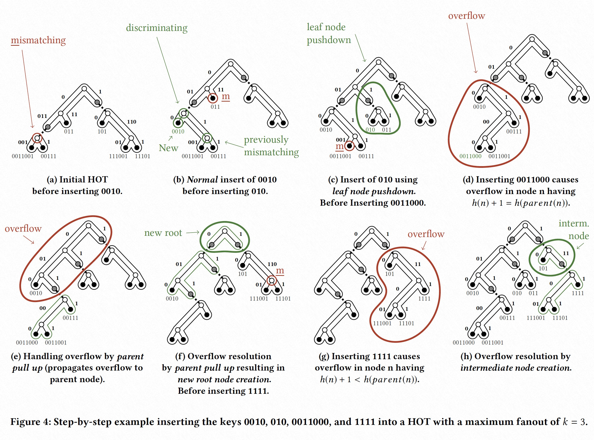

### [HOT: A Height Optimized Trie Index for Main-Memory Database Systems](../../assets/pdfs/hot-index.pdf)

> SIGMOD '18
>
> https://dl.acm.org/doi/10.1145/3183713.3196896

[ART](../triefamily/art.md) 的 span 固定为 8 bits，根据子节点个数动态调整 node 类型以减少 memory consumption 并提高缓存命中率，但对于稀疏的索引键类型，如字符串，低层节点 fanout 通常很小。HOT 则采用了不同的策略，它规定了最大的 fanout，通过动态调整 span 的 bits 数来避免 fanout 较小的节点，让 Trie 看起来更像 B-Tree。

> The core algorithmic idea of HOT is to dynamically vary the number
> of bits considered at each node, which enables a consistently high
> fanout and thereby good cache efficiency.
> The layout of each node is carefully engineered for compactness and
> fast search using SIMD instructions.

HOT 由于节点 fanout 较大，导致其 space consumption 及树高度的减少:

不同 trie 的变种为了提升性能做了不同的优化，如下图展示:

- Binary trie 由于树高很大导致性能较差
- Patricia 将只有一个子节点的节点忽略，以降低树高，但由于 fanout 只有 2，树高依然较高
- Generalized Prefix Tree 通过增加 span bits 来减少树高，但对于稀疏分布的键，其 fanout 通常远小于最优值，且浪费空间
- 将 Patricia 忽略节点的优化用于 Generalized Prefix Tree，可以减少 node 个数，但不能减少树高
- ART 使用固定的 span bits，并动态调整节点类型，来减少 space consumption，但不能减少树高
- HOT 使用非固定的 span bits 及不同的节点类型，使得节点具有较大的 fanout，减少 space consumption 的同时减少了树高

> The optimizations discussed in the previous section combine the
> nodes of a binary trie into compound nodes with a higher fanout.
> The most important optimization is to increase the span of each
> node.

HOT 的一个关键特性: 

> **Every compound node represents a binary Patricia trie with a fanout of up to k.**

一个具有 `n` 个 key 的 binary Patricia trie 有 `n − 1` 个 inner nodes，因此一个 fanout 为 `k` 的 HOT 节点最多只需存储 `k - 1` 个 binary inner nodes（加上 `k` 个子节点）。

每个 HOT compound node 的高度定义为:

向一个 HOT trie 中插入键值涉及四种操作：

1. normal insert
2. leaf-node pushdown
3. parent pull up
4. intermedia node creation

Insert 的算法描述:

文中给出了一个插入示例的图示:

Section 4 关于 **Node Implementation** 的部分没看懂，暂时不花时间细看了☹️。

算法的完整实现: [https://github.com/speedskater/hot](https://github.com/speedskater/hot)。

视频介绍: [Robert Binna, University of Innsbruck, HOT: A Height Optimized Trie Index for Main-Memory DBMS](https://www.youtube.com/watch?v=1F1oMFwLTq0)。
