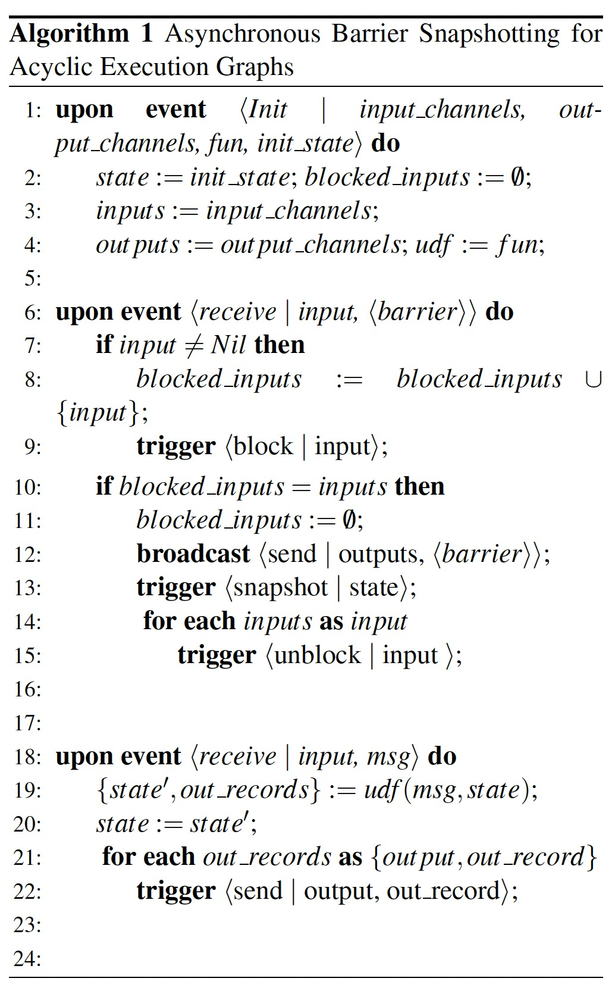
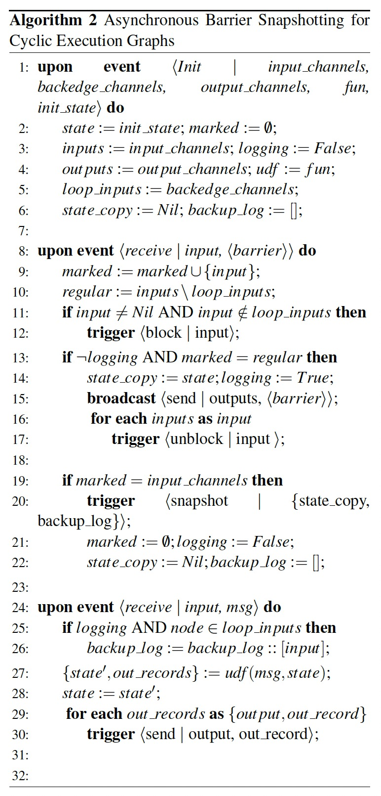

### [Lightweight Asynchronous Snapshots for Distributed Dataflows](../assets/pdfs/Lightweight.Asynchronous.Snapshots.for.Distributed.Dataflows.pdf)

> arXiv:1506.08603 · 2015
>
> https://arxiv.org/abs/1506.08603

读过 [Chandy-Lamport](./chandy.md)（后简称 CL）之后，理解 `Asynchronous Barrier Snapshotting`（后简称 ABS）就比较容易了，ABS 可以看做 CL 的一个特例。不同于 CL 假设的强连通图，ABS 是为解决有向无环图而设计的，其主要步骤包含:

- A central coordinator periodically injects stage barriers to all the sources.
- When a source receives a barrier it takes a snapshot of its current state, then broadcasts the barrier to all its outputs
- When a non-source task receives a barrier from one of its inputs, it blocks that input until it receives a barrier from all inputs
- When barriers have been received from all the inputs, the task takes a snapshot of its current state and broadcasts the barrier to its outputs
- Then, the task unblocks its input channels to continue its computation

可以看出，ABS 的非 Souce 节点在第一次收到 barrier 的时候并没有马上进行对当前状态做 snapshot，而是等待所有 input channel 都收到 barrier 之后才进行 snapshot（即 Flink 中的 barrier alignment），这样减少了 CL 中对 channel 状态的记录。其算法描述为:

ABS 还可扩展用于有向循环图，通过额外记录 back-edges（a back-edge in a directed graph is an edge that points to a vertex that has already been visited during a depth-first search）通道的消息，与节点记录的状态共同构成快照，算法描述为:

另外该论文还描述了 Failure Recovery 的方法，整个 execution graph 从最后一个快照重启，每个 task 做如下操作:

1. retrieves from persistent storage its associated state for the snapshot st and sets it as its initial state
2. recovers its backup log and processes all contained records
3. starts ingesting records from its input channels

