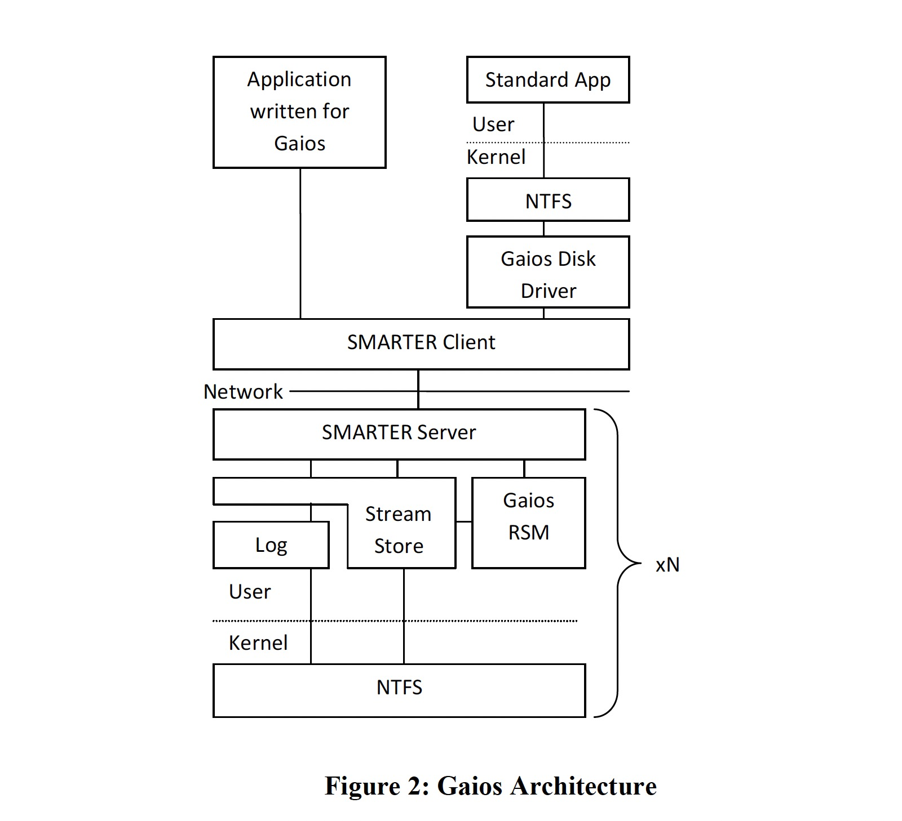

### [Paxos Replicated State Machines as the Basis of a High-Performance Data Store](../assets/pdfs/Bolosky.pdf)

> Proceedings of the 8th USENIX conference on Networked systems design and implementation, March 2011
>
> https://dl.acm.org/doi/10.5555/1972457.1972472

传统观点认为 Paxos 对于大容量、高吞吐量、数据密集型应用过于昂贵，因此，容错存储系统通常依赖于特殊硬件、弱于顺序一致性的语义、有限的更新接口（例如仅追加）、通过主节点序列化所有读取的主备复制方案、时钟同步，或者它们的某种组合，以确保正确性。

论文认为在通过局域网复制并且伴随着大量硬盘操作的系统中，Paxos 引入的额外消息开销相对于大约两个数量级的磁盘延迟显得微不足道。此外，Paxos 复制状态机的 **operation serialization** 和 **commit-before-reply** 特性看起来不是那么容易能够从磁盘获取高性能，但通过仔细的实现，能够在保持 Paxos 顺序一致性的同时做到高效操作磁盘。

#### Gaios Architecture

> One way to think of what SMARTER does is that it implements an asynchronous Remote Procedure Call (RPC) 
> where the server (the state machine) runs on a fault-tolerant, replicated system.

论文的结论比较有意思，后边内容简单浏览了一遍，今后有需要再读 🧐