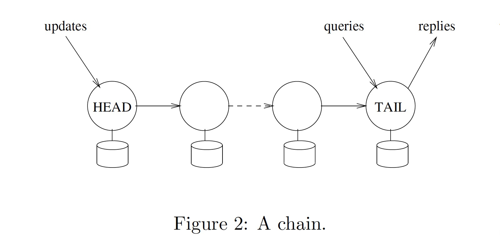
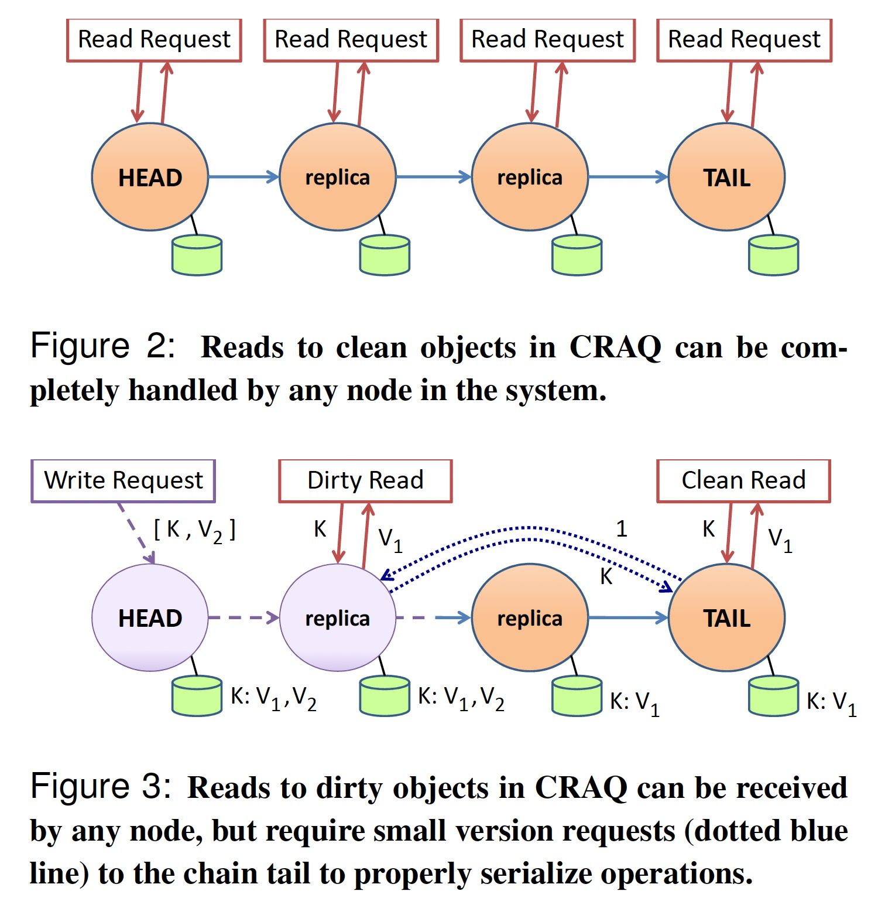

### [Chain Replication for Supporting High Throughput and Availability](../assets/pdfs/chain-replication.pdf)

> OSDI'04
>
> https://dl.acm.org/doi/10.5555/1251254.1251261

Chain Replication 是一种为大规模存储服务提供高吞吐、高可用，且无需牺牲强一致性的复制协议。

CR 中的节点应该具有 fail-stop 特性（即 non-byzantine）:

- each server halts in response to a failure rather than making erroneous state transitions
- a server’s halted state can be detected by the environment

一个由 n 个节点构成的 CR 复制链路可容忍 n-1 个节点失效。一条链路显示如下:

所有的 response 都由 tail 节点返回给客户端，update 请求有 head 节点接收并逐一发送给下游，query 请求则被发送到 tail 节点。

- **Reply Generation.** The reply for every request is generated and sent by the tail.
- **Query Processing.** Each query request is directed to the tail of the chain and processed there atomically using the replica of objID stored at the tail.
- **Update Processing.** Each update request is directed to the head of the chain. The request is processed there atomically using replica of objID at the head, then state changes are forwarded along a reliable FIFO link to the next element of the chain (where it is handled and
forwarded), and so on until the request is handled by the tail.

由于查询和更新都由尾节点串行处理，因此 Chain Replication 遵循强一致性。

节点的失效由一个被称为 master 的服务（实现了 paxos 算法，可以认为是一个不会失效的单一服务）提供如下能力:

- detects failures of servers（i. failure of the head; ii. failure of the tail; iii. failure of some other server in the chain）
- informs each server in the chain of its new predecessor or new successor in the new chain obtained by deleting the failed server
- informs clients which server is the head and which is the tail of the chain

[CRAQ](../assets/pdfs/craq.pdf) 算法对 CR 进行了扩展，read 操作可以被分派到任意节点执行，可提供三种一致性模型:

- Strong Consistency
- Eventual Consistency
- Eventual Consistency with Maximum-Bounded Inconsistency

craq 使用 zookeeper 来实现 CR 中 master 的功能，其 watcher 机制能更好地检测节点失效。

