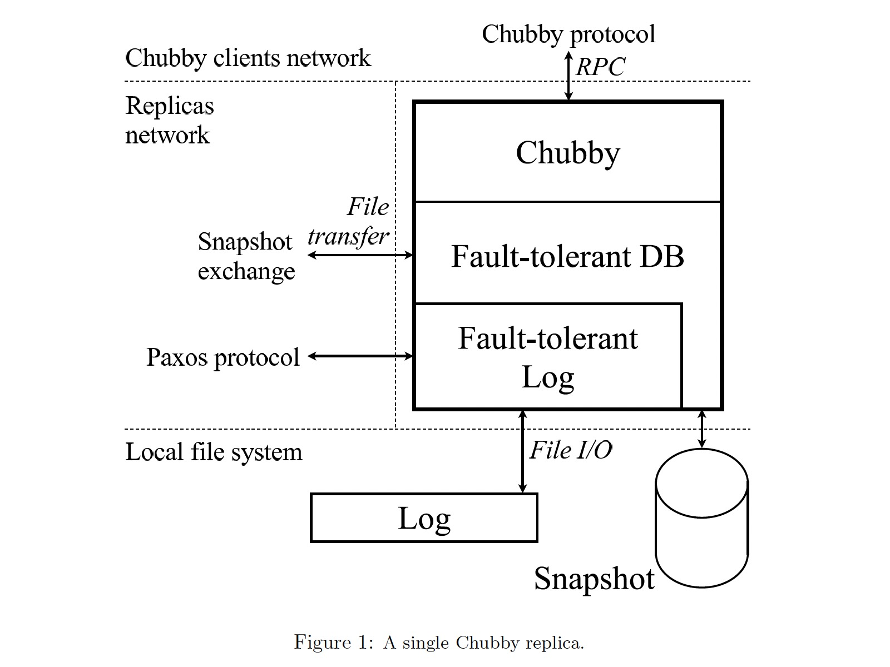

### [Paxos Made Live - An Engineering Perspective](../../assets/pdfs/paxos-made-live.pdf)

> PODC '07
>
> https://dl.acm.org/doi/10.1145/1281100.1281103

> By repeatedly applying such an algorithm on a sequence of input values, it is possible to build an
identical log of values on each replica.
>
> If the values are operations on some data structure, application of
the same log on all replicas may be used to arrive at mutually consistent data structures on all replicas.
>
> For instance, if the log contains a sequence of database operations, and if the same sequence of operations is
applied to the (local) database on each replica, eventually all replicas will end up with the same database
content (provided that they all started with the same initial database state).

Chubby 是 Google 公司内部使用的一个提供分布式锁机制和存储小文件的容错系统，通常一个数据中心运行一个 Chubby 实例，GFS、Bigtable 等应用（Chubby Clients）使用 Chubby 作为协调者来存储少量元数据。

Chubby 通过复制来容错，一个 Chubby 实例通常由五个副本（replica）组成，每个副本运行同样的代码，各自部署在独立的机器上。在任一时刻，其中的一个 replica 被认为是 master 且服务所有的客户端请求。下图是一个 replica 的架构：

各模块的功能

- Fault-tolerant Log 基于 Paxos 算法，保证各 replica 本地日志的一致性
- Log 即 replay-log，保存 Fault-tolerant Log 持久化的日志，用于失败恢复
- Fault-tolerant DB 保存 Chubby 的状态
- Snapshot 保存 Fault-tolerant DB 的状态快照，快照成功后可以清理无用的 replay-log 以避免存储耗尽和缩短日志回放时间

可以看出这是一种典型的复制状态机模型（replicate state machine）。

#### Paxos

论文对于 Paxos 算法的描述不同于 [Paxos Made Simple](paxos-made-simple.md)，将其分为了三个阶段：

1. Elect a replica to be the `coordinator`.
2. The coordinator selects a value and broadcasts it to all replicas in a message called the `accept` message. Other replicas either `acknowledge` this message or `reject` it.
3. Once a majority of the replicas `acknowledge` the coordinator, **consensus has been reached**, and the coordinator broadcasts a `commit` message to notify replicas.

这种描述是为了方便引入 `Multi-Paxos`，在后文的介绍中提到，上述的协调者选举阶段包含了 Propose/Promise 消息。当协调者不变的情况下，上述的 2、3 即可连续执行以优化性能，即 `Multi-Paxos`。

Paxos 存在多个 replica 同时认为自己为 Coordinator 的情形，这种情况下，Paxos 通过附加两个约束来保证在一个值上达成共识：

- assigning an ordering to the successive coordinators
- restricting each coordinator’s choice in selecting a value

对协调者排序使得 replica 能够区分当前的协调者和过去的协调者，拒绝旧协调者的消息使得 replica 能够达成一致。Paxos 使用递增序号来对协调者进行排序，方法如下：

> Each replica keeps track of the most recent sequence number it has seen so far.
> 
> When a replica wants to become coordinator, it generates a unique sequence number higher than any it has seen, and broadcasts it to all replicas in a propose message.
> 
> If a majority of replicas reply and indicate they have not seen a higher sequence number, then the replica acts as a coordinator.

当对一个值形成共识之后，Paxos 需要保证之后的协调者不能改变其值:

> Once consensus is reached on a value, Paxos must force future coordinators to select that same value in order to ensure continued agreement.
>
> To guarantee this, the promise messages from replicas include the most recent value they have heard, 
> if any, along with the sequence number of the coordinator from whom they heard it.
>
> The new coordinator chooses the value from the most recent coordinator. If none of the
> promise messages contain a value, the coordinator is free to choose a submitted value.

这块的描述不是很详尽，但看过 [zab](./zab.md) 和 [raft](./raft.md) 的读者应该能联想到 zab 的 `Discovery Step l.1.2` 和 raft 的 `Election restriction`。
