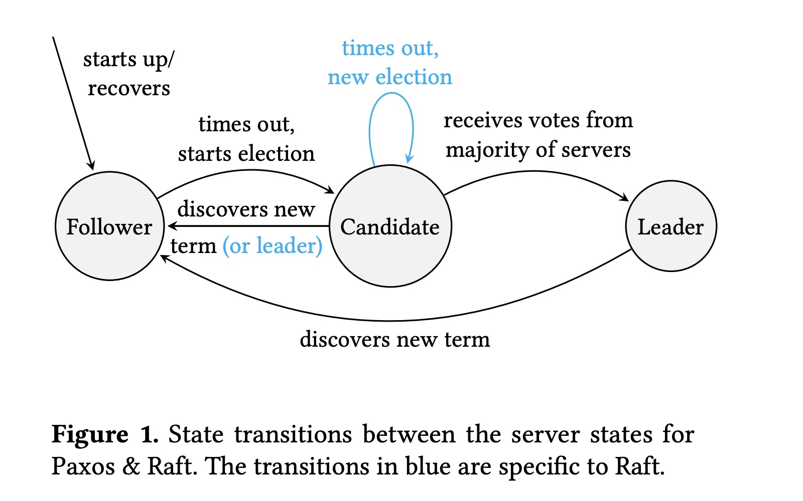
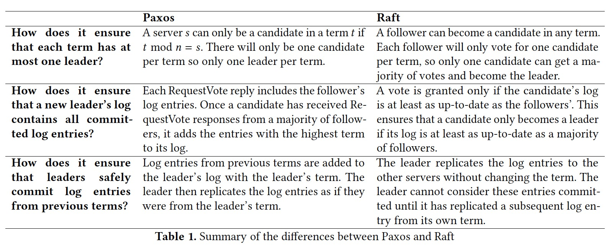

### [Paxos vs Raft: have we reached consensus on distributed consensus?](../../assets/pdfs/paxos_vs_raft.pdf)

> Proceedings of the 7th Workshop on Principles and Practice of Consistency for Distributed Data, April 2020
>
> https://dl.acm.org/doi/abs/10.1145/3380787.3393681

虽然有很多分布式共识协议被提出，Paxos 和 Raft 无疑是工业界的两个主宰（作者可能将 Zab 归类为 paxos alike ?）。Paxos 算法被认为是分布式共识的*同义词*，但它也因难理解、难实现而著称；Raft 将易于理解视为最高优先级，并且能够达到跟 Paxos 一样的性能。

Paxos 和 Raft 非常相似，仅仅在 `leader election` 上有所区别。Raft 通过 `Election restriction` 限制了只有其本地日志 up-to-date 的 replica 才能被选举为 leader；而 Paxos 则允许本地日志非 up-to-date 的 replica 被选为 Leader，然后将其日志更新为 up-to-date。

> Raft’s approach is surprisingly efficient given its simplicity as, unlike Paxos, 
> it does not require log entries to be exchanged during leader election.

论文以 Raft 的接口风格定义了一种 Paxos 算法（见附录 A & B），replica 在任意时刻的状态为 `Follower`、`Candidate`、`Leader` 其中的一种，如下图所示:

在 Leader 不失效处理 Normal Operation 时，都是依赖 quorum 完成复制状态机的操作。

当 Leader 失效时，需要选举出新的 Leader，Paxos 和 Raft 在选主的过程中使用了不同的方法：

- Paxos
  - Follower 在一定时间内未收到 `AppendEntries`，将状态变为 Candidate，将其 term 更改为 t (t mod n = s, n 为 replicas 个数，s 为该节点的 index)
  - Candidate 向所有其它 replica 发送 `RequestVote`，包含 t 和 commit index
  - 其它 replica 收到 `RequestVote` 后，如果请求的 t 大于自己的 term，则回复该消息，附带本地 commit index 之后的日志
  - 在收到多数派 replica 恢复的消息之后，Candidate 通过对比收到的日志来更新本地日志并当选 Leader
- Raft
  - Follower 在一定时间内未收到 `AppendEntries`，将自身状态变为 Candidate 并增加其 term
  - Candidate 向所有其它 replica 发送 `RequestVote`，包含增加后的 term 及日志 index
  - 其它 replica 收到 `RequestVote` 后，如果请求附带的 term 大于或等于 replica 的 term，且 replica 在该 term 未 VoteFor 其它 candidate，且 Candidate 的日志至少与 replica 的日志一样新（by ensuring that the candidate’s last log term is greater than the server’s or, if they are the same, that the candidate’s last index is greater than the server’s），replica 回复 Candidate
  - Candidate 在收到多数派回复消息后，当选 Leader 并开始服务
  - Raft 的一个 safty property: the leader does not update its commit index until at least one log entry from the new term has been committed

两种算法都具有如下特性:

- State Machine Safety: If a server has applied a log entry at a given index to its state machine, no other server will ever apply a different log entry for the same index.
- Leader Completeness: If an operation op is committed at index i by a leader in term t then all leaders of terms > t will also have operation op at index i.

Raft 和 Paxos `leader election` 的不同总结如下:

结论:

> We conclude that there is no significant difference in understandability between the algorithms, 
> and that Raft’s leader election is surprisingly efficient given its simplicity.

#### References:

[1] [Paxos vs Raft: Have we reached consensus on distributed consensus?](https://www.youtube.com/watch?v=JQss0uQUc6o) explained by Heidi Howard 
[2] [Paxos vs Raft: Have we reached consensus on distributed consensus?](https://www.youtube.com/watch?v=0K6kt39wyH0) more detailed explanation by Heidi Howard