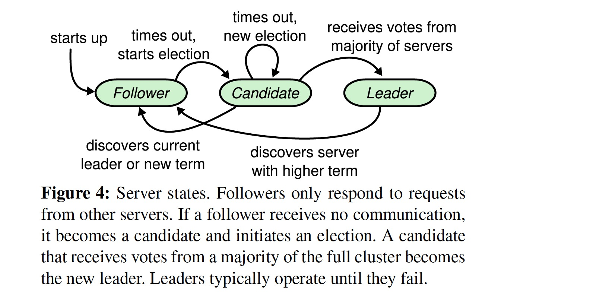
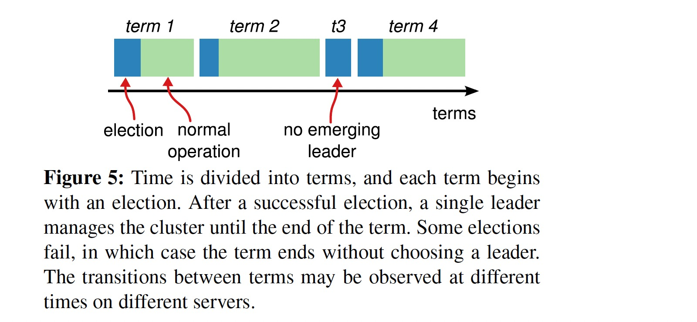
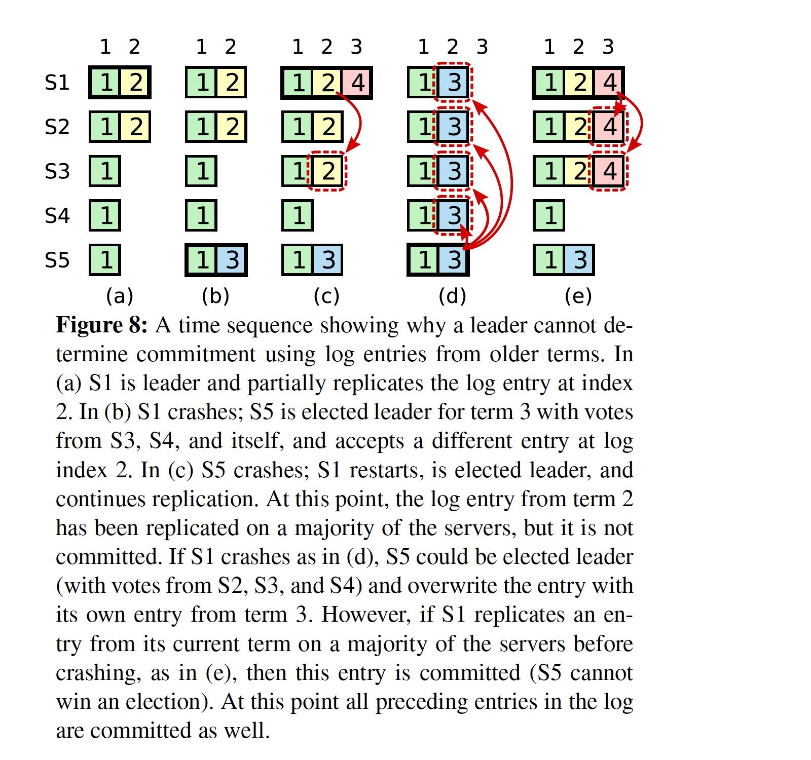

### [In Search of an Understandable Consensus Algorithm](../../assets/pdfs/raft.pdf)

> USENIX ATC'14
>
> https://dl.acm.org/doi/10.5555/2643634.2643666

共识算法通常伴随着复制状态机（replicated state machines），而复制状态机通常使用 `relicated log` 实现，每台服务器存储包含一系列命令的日志，状态机按序执行这些日志，如果各状态机以相同的状态开始并以相同的顺序执行相同的输入，它们将以相同的状态结束并产生相同的输出。

> Keeping the replicated log consistent is the job of the consensus algorithm.

#### What's wrong with Paxos?

- The first drawback is that Paxos is exceptionally difficult to understand.
- The second problem with Paxos is that it does not provide a good foundation for building practical implementations.

而 Raft 则将 **易于理解** 作为最重要的设计目标，算法设计出来应该能被大部分人轻松理解，能够让人产生直觉，进而可以被更多的开发者实现出来。

#### Raft 基本概念

Raft 算法分为三个部分:

- Leader election
- Log replication
- Safty

一个 Raft 集群包含多台服务器（通常为奇数），`2f + 1` 台机器能容忍 `f` 台机器出错（non-Byzantine fault），一台机器在任意时刻处于以下三种状态中的一种:

- leader
- follower
- candidate

其状态转换过程:

Raft 把时间分为多个 `term`，每个 `term` 的长度由集群的状态决定，当 `leader` 失效后，其中一个 `follower` 变为 `candidate` 并作出选举，相应的 `term` 进行加一，但一个 `term` 不一定有 `leader`，这是由于多个 `follower` 同时提出选举，可能会出现 `split vote`。

> Raft’s basic consensus algorithm depends on only two message (RPC) types: RequestVote and AppendEntries.

#### Leader election

Raft 使用心跳机制（`AppendEntries RPCs` that carry no log entries）来维护 `leader` 的权威性，一个 `follower` 只要收到心跳会一直保持在 follower 状态。如果 `follwer` 在 **election timeout (150-300ms 之间的一个随机值)** 之后未收到心跳，其状态变为 `candidate`，term + 1，投票给自己并使用 `RequestVote` RPC 向其它节点索要投票，该节点处于 `candidate` 状态直到以下三种情之一发生:

1. 得到多数投票赢得选举，状态变为 leader
2. 另外一个节点赢得选举，状态变为 follower
3. 一段时间过去了，没有 leader 被选出，此时该 term 内没有 leader，等待下一次选举

如果 RPC 中返回的 term 大于 candidate 自身 term，更新 term 并将自身状态变为 follower，此种情况归类为如上 2。

*Liveness propery*

随机选举超时时间保证了短时间内有 `leader` 当选，i.e. something good eventually happens。

*Safety property*

`votedFor` 和 `currentTerm` 持久化保证了同一 `term` 只能有一个 `leader` 当选，i.e. nothing bad happens。

#### Log replication

当一个节点被选为 `leader` 后，它开始服务客户端请求，每个客户端请求都包含一个需要被 `relicated state machines` 执行的命令，leader 节点将该命令包装为 entry(leader 的 currentTerm + 命令本身) 追加写到自己的 log，然后将该 entry 并发使用 `AppendEntries` 发送给 `follower` 节点，当多数派收到该 entry 后，`leader` 将该 entry 提交给状态机执行，并返回客户端执行结果。

当 `leader` 节点出现问题时，可能会出现日志不一致的情况，Raft 通过强制 `follower` 复制 `leader` 的日志来解决一致性问题。

> To bring a follower’s log into consistency with its own, the leader must find the latest log entry where the two
> logs agree, delete any entries in the follower’s log after that point, and send the follower all of the leader’s
> entries after that point.

通过在 Leader 节点为每个 `follower` 维护一个 `nextIndex` 值，当 `AppendEntries` 发送的日志与 `follower` 节点的日志不匹配时，`leader` 节点将对应 `follower` 的 `nextIndex` 值减一，直到找到匹配的位置重新发送。该过程保证了 `Log Matching Property`:

> If two entries in different logs have the same index and term, then they store the same command.
> If two entries in different logs have the same index and term, then the logs are identical in all preceding entries.

这种机制使得 `leader` 节点不需要做任何特殊处理就能够恢复日志的一致性，`leader` 节点从不覆盖写或删除已有的日志（Leader Append-Only Property）。但需要对选举的过程做一些额外限制来避免已经提交的日志被删除。

*Election restriction*

> A candidate must contact a majority of the cluster in order to be elected, which means that every
> committed entry must be present in at least one of those servers. If the candidate’s log is at least
> as up-to-date as any other log in that majority then it will hold all the committed entries.

`up-to-date` 定义为:

- If the logs have last entries with different terms, then the log with the later term is more up-to-date.
- If the logs end with the same term, then whichever log is longer is more up-to-date.

*Commitment rules*

- Raft never commits log entries from previous terms by counting replicas.
- Only log entries from the leader’s current term are committed by counting replicas.
- once an entry from the current term has been committed in this way, then all prior entries are committed indirectly because of the Log Matching Property.

如上规则能避免下图中的问题:

#### Raft's 5 guarantees

1. **Election Safety:** at most one leader can be elected in a given term.
2. **Leader Append-Only:** a leader never overwrites or deletes entries in its log; it only appends new entries.
3. **Log Matching:** if two logs contain an entry with the same index and term, then the logs are identical in all entries up through the given index.
4. **Leader Completeness:** if a log entry is committed in a given term, then that entry will be present in the logs of the leaders for all higher-numbered terms.
5. **State Machine Safety:** if a server has applied a log entry at a given index to its state machine, no other server will ever apply a different log entry for the same index.

#### Optimizations

1. when rejecting an AppendEntries request, the followe rcan include the term of the conflicting entry and the first index it stores for that term. With this information, the leader can decrement nextIndex to bypass all of the conflicting entries in that term
2. Diego Ongaro's Ph.D. dissertation describes an optional `PreVote` phase in Raft that is designed to prevent a partitioned server from disrupting the cluster by forcing a re-election when it rejoins the cluster.

#### Cluster Membership Changes

Raft 使用 `joint consensus` 算法来保证配置切换期间不会出现双 `leader` 且能持续服务客户端。

#### References:

[1] [Raft Homepage](https://raft.github.io/) 
[2] [Raft lecture (Raft user study)](https://www.youtube.com/watch?v=YbZ3zDzDnrw) by by John Ousterhout 
[3] [Designing for Understandability: The Raft Consensus Algorithm](https://www.youtube.com/watch?v=vYp4LYbnnW8) by John Ousterhout 
[4] [In Search of an Understandable Consensus Algorithm (Extended Version)](../../assets/pdfs/raft-extended-version.pdf) 
[5] [Diego Ongaro's Ph.D. dissertation](https://github.com/ongardie/dissertation#readme) 
[6] [Students' Guide to Raft](https://thesquareplanet.com/blog/students-guide-to-raft/)