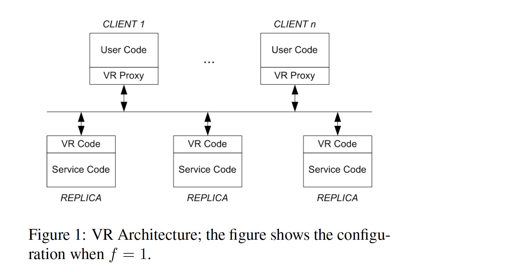
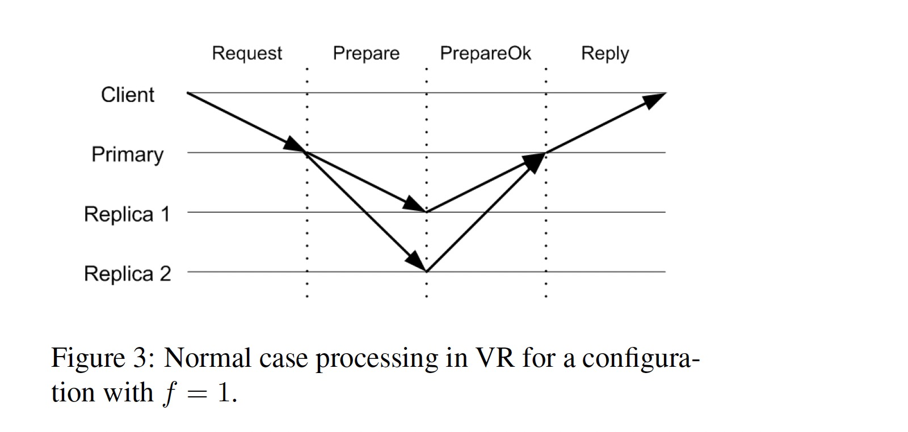

### [Viewstamped Replication Revisited](../../assets/pdfs/vr-revisited.pdf)

> MIT technical report MIT-CSAIL-TR-2012-021, July 2012
>
> https://pmg.csail.mit.edu/papers/vr-revisited.pdf

Viewstamped Replication 最初在 1988 年发表的 [Viewstamped Replication: A New Primary Copy Method to Support Highly-available Distributed Systems][VR] 中提出，其原始描述与分布式 Transactions 协议耦合在一起，理解起来较为困难。2012 年发表的 **Viewstamped Replication Revisited** 将其共识算法抽取出来，对协议的描述更为清晰。本文基于 vr-revisited 介绍 VR 协议。

> VR was originally developed in the 1980s, at about the same time as Paxos, 
> but without knowledge of that work. It differs from Paxos in that it is a 
> **replication protocol** rather than a consensus protocol: it **uses consensus**, 
> with a protocol very similar to Paxos, as part of supporting a 
> **replicated state machine**.

虽然论文声称 VR 不是 consensus，而是使用了 consensus 的复制协议，但通常在提到 VR 协议时，认为它就是共识算法。

#### Failure Mode

VR 假设集群中节点的失效模型为 *crash failures*，而非 *Byzantine failures*。VR 工作在异步网络模型（如 Internet），同时假设网络不会被恶意攻击者篡改。

> Messages might be lost, delivered late or out of order, and 
> delivered more than once; however, we assume that if sent 
> repeatedly a message will eventually be delivered.

VR 是一个多数派的协议，一个 **replica group** 由 2f + 1 个节点组成，可以忍受 f 个节点同时失效，f + 1 个节点被称为 **quorum**，协议的正确性依赖 **quorum intersection property**:

> The quorum of replicas that processes a particular step of the protocol must
> have a **non-empty intersection** with the group of replicas available to 
> handle the next step, since this way we can ensure that at each next step 
> at least one participant knows what happened in the previous step.

#### Architecture

上图显示了 f = 1 的 VR 架构图，客户端通过 VR Proxy 和集群进行交互，每个 Replica 包含两部分代码:

- VR Code: 运行 VR 协议，当一个请求可以被执行的时候，产生一个 up-call 让 service code 执行该请求
- Service Code: 执行请求，更新状态并将结果返回给 VR code，VR code 将结果消息发送给 client proxy

#### VR Protocol

**State machine replication** 要求所有的 replica 以同样的初始状态开始，执行同样序列的操作，最终会得到一样的状态。

> The challenge for the replication protocol is to ensure that 
> operations execute in the same order at all replicas in spite 
> of concurrent requests from clients and in spite of failures.

VR 协议使用一个 **primary** replica 对客户端请求进行排序，**backup** replica 接受 primary 选择的请求顺序。当 primary 失效，集群通过 *view change protocol* 选择一个新的 primary，如何保证新的 primary 能反应已经被执行过的请求是一个挑战。

> We support this requirement by having the primary wait until at least **f + 1** replicas 
> (including itself) know about a client request before executing it, and by initializing 
> the state of a new view by consulting at least **f + 1** replicas. Thus each request is 
> known to a quorum and the new view starts from a quorum.

VR 使用三个 sub-protocols 来保证协议的正确性：

- Normal case processing of user requests.
- View changes to select a new primary.
- Recovery of a failed replica so that it can rejoin the group.

每个 replica 根据其 IP 地址被赋予一个 id，集群根据 replica id 循环（Round Robin）选择下一个 primary 角色。每个 replica 的 VR layer 维护了如下状态:

- configuration: 依据 2f + 1 个 relica 的 IP 地址排序的数组
- replica number: 该 replica 在 configuration 中排序数组的 index
- view-number: replica 当前的视图号，初始值为 0，递增
- status: replica 当前状态，可能值为 normal、view-change 或 recovering
- op-number: 赋予最新请求的操作id，初始值为 0，递增
- log: replica 上维护的包含操作记录的数组
- commit-number: 最新提交的请求操作的 op-number
- client-table: 对于每个客户端维护的最新的请求，如果该请求已经被执行过，则该结构还会保存请求对应的响应结果

**1. Normal Operation: request processing protocol**

在 primary 节点不出错的情况下，多个状态为 *normal* 且在同一 view 的 replicas 参与请求的处理。

> Replicas only process normal protocol messages containing a view-number that matches 
> the view-number they know.

该协议工作流程如下:

1. 客户端发送 `<Request op, c, s>` 消息给 primary，其中 op 是客户端想要执行的请求（包含参数），c 是客户端 id，s 是指定给请求的 request-number;
2. primary 收到请求后，将 request-number 和 client-table 中记录的信息进行对比。如果 request-number 不大于 client-table 记录的 request-number，该 request 被丢弃，如果该 request 是 client-table 记录的最新 request，primary 会给客户端重新发送该请求对应的响应;
3. primary 增加 op-number 值，将请求追加到 log，更新 client-table 中对应该客户端的信息。向其它 replicas 发送 `<Prepare v, m, n, k>` 消息，v 是 primary 当前的 view-number，m 是客户端发送的消息（即 Step 1 中的 Request），n 是指定给请求的 op-number，k 是 commit-number;
4. backups 按照顺序处理 Prepare 消息，当 backup 收到 Prepare 消息时，它会等待所有更早的请求都存在于其 log 后，增加其 op-number 值，将该请求追加到 log，更新 client-table，然后向 primary 发送 `<PrepareOk v, n, i>` 消息，告诉 primay 该消息已经在本地日志就绪;
5. primary 在收到 f 个不同 backups 返回的 PrepareOk 消息后，认为该操作（及所有先前的操作）为 committed，在执行了所有更早的操作后，primary 通过 up-call 让 service code 执行该操作，并更新 commit-number。然后发送 `<Reply v, s, x>` 消息给客户端，v 是 primary 当前的 view-number，s 是客户端的 request-number，x 是 up-call 返回的结果。primary 同时会更新 client-table 中对应该请求的结果;
6. 通常情况下，primary 通过下次 Prepare 消息通知 backups 当前的 commit-number，但是当在一定时间后未收到客户端发送的请求时，primary 会给 backups 返送 `<Commit v, k>` 消息，v 是 primary 当前的 view-number，k 是当前的 commit-number;
7. backup 在收到 commit-number 更新后，等待 log 中所有早于 commit-number 的请求被执行后，执行 up-call 让 service code 处理 commit-number 对应的操作，递增 commit-number 值，并更新 client-table，不过 backup 不需要给客户端回复结果。

如果客户端在一定时间后未收到请求的响应，会将该消息发送给所有 replicas，这样能保证 replica group 进入下一个 view 后，请求可以发送给新的 primary。

**2. view change Protocol**

backup 通过 `Prepare` 和 `Commit` 消息对 primary 进行探活，如果在一定时间内未收到来自 primary 的消息，replicas 会通过 **view change** 切换新的 primary。

View Changes 保证正确性的前提是：每一个通过 up-call 被 service code 执行的请求，必须存活于下一个 view 且保证其在 log 中的顺序与执行顺序一致。

> The correctness condition for view changes is that every committed operation survives into 
> all subsequent views in the same position in the serial order. This condition implies that 
> any request that had been executed retains its place in the order.

只有 committed 的操作会执行 up-call，这意味着旧的 primary 已经收到 f 个 backup 返回 PrepareOK 消息，进而意味着该操作已经在 f + 1 个 replica 的 log 中被记录。当 **view change protocol** 获取了 f + 1 个 replica 的日志信息后，依据 **quorum intersection property**，所有 committed 操作都能被新的 view 获取到。

该协议工作流程如下:

1. replica i 根据其 timer 或在收到 *view-number* 大于该 replica 本身 *view-number* 的 StartViewChange 或 DoViewChange 消息后，执行 view change，将自己的状态置为 *view-change*，增加其 *view-number*，然后给其它 replicas 发送 `<StartViewChange v, i>` 消息，其中 v 为新视图的 *view-number*;
2. 当 replica i 收到 f 个与其 *view-number* 相同的 StartViewChange 消息后，该 replica 发送 `<DoViewChange v, l, v', n, k i>` 消息给下一个视图的 primary（通过 Round Robin 指定）。其中 v 是该 replica 的 *view-number*，l 是它的 log，v' 是状态为 *normal* 的最近的视图的 *view-number*，n 为 *op-number*, k 为 *commit-number*;
3. 当新的 primary 从不同 replicas（包括其自己）收到 f + 1 个 DoViewChange 消息后，它将自己的 *view-number* 及 log 设置为 v' 最大或多个具有最大 v' 中 n 最大的消息对应的 v 及 log，将其 *op-number* 设置为新 log 的最大 index，将其 *commit-number* 设置为所有 DoViewChange 中最大的 *commit-number*，然后将其状态设置为 normal，通过给各 replica 发送 `<StartView v, l, l, n, k>` 来通知其它 replica view change 过程结束，其中 l 为新的日志，n 为 *op-number*，k 为 *commit-number*;
4. 新 replica 开始接收客户端请求，将之前未执行的 `committed` 操作执行一遍，更新 client-table，并给客户端发送响应;
5. 当其它 replica 收到 StartView 消息后，它们更新本地的 log、op-number 及 view-number，将状态设置为 *normal*，并更新 client-table 中的信息。如果日志中有未提交的操作，replica 会给 primary 发送 `<PrepareOk v, n, i>`，然后执行之前未执行的 `committed` 操作，增加 *commit-number* 值，并更新 client-table 的信息。

> VR as originally defined used a slightly different approach: it assigned each operation a 
> viewstamp. A viewstamp is a pair <view-number, op-number>, with the natural order: the 
> view-number is considered first, and then the op-number for two viewstamps with the same 
> view-number.

VR 在最初的论文中根据如上定义被命名为 *viewstamps*。

一个 View Change 过程可能由于新 primary 的失败而失败，这种情况下需要执行新一轮的 View Change。

**3. recovery protocol**

当一个 replica 从失败中恢复后，它不能参与集群的请求处理及 view changes 直到它获取到至少它失败时的状态。如果在磁盘上记录了状态，节点在读取磁盘重新初始化其状态后可以马上重新加入到系统中:

> The reason is that in this case a recovering node hasn’t forgotten anything 
> it did before the crash (assuming the disk is intact). Instead it is the 
> same as a node that has been unable to communicate for some period of time: 
> its state is old but it hasn’t forgotten anything it did before.

但 VR 为了提高其吞吐，并未在发送 Prepare 及 PrepareOk 消息之前写磁盘，其假设所有几点不会在同一时刻同时失败，及 replcas 具有 `failure independent` 的属性（依赖 UPS、non-volatime memory 或将 replica 放置在不同的地理位置）。

该协议工作流程如下:

1. 需要恢复的 replica i 给其它 replica 发送 `<Recovery i, x>`，其中 x 是一个递增的 nonce 值;
2. replica j 在状态为 *normal* 的前提下回复 `<RecoveryResponse v, x, l, n, k, j>` 消息给 replica i，v 是 *view-number*，x 是 Recovery 消息中的 nonce 值，如果 j 为当前视图的 primary，则 l 是其 log，n 为 *op-number*，k 为 *commit-number*，如果为 backup，则 l、n、k 的值都为 nil;
3. 当 replica i 从不同节点收到 f + 1 个 RecoveryResponse 消息后（所有消息需包含与 Recovery 消息相同的 nonce，且至少有一个包含这些消息中含有最新视图的 primary 节点的消息），replica i 依据 primary 返回的信息更新其 log、*view-number*、*op-number* 及 *commit-number*，并将其状态改为 *normal*。

当需要恢复的 replica i 同时为 view change 的 new primary 时，由于 replica i 不会回复 DoViewChange 消息，因此 view change 不能完成。这种情况下会进行新一轮的 view change。

nonce 的作用在于避免需要恢复的节点接收之前 Recovery 消息对应的 RecoveryResponse。

> When a replica recovers it doesn’t know what view it was in when it failed. 
> However, when it receives **f + 1** responses to its RECOVERY message, it 
> is certain to learn of a view at least as recent as the one that existed 
> when it sent its last PREPAREOK, DOVIEWCHANGE, or RECOVERYRESPONSE message. 
> Furthermore it gets its state from the primary of the latest view it hears 
> about, which ensures it learns the latest state of that view.

#### Efficient log

如上协议中的 log 在长时间运行之后可能会非常巨大，依赖 application state 及 checkpoints 可以高效地管理日志，并可以将无用的 log 进行 gc。高效的日志管理对于提升 **Recovery**、**State Transfer**、**View Changes** 的性能都有很大的帮助，详细分析见论文。

#### Optimizations

论文中提到了几个可以提高协议性能的优化点:

- Witnesses: 只执行 VR Code，不执行 Service Code。同时执行 VR Code 和 Service Code 的节点被称为 `active replica`，primary 总是 `active replica`
- Batching: primary 收集一堆请求同时运行 VR 协议，以提高 throughput
- Fast Reads
  - Reads at the Primary: 依赖 lease 避免读取 old primary 中 stale 的数据，一个新 view 只会在 view change 算法的 f + 1 个参与者的 lease 结束后才开始，这样保证了新视图在旧 primary 停止回复读取操作后才开始
  - Reads at Backups: 客户端维护 *last-request-number*，当进行写操作时，replica 返回请求的 op-number；当进行读操作时，replica 返回当前的 commit-number。客户端将 replica 返回的值保存在 *last-request-number*，在进行读取操作时，将该值包含在读请求中，replica 只有在至少执行到 *last-request-number* 对应的操作时才会回复客户端。

#### Reconfiguration

当有机器不可恢复、改变机器规格或者需要增大或缩小集群最大容错数 f 时，需要对集群进行 Reconfiguration。具体细节见 paper，本文略。

另外 VR 的 Reconfiguration 在进行中不能处理客户端请求，这点 Raft 更具优势 ?

 

[TigerBeetle][tigerbeetle] 实现了 VR protocol。

#### References:

[1] [Viewstamped replication](https://blog.acolyer.org/2015/03/02/viewstamped-replication-a-new-primary-copy-method-to-support-highly-available-distributed-systems/), a walk-through by Adrian Colyer 
[2] [Viewstamped Replication Revisited](https://blog.acolyer.org/2015/03/06/viewstamped-replication-revisited/), a walk-through by Adrian Colyer 
[3] [Bruno Bonacci on Viewstamped Replication @PWL London](https://www.youtube.com/watch?v=1EzNa-zAYS8) 
[4] [Paper #74. Viewstamped Replication Revisited](https://www.youtube.com/watch?v=Wii1LX_ltIs) by Joran Dirk Greef 

[VR]: ../../assets/pdfs/viewstamped-replication.pdf
[tigerbeetle]: https://github.com/coilhq/tigerbeetle