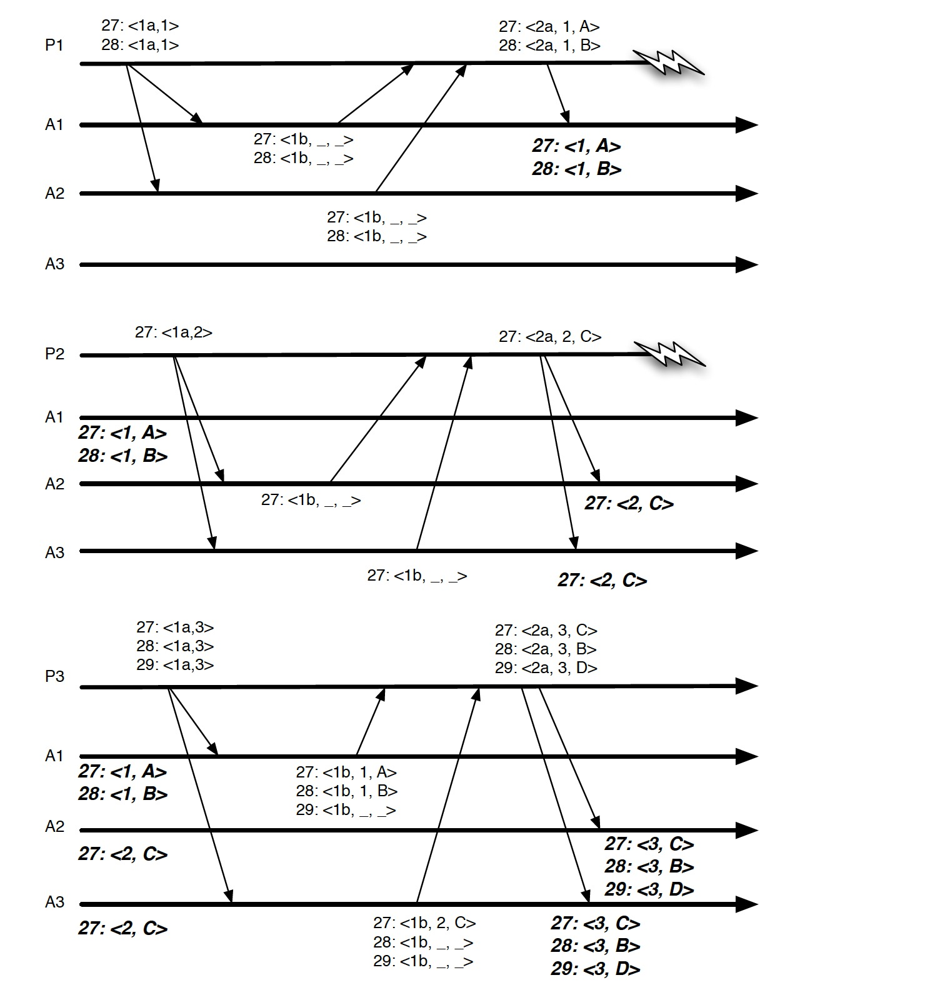
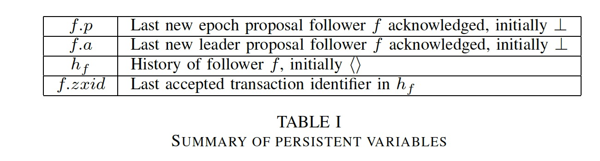
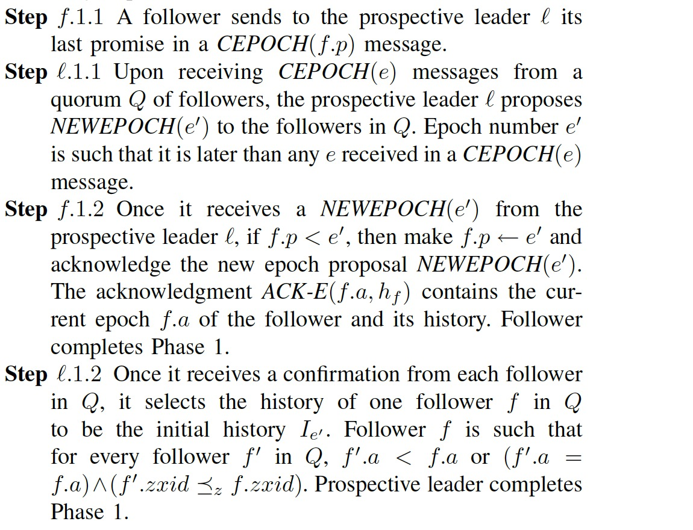
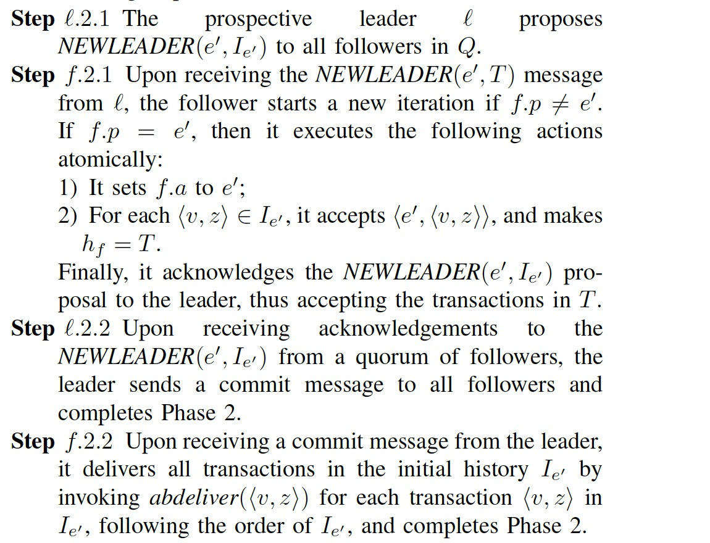
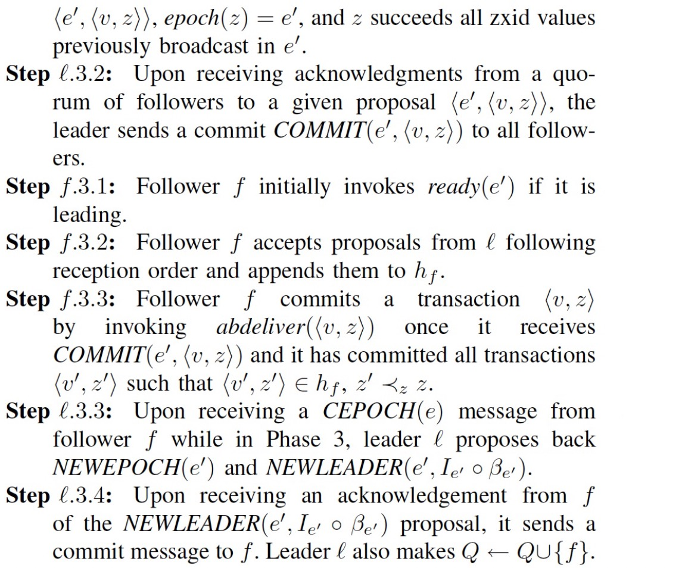
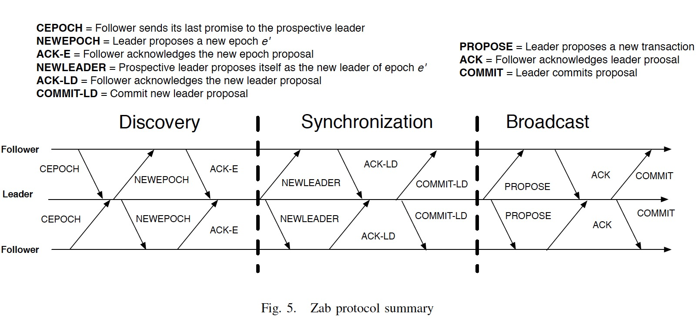

### [Zab: High-performance broadcast for primary-backup systems](../../assets/pdfs/zab.pdf)

> International Conference on Dependable Systems & Networks (DSN), 2011
>
> https://ieeexplore.ieee.org/document/5958223

Zab: Zookeeper atomic broadcast，原子广播在分布式系统中也称为 total order broadcast。Zookeeper 使用 Zab 协议将系统的增量状态修改同步到备节点。

> Due the dependence of an incremental state change on the
sequence of changes previously generated, Zab must guarantee
that if it delivers a given state change, then all other changes it
depends upon must be delivered first.

ZooKeeper 对系统的要求是一个客户端的多个操作需要能同时执行，且严格按照操作的顺序提交。传统的 Paxos 实现没有直接提供这样的能力，当多个操作同时进行的时候，可能会出现下图的问题，虽然每个值都达成了共识，但不能保持操作之间的依赖关系。

Zab 进程有两个角色，leader 和 follower。

> A leader concurrently executes the primary role and proposes transactions according to the order of broadcast calls of the primary.
>
> Followers accept transactions according to the steps of the protocol.

Leader 也会执行 Follower 的步骤。

#### 算法

需要持久化的数据：

Zab 协议分为三个阶段：

- discovery

- synchronization

- broadcast

其中 Synchronization 阶段 Leader 将 Discovery 阶段从 Follower 收集的 history 数据选择最新的数据（Step l.1.2）广播给 Follower 节点。文中提到这块可以做个优化:

> use a leader election primitive that selects a leader that has the latest epoch and has
accepted the transaction with highest zxid among a quorum of processes.

这个优化正是 Raft 的选举阶段的 `Election restriction`，Raft 将此作为一个 Safty Property。

Zab 协议的流程图示:

[ZooKeeper’s Atomic Broadcast Protocol: Theory and practice](../../assets/pdfs/zab_theory_and_practice.pdf) 对 zab 原理及 Zookeeper 中 zab 的实现作了进一步介绍。

#### References

[1] [Zab: High-performance broadcast for primary-backup systems](https://blog.acolyer.org/2015/03/09/zab-high-performance-broadcast-for-primary-backup-systems/) by Adrian Colyer