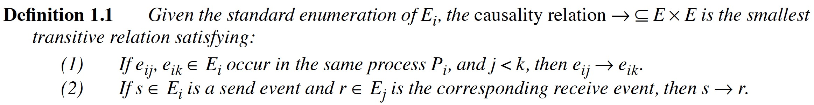
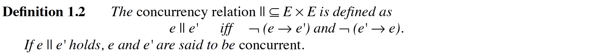
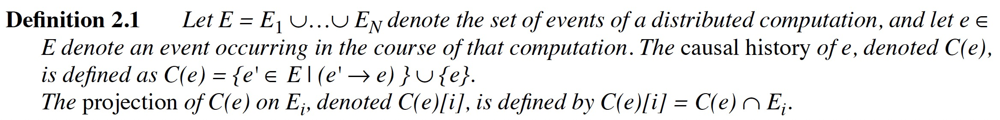
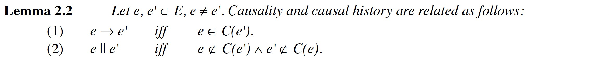
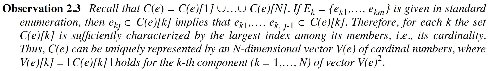
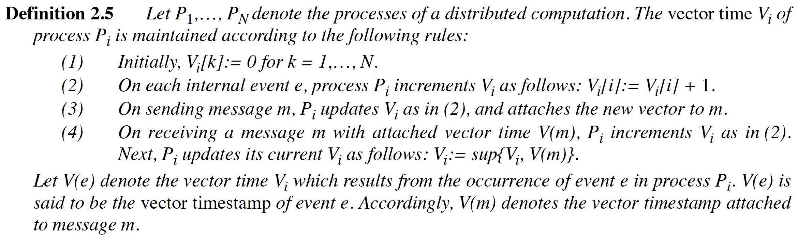
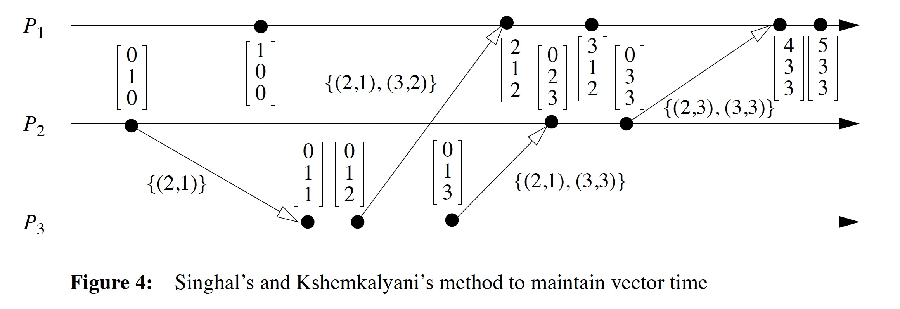
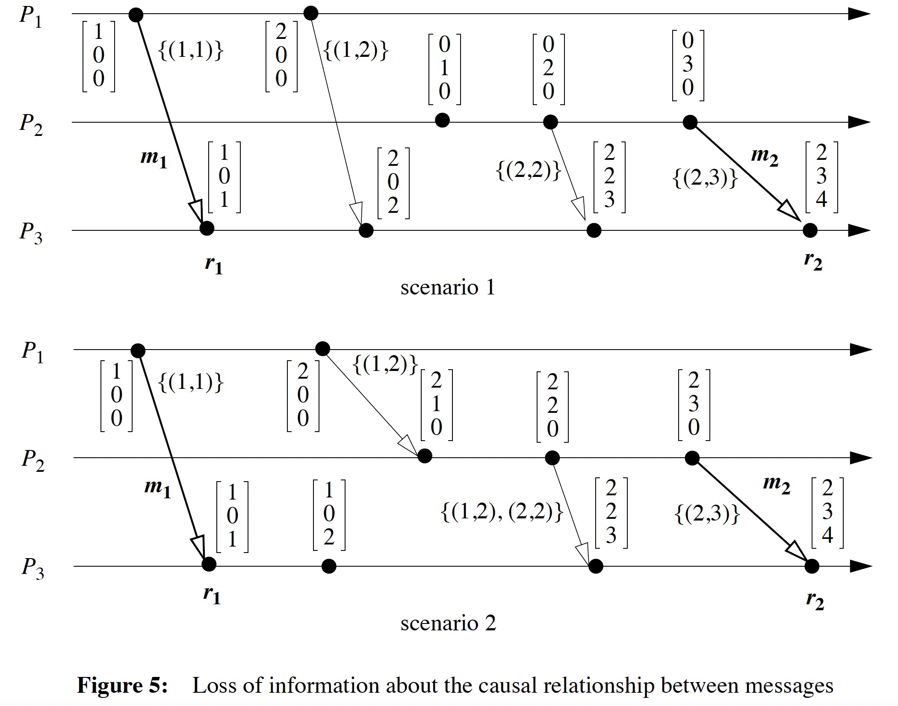

### [Detecting Causal Relationships in Distributed Computations: In Search of the Holy Grail](../assets/pdfs/holygrail.pdf)

> by R Schwarz · 1994
> 
> https://www.vs.inf.ethz.ch/publ/papers/holygrail.pdf

实现一个分布式系统更像是一门艺术而非工程问题，理解分布式系统的行为任然充满了挑战。为了正确理解分布式程序及其执行，确定计算中事件之间的因果关系和时间关系。并发性和非确定性在分析分布式系统的监控、调试和可视化等行为过程中起着非常重要的作用。

该论文是对已有因果关系研究成果的汇总，循循善诱地将 Lamport Clock、Vector Time、Characterizing Concurrency with Concurrent Regions、Global Predicates、Behavioral Patterns 等概念进行分析描述。

#### Causality relation

这里的 `causality` 即 Lamport 的 `happen before`，但因果关系的表述更准确。

因果关系是分布式计算中很多问题的基础，比如 consistent global snapshot、determining consistent recovery points、determining deadlocks or detecting the termination of a distributed computation 等。

> Lamport Clock is consistent with causality but does not characterise it.

#### Vector Time

##### Causal Histories

Causal history 能很好地反应因果关系，但是 Causal history set 维护所有了的前置事件，数量过于庞大，但通过观察可以发现:

因此可以使用 Vector Time 来替代 Causal History，Vector Time 的定义:

> the structure of vector time is isomorphic to the causality structure of the underlying distributed computation, a.k.a vector time charaterise causality.

#### Efficient Realizations of Vector Time

Vector Time 的主要缺点是它的大小，由于需要在发送消息是附加一个 O(N) 大小的向量时间，可能会造成大规模并行计算的瓶颈问题。

解决该问题的一种方法是通过在每个线程额外维护两个数组 LSi（"last sent"）和 LUi（"last update"），以此来减少发送消息的大小，如下图所示:

但这可能会使同一个接收者接收的不同消息之间的因果关系变得不确定:

#### Characterizing Concurrency with Concurrent Regions

对于有些应用，只需要知道两个任意事件 e 和 e' 是否同时发生，而它们的因果关系则无关紧要。

#### Evaluating Global Predicates

由于相对较难理解，还没深入看 :()

#### Detecting Behavioral Patterns

由于相对较难理解，还没深入看 :()

#### Further readings

[1] [Timestamps in Message-Passing Systems That Preserve the Partial Ordering](https://fileadmin.cs.lth.se/cs/Personal/Amr_Ergawy/dist-algos-papers/4.pdf)