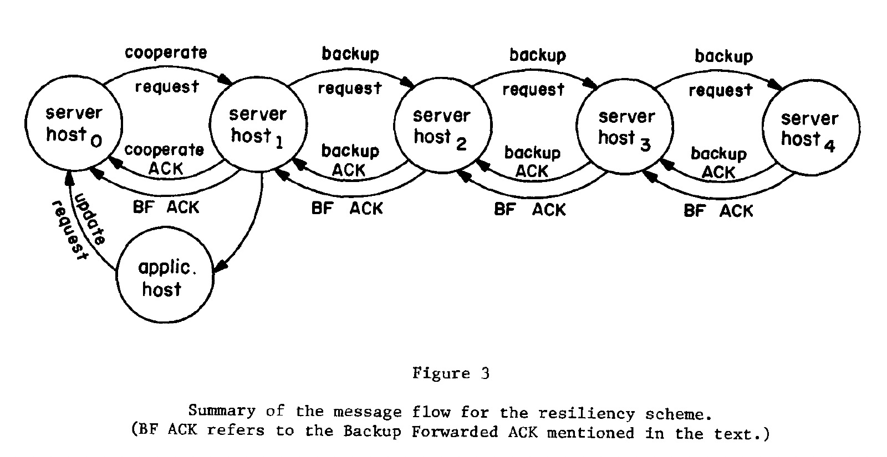
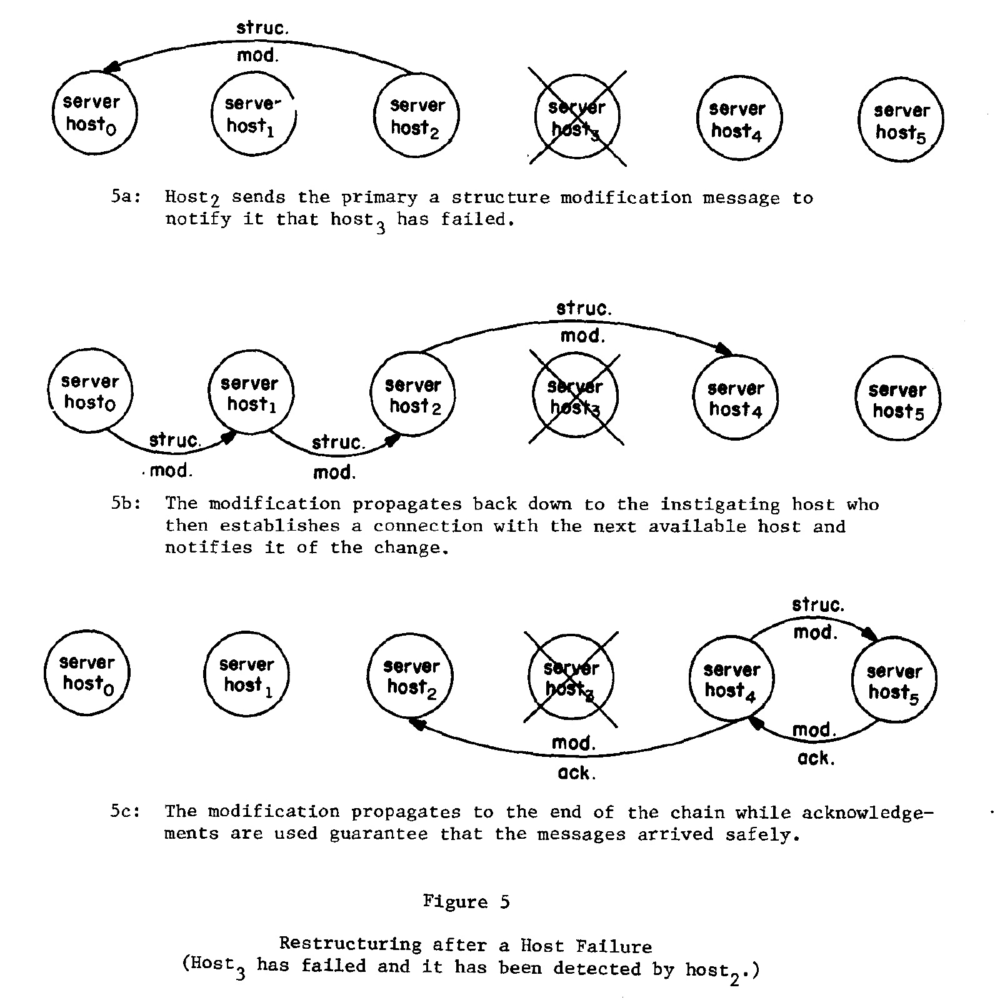

### [A principle for resilient sharing of distributed resources](../assets/pdfs/a_principle_for_resilient_sharing_of_distributed_reources.pdf)

> Proceedings of the 2nd International Conference on Software Engineering, October 1976
>
> https://dl.acm.org/doi/10.5555/800253.807732

本文提出了 primary/backup 复制模型，其本质是将其中一个节点作为主，其它几点作为备份。任一备份节点都可以执行主节点的职责，因此 primary 角色可以迁移到任一节点。

Resiliency（即恢复能力），具有如下四个主要特性:

- It is able to detect and recover from a given maximum number of errors
- It is reliable to a sufficiently high degree that a user of the resilient service can ignore the possibility of service failure
- If the service provides perfect detection and recovery from n errors, the (n+1)st error is not catastrophic. A "best effort" is made to continue service
- The abuse of the service by a single user should have negligible effect on other users of the service

在本文的 Resiliency 服务中，更新操作可以被发送给主或任意备节点，然后用户请求被阻塞，等待服务返回或超时后重新发送请求。如果更新操作被发送给备节点，备节点会将请求转发给主，所有的更新必须由主节点开始更新。

备份的架构可以是线性的（linearly），如下图:

也可以是广播的模式，广播的模式具有最小的延迟、需要更少的发送消息，但相对线性模式其错误恢复更复杂。

系统中有两种失败需要被处理:

- host failure (easy to handle)
- network partition (hard to handle)

Host Failure 的恢复使用 `structure modification` 消息来处理，当一个节点监测到其下游不可用时，会向 primary 报告，primary 则将需要的节点信息传递给下游，其过程图:

网络分区的处理则先通过发送 `are you alive` 消息，来判断是否进入 `partitioned operation mode`，在此模式下，服务对更新的的处理往往依赖应用程序。