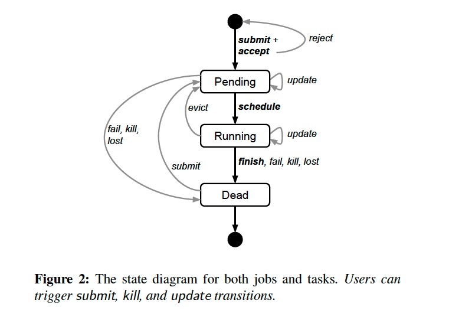
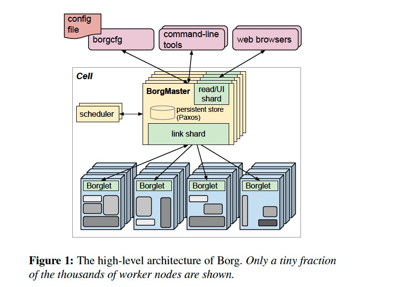

### [Large-scale cluster management at Google with Borg](../../assets/pdfs/borg.pdf)

> Proceedings of the Tenth European Conference on Computer Systems, April 2015
>
> https://dl.acm.org/doi/10.1145/2741948.2741964

Borg 作为 Kubernetes 的前身，在 Google 内部管理着多个拥有上万台机器的集群。它的三个主要好处:

1. hides the details of resource management and failure handling so its users can focus on application development instead
2. operates with very high reliability and availability, and supports applications that do the same
3. lets us run workloads across tens of thousands of machines effectively

用户将 job 提交给 Borg，每个任务运行在一个 Borg cell（a set of machines that are managed as a unit） 中，Borg cells 的任务负载主要包含两类：

- long-running services that should “never” go down, and handle short-lived latency-sensitive requests (a few ms to a few hundred ms).
- batch jobs that take from a few seconds to a few days to complete; these are much less sensitive to short-term performance fluctuations.

Google 内部的很多应用框架都构建在 Borg 之上，比如 MapReduce、FlumeJava、MillWheel、Pregel；GFS、CFS、Bigtable、Megastore 等分布式存储系统也都运行在 Borg 上。

#### Borg 中的概念

Borg 的工作负载没有运行在虚拟机上，因为 Google 不想承担这部分开销。

- cell: 包含一组机器，一个 median cell 通常包含 10k 台机器
- cluster: 一个 cluster 运行在数据中心的一个建筑中，一个 cluster 通常托管一个 large cell 并且可能托管几个测试或特殊目的的几个 small cell
- job: 运行在单个 cell，包含了 name、owener 及运行 tasks 数量等属性，并且约束运行任务机器需要满足的条件（CPU arch、OS version、external IP 等）
- task: 映射为运行在单机上的一组 Linux 进程，每个 Linux 进程运行在一个容器中
- alloc: 一台机器上的一组预留资源
- priority: 每个任务都有一个数字优先级，用于资源的抢占
- quota: 用于决定 job 是否能被调度，quota 表示为资源（CPU, RAM, disk）需求量的数组
- naming: 用于任务发现，将任务的 hostname 及 port 等信息持久化到 Chubby

大多数 job 可描述为声明式的配置语言: BCL。

job 和 task 的生命周期如下图所示:

> A user can change the properties of some or all of the tasks in a running job by 
> pushing a new job configuration to Borg, and then instructing Borg to **update** 
> the tasks to the new specification.

#### Borg architecture

每个 cell 包含一组 Borgmaster 和 Scheduler，Borgmaster 逻辑上是一个进程，但实际上有 5 个副本以保证高可用。

> Each replica maintains an in-memory copy of most of the state of the cell, 
> and this state is also recorded in a highly-available, distributed, 
> Paxos-based store on the replicas’ local disks.

Borgmaster 负责处理客户端请求（如 create job、lookup job）、管理资源（machines、tasks、allocs）的状态机、与 Borglets 通信并提供 web UI。

当一个 job 提交后，Borgmaster 将其持久化到 Paxos store 并将 job 对应的 tasks 附加到 pending 队列，scheduler 异步扫描后将 tasks 指派给满足 job 约束的机器。调度算法包含两个部分:

1. feasibility checking: 寻找满足 task 约束且资源足够的一组机器
2. scoring: 根据规则从这组机器选择一个来运行 task

> The score takes into account user-specified preferences, but is mostly driven by 
> built-in criteria such as minimizing the number and priority of preempted tasks, 
> picking machines that already have a copy of the task’s packages, spreading tasks 
> across power and failure domains, and packing quality including putting a mix of 
> high and low priority tasks onto a single machine to allow the high-priority ones 
> to expand in a load spike.

为了保持可用性，Borg 使用了如下策略:

- automatically reschedules evicted tasks, on a new machine if necessary;
- reduces correlated failures by spreading tasks of a job across failure domains such as machines, racks, and power domains;
- limits the allowed rate of task disruptions and the number of tasks from a job that can be simultaneously down during maintenance activities such as OS or machine upgrades;
- uses declarative desired-state representations and idempotent mutating operations, so that a failed client can harmlessly resubmit any forgotten requests;
- rate-limits finding new places for tasks from machines that become unreachable, because it cannot distinguish between large-scale machine failure and a network partition;
- avoids repeating task::machine pairings that cause task or machine crashes;
- recovers critical intermediate data written to local disk by repeatedly re-running a logsaver task, even if the alloc it was attached to is terminated or moved to another machine. Users can set how long the system keeps trying, a few days is common.

#### References

[1] [Borg: The Predecessor to Kubernetes](https://kubernetes.io/blog/2015/04/borg-predecessor-to-kubernetes/)