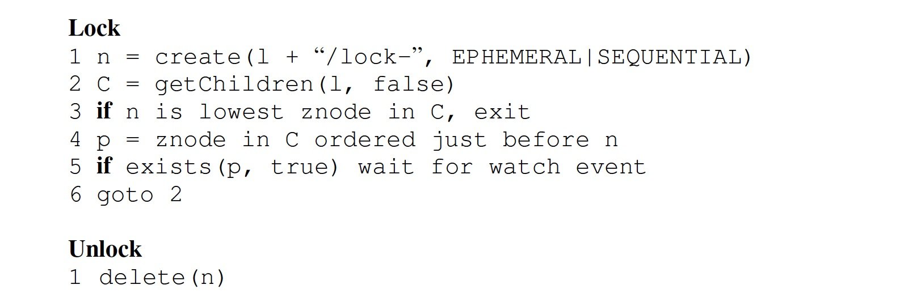
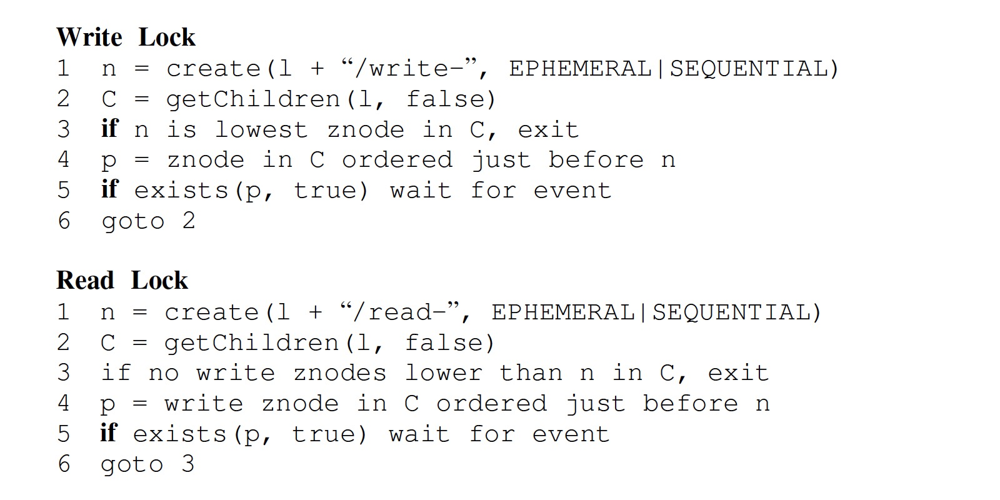
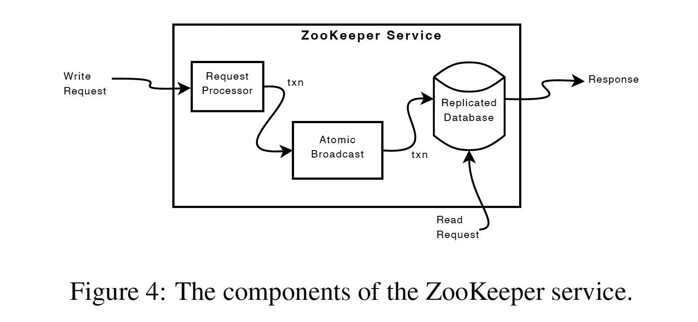

### [ZooKeeper: wait-free coordination for internet-scale systems](../assets/pdfs/zookeeper.pdf)

> USENIX ATC'10
>
> https://dl.acm.org/doi/10.5555/1855840.1855851

ZooKeeper 提供的接口具有 wait-free 的特点，每个客户端的请求以 `FIFO` 顺序执行（FIFO client order），而改变 ZooKeeper 状态的请求则具有 `linearizablity` 的特性（Linearizable writes）。

大型分布式应用往往需要不同形式的协同(coordination)，包括:

- Configuration
- Group membership
- Leader election
- Locks

其中 `Locks` 作为一种较强的协同服务可以用来实现较弱的协同服务，如 `Group membership`、`Leader election` 等。ZooKeeper 实现了一个类似文件系统的接口，具有操作简单、 `wait-free` 的特点。

> Implementing wait-free data objects, however, differentiates Zookeeper significantly
> from systems based on blocking primitives such as locks.

ZooKeeper 的状态变更依赖 [Zab](./consensus/zab.md) 原子广播协议。所有的写操作都会重定向到 Leader 节点，读操作则使用在 Follower 本地执行。

ZooKeeper 通常用来存储应用的元数据，读操作的比例往往远大于写操作，因此在客户端缓存数据能提高读性能。

> ZooKeeper uses a watch mechanism to enable clients to cache data without managing the client cache directly.

ZooKeeper 中的几个概念:

- client: 使用 ZooKeeper 服务的用户
- server: ZooKeeper 集群中的一个节点，即 zookeeper 进程
- znode: ZooKeeper 中的内存数据节点，类比文件系统中的 DIR 或 FILE
- data tree: znode 构成的分层命名空间，类比文件系统
- session: 客户端连接 ZooKeeper 服务时创建的连接句柄

#### znode

znode 具有两种形态，`Regular` 类型的 znode 需要用户显示创建和删除；`Ephemeral` 类型的 znode 由用户创建，session 断开后由系统自动删除。

> All znodes store data, and all znodes, except for `ephemeral` znodes, can have children.

创建 znode 时可以指定 `sequential` 标志。znode 存储的数据上限为 1MB。

> Nodes created with the sequential flag set have the value of a monotonically increasing counter appended to its name.

#### Client API

- create(path, data, flags)
- delete(path, version)
- exists(path, watch)
- getData(path, watch)
- setData(path, data, version)
- getChildren(path, watch)
- sync(path)

所有接口都具有两个版本，一个同步一个异步。

> The asynchronous API, however, enables an application to have both multiple
> outstanding ZooKeeper operations and other tasks executed in parallel.

由于读操作可以在任意 server 上进行，因此可能读到旧数据，`sync` 接口用以解决该问题:

> sync causes a server to apply all pending write requests before processing the
> read without the overhead of a full write.

#### 使用 ZooKeeper API 实现协同元语

通过 ZooKeeper API 可以在客户端实现 `Configuration Management`、`Rendezvous`、`Group Membership`、`Locks`、`Double Barrier` 等协同。

**lock**

**rwlock**

#### Implementation

ZooKeeper 的内部模块如下图所示:

写操作发送给 Leader 的 `Request Processor` 模块，通过计算执行该操作后的状态来判断该操作是否应该被 apply，如果可行则生成一个幂等的事务提交给 `Atomic Broadcast` 模块，该模块负责复制状态机的一致性，读操作则直接提交给 `Replicated Database`。

`Replicated database` 是一个内存数据库，通过定期执行 `fuzzy snapshot` 来减少回放的时间，由于 WAL 中记录的事务日志具有幂等的特性，snapshot 不需要加锁。

读请求在每台服务器本地处理。每个读请求用其所在服务器看到的最后一个事务的 zxid 进行标记后处理。

ZooKeeper 使用超时机制来检测客户端会话失效。