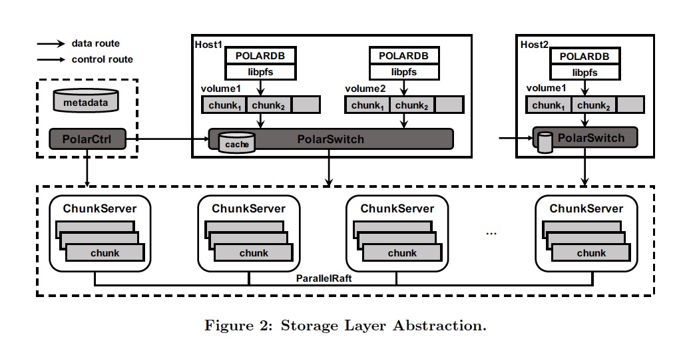

### [PolarFS: An Ultralow Latency and Failure Resilient Distributed File System for Shared Storage Cloud Database](../assets/pdfs/p1849-cao.pdf)

> Proceedings of the VLDB EndowmentVolume 11Issue 12August 2018 pp 1849–1862
>
> https://doi.org/10.14778/3229863.3229872

PolarFS 是为 PolarDB 设计的一个分布式文件系统，通过利用 RDMA、NVMe 等 bypass kernel 的技术，使 PolarFS 具有低时延、高吞吐、高可用等特性。为了最大化 I/O 吞吐，PolarFS 开发了 ParalleRaft，它利用数据库能够容忍乱序完成的能力，打破了 Raft 的严格串行化。

PolarFS 的特点:

- 使用 RDMA、NVMe 等新兴硬件，实现轻量的用户态的网络栈和 I/O 栈
- 提供 POSIX-like 文件系统链接库 libpfs，应用直接调用 libpfs 提供的接口进而绕过 VFS。这样所有 I/O 路径都在用户态
- 关键数据路径在设计上避免锁和上下文切换，充分利用 Zero-copy 技术
- 使用允许 `out-of-order log acknowledging` 的 ParalleRaft 共识算法，提高 I/O 并发

为了支撑 PolarDB 的主(Primary)从(Read Only)共享 redo 日志和数据文件的功能，PolarFS 还具有以下特点:

- 可以同步文件元数据的改动，使得这些改动对从节点可见
- 文件元数据的并发修改是串行化的，以保证文件系统在所有节点的一致性
- 当发生网络分区的时候，PolarFS 确保只有一个 Primary node 提供服务，避免数据出错

### 架构

PolarFS 由存储层(Storage layer)和文件系统层(File system layer)构成，存储层管理存储节点的磁盘资源并为每个数据库实例提供一个数据库卷(disk volumn)，文件系统层负责卷内的文件管理以及文件系统元数据的并发及同步管理。

#### 文件系统层

- 提供一个共享、并发的文件系统，可以被多个数据库实例访问
- libfs 完全实现在用户态，提供一组 Posix-like 文件系统接口，如 pfs_mount 将应用程序附加到相应的 Volumn 上，并初始化文件系统状态；pfs_mount_growfs 可以将 Volumn 扩展的空间标识为文件系统可用
- 元数据的管理分为两部分
  - organize metadata to access and update files and directories within a database node
  - coordinate and synchronize metadata modification among database nodes
- 元数据的更改记录在 jounal 中，RO 实例通过轮询日志 anchor 的变动来将日志 replay 到本节点的元数据
- 当网络分区发生的时候，有可能有多个实例写 journal，因此需要 disk paxos 算法来协调写日志

#### 存储层

**ChunkServer**

- 一个数据库实例对应一个 Volumn，每个 Volumn 对应一个或多个 Chunk
- Chunk 大小为 10G 固定，通过将 Chunk Append 到 Volumn 使 Volumn 空间得以扩展
- 100TB 的 Volumn 只需在元数据数据库中存储 10,000 条记录，这些元数据还可以缓存在 PolarSwitch 的内存中
- Volumn 提供 512B 字节原子读写
- Chunk 由 ChunkServer 管理，每个 Chunk 会 replicate 到 3 个 ChunkServer
- Chunk 被进一步切分为 Block，每个 Block 64KB。磁盘空间按 Block 粒度进行分配并 mapping 到 Chunk 以获得 thin provision
- Chunk LBA 到 Block 的 mapping 表（640KB）存储在 ChunkServer 上并在内存缓存
- 每个 ChunkServer 进程管理一个 NVMe SSD 盘并进行了绑核以减少 ChunkServer 间的资源竞争
- 每个 ChunkServer 对应一个 WAL，数据的修改先以 append 的方式写入 WAL，然后异步更新到对应的 Block，以保证原子性和持久性
- Consensus Group 按 ChunkServer 粒度实现，使用 ParallelRaft 算法复制 I/O 请求，进而保证数据一致性

问题：

- WAL 对应的 3D XPoint SSD 与 Chunk 空间分配方法没有细致的描述

**PolarSwitch**

- 同一个或多个数据库实例一起部署在数据库服务器上
- libpfs 将 I/O 请求传递给 PolarSwitch，每个 I/O 请求包含 (volumn id, offset, length)
- PolarSwitch 根据缓存的 Volumn 元数据把 I/O 再发送到对应的 ChunkServer
- PolarSwitch 上的 Volumn 元数据跟 PolarCtrl 是同步的
- Chunk 的副本信息元数据缓存在 PolarSwitch

**PolarCtrl**

- PolarCtrl 作为 PolarFS 的管控面，部署在一组（至少3个）专用的服务器上以保证服务高可用
- 监测集群中 ChunkServer 的活动状态
- 在元数据数据库（Mysql 实例）中维护 Volumns 状态 和 Chunks 位置
- 创建 Volumn 并将 Chunks 分配给 ChunkServer
- 将元数据同步到 PolarSwitch，推和拉两种方式都有
- 监控 Volumn 和 Chunk 的 I/O 时延和吞吐

#### I/O 执行模型

对于写请求，数据库实例通常会调用 pfs_fallocate 预分配空间，以此避免昂贵的元数据操作。libpfs 通过共享内存与 PolarSwitch 进行数据交换。共享内存以生产者消费者的形式组成多个 ring buffer。

读请求简单的由 Consensus Group 的 Leader 处理，而写请求则涉及所有的 Replica。下图展示了写 I/O 的流程：

1. PolarDB 通过 libpfs 和 PolarSwitch 之间的 ring buffer 将 I/O 请求发送给 PolarSwitch
2. PolarSwitch 通过缓存的元数据信息将 I/O 转发给对应的 Chunk 的 Leader 节点
3. Leader Node 通过 RDMA 语义操作（通常是单边操作）将 I/O 放到预注册好的 buffer 中，并将请求放到请求队列，一个专用的线程循环从该队轮询消息
4. 请求通过 SPDK 被写入日志并且通过 RDMA 发送到 Follower 节点
5. 在 Follower 节点，RDMA NIC 将 Leader 节点发来的 I/O 请求放到与注册好的 buffer 中，并将请求放到请求队列
6. Follower 节点也有一个专用的线程从队列轮询将请求通过 SDPK 异步写入磁盘
7. Follower 将写入成功的消息通过 RDMA 发送给 Leader
8. Leader 节点收到多数 Follower 返回的写入成功后，Leader 通过 SDPK 将写请求写入磁盘（步骤4只写了日志）
9. Leader 通过 RDMA 回复 PolarSwitch
10. PolarSwitch 回复客户端

从上述过程可以看出 PolarFS 使用了大量的 bypass kernel 的技术。

### ParallelRaft

这部分只是简单浏览了一下，以后有机会再详细拜读。
