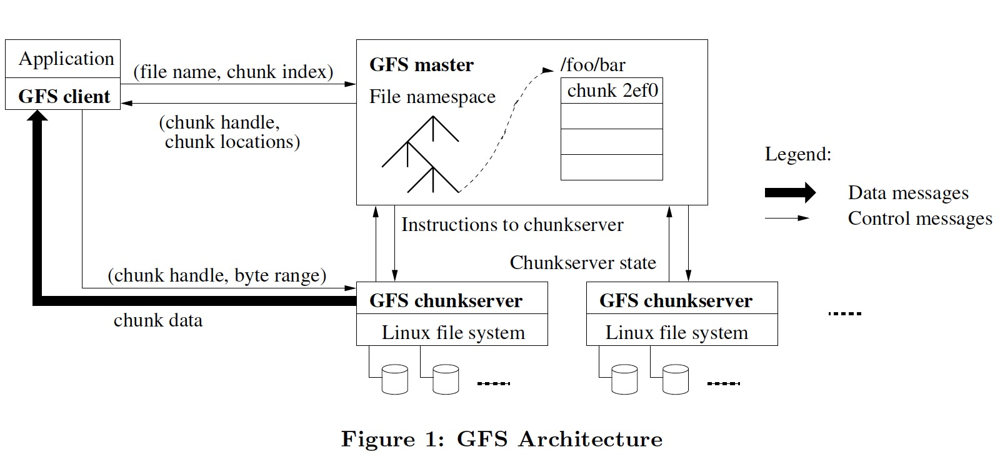

### [The Google File System](https://static.googleusercontent.com/media/research.google.com/en//archive/gfs-sosp2003.pdf)

> Proceedings of the nineteenth ACM symposium on Operating systems principles, October 2003
>
> https://dl.acm.org/doi/10.1145/945445.945450

GFS 是为大规模分布式数据密集型应用设计的一个可扩展的分布式文件系统，它运行在廉价服务器上，提供容错机制，为大量客户端提供高性能存储服务。

GFS 与其它分布式文件系统具有相同的设计目标，如:

- performance
- scalability
- reliability
- availability

同时出于对 Google 业务及技术环境的观察，GFS 具有一些独特的设计要点。

**设计假设**

1. The system is built from many inexpensive commodity components that often fail
2. The system stores a modest number of large files（>100MB）
3. The workloads primarily consist of two kinds of reads: large streaming reads and small random reads
4. The workloads also have many large, sequential writes that `append` data to files
5. The system must efficiently implement well-defined semantics for multiple clients that concurrently append to the same file
6. High sustained bandwidth is more important than low latency

**设计要点及架构**

- 一个 master, 维护文件系统所有的元数据（文件和 chunk 的命名空间、文件到 chunk 的映射、chunk 到 chunkserver 的映射、ACL、chunk 租约管理、GC 等）
- namespaces 和 file-to-chunk mapping 持久化到 operation log, 而 chunk 到 chunkserver 的映射关系是 master 向 chunkserver 索要的
- 多个 chunkserver, 文件数据被分为固定大小的 chunk(64MB) 保存在 chunkserver
- 三副本，分布在多个机器上并位于不同 rack
- master 和 chunckserver 之间通过心跳消息来传递指令并收集状态
- client 和 master 之间通信获取元数据，但数据的存取是直接和 chunkserver 进行的
- master 可以通过 operation log 来恢复命名空间，为了减少恢复时间，要求 operation log 不能过大，通过使用 checkpoint（compact B-tree like form） 来达到此目的
- 一致性模型，GFS 通过使用 `atomic record append` 来达到一个比较松弛（relaxed）的一致性模型，record append 使用的是 GFS 选择的 offset 而非应用指定的 offset
- GFS 使用租约（lease）来保证多副本间一致的更改顺序。master 授权其中一个 chunk 为 primary, 由它来确定多个更改的顺序
- 如果 record append 的数据超过了 chunk 的范围，会将每个 replica padding 到结尾。record append 的大小被限制为 16MB，以避免过多的空间浪费
- GFS 使用 `at-lease-once` 语义，由应用程序处理冗余数据

GFS 的一致性模型是我认为最难懂的地方，需结合 2.7、3.1 和 3.3 节多看几遍。

#### References

[1] Google Filesystem: Architecture + Consistency Model Overview [Part 1](https://www.youtube.com/watch?v=64ioICo0YBo) & [Part 2](https://www.youtube.com/watch?v=kVY_3CNPjhk) 
[2] GFS [FAQ](http://nil.lcs.mit.edu/6.824/2020/papers/gfs-faq.txt) from MIT 6.824 
[3] [Case Study GFS: Evolution on Fast-forward](../assets/pdfs/1594204.1594206.pdf)
