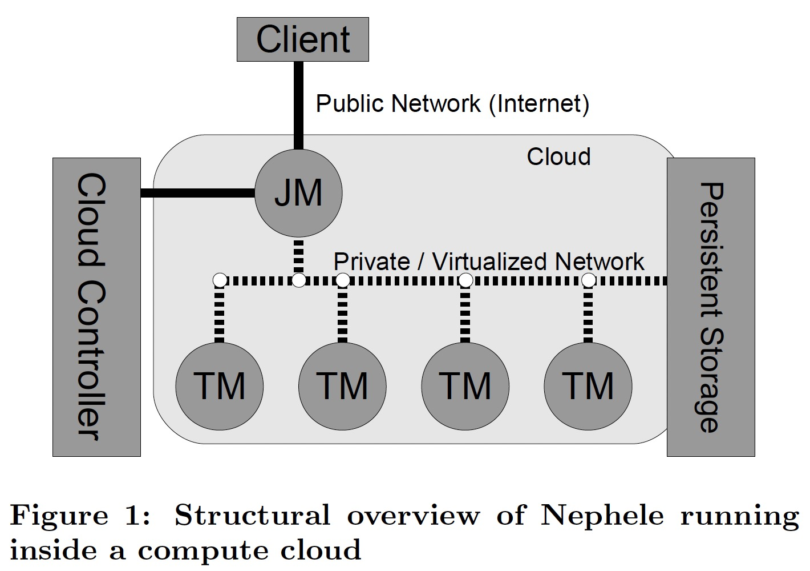
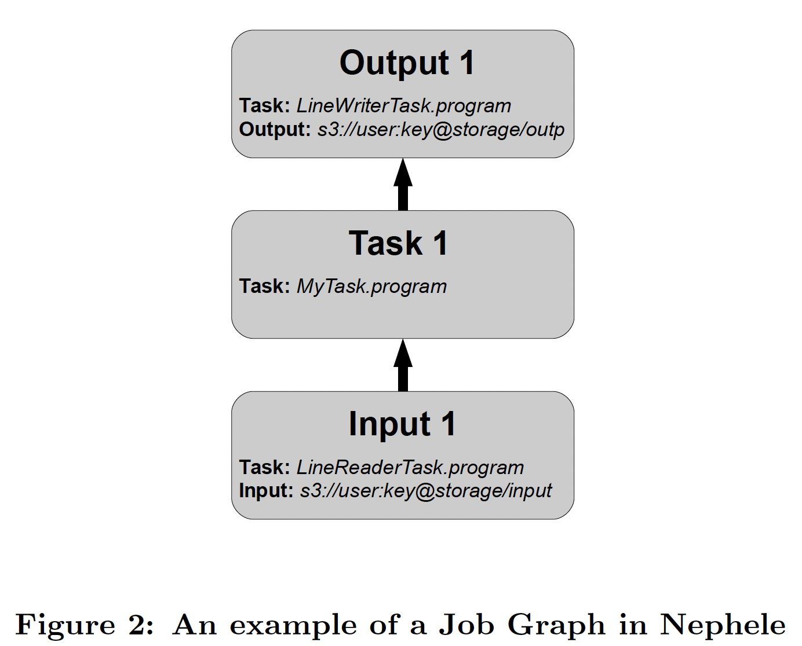
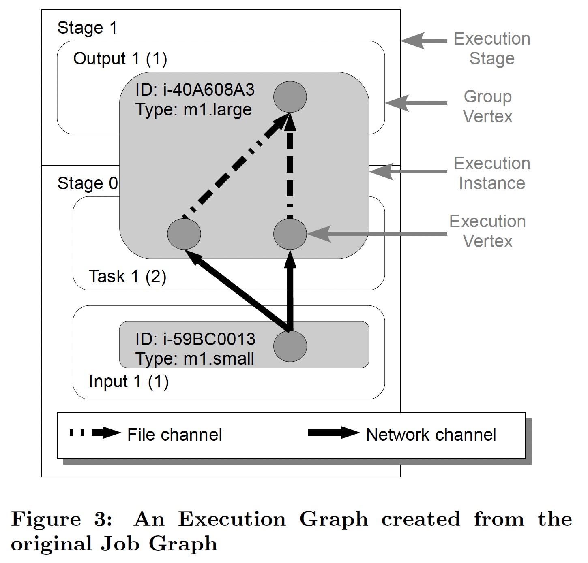

### [Nephele: Efficient Parallel Data Processing in the Cloud](../assets/pdfs/Nephele_09.pdf)

> Proceedings of the 2nd Workshop on Many-Task Computing on Grids and Supercomputers, November 2009
>
> https://dl.acm.org/doi/10.1145/1646468.1646476

在云的时代，对于一个并发数据处理框架的调度器来说，要回答的问题从 `Given a set of compute resources, how to distribute the particular tasks of a job among them?` 转变为了 `Given a job, what compute resources match the tasks the job consists of best?`

这种新的范式对调度器提出了三个要求：

1. 必须了解 job 执行所在的云环境，如各种 VM 的类型及其定价
2. 必须能够描述一个 job 的各个 task 之间的依赖关系，进而判断何时一个 VM 不再需要可以提前释放
3. 必须能够决定一个 task 应该在哪种类型的 VM 上执行

这种灵活性同时带来了一些挑战，其中最主要的问题在于网络拓扑，数据处理框架很难知道网络的层级，比如两个节点之间的数据传输经过了几个交换机，对于调度器来说，拓扑感知的调度非常困难。即使知道了底层的网络层级，由于 VM 的迁移特性，网络拓扑可能会随时变动。解决这种问题的唯一方法是将需要大量数据传输的 tasks 调度在一个更强的 VM 上以保证 Data locality。

### Nephele

基于云计算带来的机遇和挑战，论文提出了 Nephele，一种基于云环境的全新数据处理框架。其架构遵循 master-worker 模式:

在一个 job 提交之前，用户需要启动一个实例运行 *Job Manager(JM)*，它负责接收用户提交的 Job 及调度，它能够通过云提供的服务接口动态申请及释放 VM。

Nephele 框架的另一种角色为 *Task Manager(TM)*，它从 JM 接收任务，执行之后将完成状态或可能的错误信息汇报给 JM。

一个任务在 Nephele 中通过 DAG 来描述，原因在于:

1. DAG 允许 task 有多个入度和出度，可以极大简化传统数据结合算子，如 join
2. DAG 的边表示了执行中的 Job 的数据传输路径，Nephele 可以根据这些信息判断哪些实例可以关闭释放

一个 Nephele Job 的定义由三个手动步骤构成:

1. the user must write the program code for each task of his processing job or select it from an external library
2. the task program must be assigned to a vertex
3. the vertices must be connected by edges to define the communication paths of the job

用户通过 Job Graph 在一个抽象的层级描述任务和任务之间的关系，将任务并行度及任务在实例上的调度留给 Nephele。用户还可以在任务描述中增加注解给 Job Graph 提供更多信息，如:

- Number of subtasks
- NUmber of subtasks per instance
- Sharing instances between tasks
- Channel types
- Instance type

在接收到用户的 Job Graph 后，JM 将其转换为 *Execution Graph*，这是 Nephele 调度和监控的主要数据结构。相对 Job Graph 只在抽象层次描述任务，Exectution Graph 多了物理层次任务调度到具体实例的信息及 tasks 之间的通信通道:

其中几个重要的概念:

- **Execution Stage** 一个 Exection Stage 执行之前，必须保证其前序 Execution Stage 都已执行完毕，它的另外三个特性使得它可以类比为 checkpoint
  - when the processing of a stage begins, all instances required within the stage are allocated
  - all subtasks included in this stage are set up and ready to receive records
  - before the processing of a new stage, all intermediate results of its preceding stages are stored in a persistent manner
- **Group Vertex** 对应一个 Job 的一个 task，如果有并发，则一个 Group Vertex 可以有多个 Execution Vertex
- **Execution Instance** 执行实例，多个 Group Vertex 可以调度在同一个 Exectuion Instance 进而提高 Data Locality
- **Channels** Nephele 要求所有的边都替换成 channel，包括如下几种:
  - Network channels - 要求通信子任务存在于同一个 Stage
  - In-Memory channels - 要求通信子任务存在于同一个 Stage
  - File channels - Nephele 只允许不同 Stage 的子任务使用这种方式

### 读后感

Nephele 是 Flink 的前身，这种根据任务申请资源、按量付费的方式在云时代有着巨大的机会，这也是为何 Snowflake、PingCap 这样的厂商逐渐撅起的一个因素。