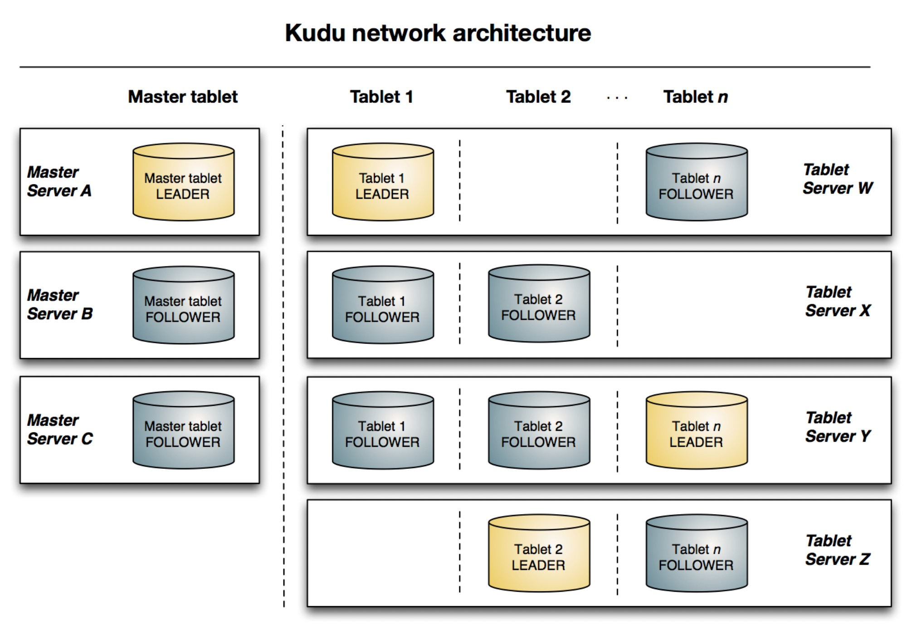

### [Kudu: Storage for Fast Analytics on Fast Data](../assets/pdfs/kudu.pdf)

> 2015
>
> https://kudu.apache.org/kudu.pdf

Kudu 是一个开源的结构化的存储引擎，它可用于低延迟的随机访问及高效的分析访问模型。Kudu 的设计填补了『高吞吐顺序访问』和『低延迟随机访问』两种访问模式不可兼得的空缺。

> Kudu o ers a "happy medium" alternative that can dramatically simplify the architecture of 
> many common workloads. In particular, Kudu offers a simple API for row-level inserts, 
> updates, and deletes, while **providing table scans at throughputs similar to Parquet**, 
> a commonly-used columnar format for static data.

#### Kude at a high level

从用户的角度来看，Kudu 是一个用于结构化数据表的存储系统。一个 Kudu 集群可以包含任意数量的表，每个表由有限个数的列构成，部分列会被定义为 *primary key*（不支持二级索引）。Kudu 使用这种关系型数据库的模式由以下两个因素驱使:

1. Explicit types allow us to use type-specific columnar en-codings such as bit-packing for integers.
2. Explicit types allow us to expose SQL-like metadata to other systems such as commonly used business intelligence or data exploration tools.

#### Architecture

Kudu 的架构延续了 BigTable 和 GFS 的设计，由 master 节点和 tablet server 节点构成。

Kudu master 负责存储集群的元数据，多个 master 节点通过 Raft 算法来保证高可用，leader 负责响应客户端请求。master 的主要职责:

1. Act as a catalog manager, keeping track of which tables and tablets exist, as well as their schemas, desired replication levels, and other metadata.
2. Act as a cluster coordinator, keeping track of which servers in the cluster are alive and coordinating redistribution of data after server failures.
3. Act as a tablet directory, keeping track of which tablet servers are hosting replicas of each tablet.

Tablet server 负责保存和处理数据，tablet 同样使用 Raft 算法（默认 3，可以在创建表时指定）及 *one-by-one* 的配置变更算法（新增或踢除 tablet）来保证数据永远可用。

分区由 **hash-partitioning** 和 **range-partioning** 构成，类似 AnalyticDB 的一级分区和二级分区。

#### Tablet storage

Kudu 的 tablet 存储有如下几个目标:

1. Fast columnar scans
2. Low-latency random updates
3. Consistency of performance

每一个 tablet 的存储作为 raft 日志后的状态机，是一个 LSM tree 单机存储引擎，包含如下几个模块:

- MemRowSet: 存储插入的数据，当 size 达到一定阈值后写入磁盘形成一个 DistRowSet
- DistRowSet: 由 MemRowSet 刷盘而来，包含 *base data* 和 *delta store*
- DeltaMemStore: 由于 base data 的不可变更性，将更新数据写入该结构
- DeltaFile: DeltaMemStore 刷盘而来

tablet 存储的设计需要满足以下约束:

1. 每个主键只能存在一个 RowSet（MemRowSet 或 DistRowSet）
2. 不同的 RowSet 的 key range 会有重合

第二个约束不难理解，LSM tree 都有这样的特性。每个主键只能在一个 RowSet 则需要在更新的插入的时候先查找是否存在对应的 primary key，如果存在，则将更新写入对应的 DistRowSet 的 DeltaMemStore，否则直接插入到 MemRowSet，该过程被称为 upsert。

为了提高性能，Kudu 通过 Bloom filter、Compaction 等特性来加速查询。

#### References:

[1] [Apache Kudu Overview](https://docs.cloudera.com/runtime/7.2.8/kudu-overview/kudu-overview.pdf)