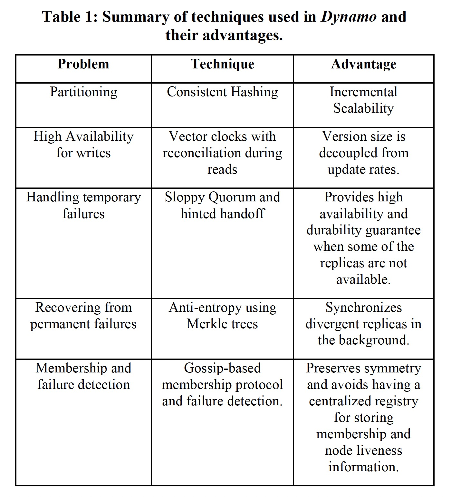
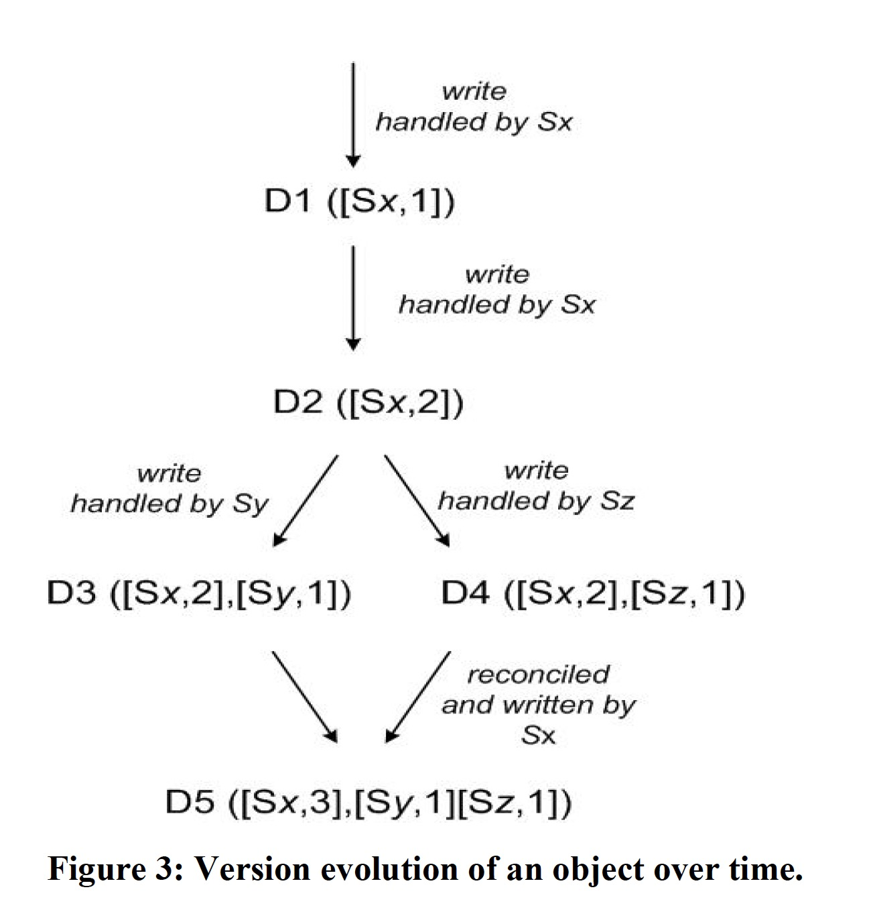

### [Dynamo: Amazon’s Highly Available Key-value Store](../../../assets/pdfs/amazon-dynamo-sosp2007.pdf)

> ACM SIGOPS Operating Systems Review, Volume 41, Issue 6 • December 2007 • pp 205–220
>
> https://dl.acm.org/doi/10.1145/1323293.1294281

亚马逊电子商务平台运行在由数以万计的服务器和网络组件、分布在世界各地的数据中心构成的基础设施之上，在这样的规模下硬件故障需要被视为常态，这驱动了软件系统可靠性和可扩展性的设计。Dynamo 作为一个高可用（always writable）、高可扩展的 kv 存储系统，为亚马逊的一些核心服务提供永远在线（always-on）状态存储能力。

> Dynamo is used to manage the state of services that have very
> high reliability requirements and need tight control over the
> tradeoffs between availability, consistency, cost-effectiveness and
> performance.

亚马逊平台有很多应用服务只需要通过主键访问数据存储系统，一个典型的例子就是购物车服务。Dynamo 将键和值都视为字节数组，通过 MD5 算法将主键映射为一个 128 比特的标识符，并暴露了两个接口:

- get(key): {object, context}
- put(key, context, object): void

`context` 作为 `object` 的元数据和 `object` 一起存储，它编码了 object 的版本信息。

Dynamo 的主要贡献在于评估了如何将不同的的技术结合起来提供一个高可用性系统。下表展示了 Dynamo 使用的技术及其优势:

#### Partitioning

一致性 Hash 算法来将数据分布到不同的存储节点，在此基础之上，Dynamo 将节点（node）映射为多个虚拟节点（vnode），每个 vnode 对应一致性 Hash 算法环上的一个点。使用 vnode 的优势有:

- If a node becomes unavailable, the load handled by this node is evenly dispersed across the remaining available nodes.
- When a node becomes available again, or a new node is added to the system, the newly available node accepts a roughly equivalent amount of load from each of the other available nodes.
- The number of virtual nodes that a node is responsible can decided based on its capacity, accounting for heterogeneity in the physical infrastructure.

#### Replication

为了实现高可用性和持久性，Dynamo 将数据复制到 N 个节点（vnode），N 是每个 Dynamo 实例的配置项。每条数据的 key 在哈希环上映射的第一个 vnode 作为它所负责范围的 coordinator，与后续的 N - 1 个 vnode 一起构成存储该键值对的 `preference list`。为了使数据分布在 N 个物理节点上，`preference list` 被设计为跳过已包含物理节点上的其它 vnode。

#### Data Versioning

Dynamo 被设计为一个最终一致性存储，也就是说更新最终会到达所有副本。在节点失效或网络分区的情况下，为了保证写可用，Dynamo 将每次修改的结果视为一个新的不可变的数据版本，系统同一时刻可能存在同一数据的不同版本。

> Most of the time, new versions subsume the previous version(s),
> and the system itself can determine the authoritative version (syntactic reconciliation).
> 
> However, version branching may happen, in the presence of failures combined with concurrent 
> updates, resulting in conflicting versions of an object.

Dynamo 使用[向量时钟](../../distributedsystem/holygrail.md)来确定同一数据对象不同版本之间的因果关系。

> If the counters on the first object’s clock are less-than-or-equal to all of the nodes
> in the second clock, then the first is an ancestor of the second and can be forgotten.
>
> Otherwise, the two changes are considered to be in conflict and require reconciliation.

当 Dynamo 更新一个数据对象的时候，它需要指定它要更新的数据版本（vector clock 信息），这些数据包含在与 object 一同保存的 context 中。在处理一个读取请求的时候，如果 Dynamo 获取了多个不能协调的分支，会返回多个版本的数据，由 client 端来决使用什么策略来协调多个数据版本（`merge` or `last write win`）。下图展示了使用向量时钟的数据版本的演进过程:

使用向量时钟的一个问题是当节点失败或网络分区发生的时候，写操作需要 `preference list` 之外的节点接管，这会造成 vector clock 的大小增长，Dynamo 使用了一种 clock truncate 的模式来解决此问题。

#### Sloppy Quorum Protocol

传统的 Quorum 有两个关键的可配置值：R 和 W:

- R 是参与读操作必须成功的最小节点数
- W 是参与写操作必须成功的最小节点数

设置 `R + W > N` 能保证读和写覆盖，可用于实现强一致性。

传统的 Quorum 协议在节点失败和网络分区的的时候会造成系统不可用。Dynamo 使用 Sloppy Quorum 来解决此问题。

> All read and write operations are performed on the first N healthy nodes from
> the preference list, which may not always be the first N nodes encountered while walking the consistent hashing ring.

使用 `Hinted Handoff`，Dynamo 确保读取和写入操作不会因临时节点或网络的失败而失败，Sloppy Quorum 是 Dynamo `always writable` 的关键。

#### Anti-entropy Using Merkle trees

当 `Hinted Handoff` 不可用是，不同节点需要同步数据以保证副本的一致性，Dynamo 使用 Merkle tree 来更快地检测副本之间的不一致并是需要传输的数据量最小化。

> Each node maintains a separate Merkle tree for each key range (the set of
> keys covered by a virtual node) it hosts. This allows nodes to compare whether the keys within a key range are up-to-date.

#### Membership

Dynamo 的最终一致性不仅体现在数据上，其节点成员信息通过 `Gossp-based` 协议达成最终一致性。

> A gossip-based protocol propagates membership changes and maintains an eventually
> consistent view of membership. Each node contacts a peer chosen at random every
> second and the two nodes efficiently reconcile their persisted membership change histories.

数据分区和放置信息也是通过 `Gossip-based` 协议进行传播，以保证每个存储节点知道其对等方处理的数据范围。

Dynamo 通过一些节点扮演 `seed` 的角色来防止 `logically partitioned ring`。

#### References:

[1] [Review of the Amazon Dynamo Paper](https://www.youtube.com/watch?v=xakpenkbOr0) by Lindsey Kuper